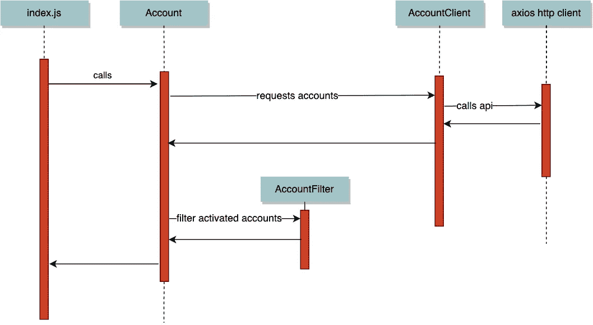
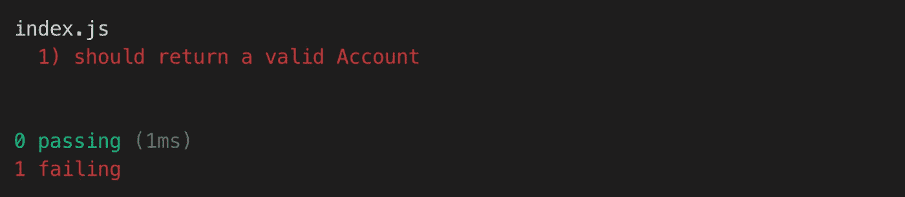
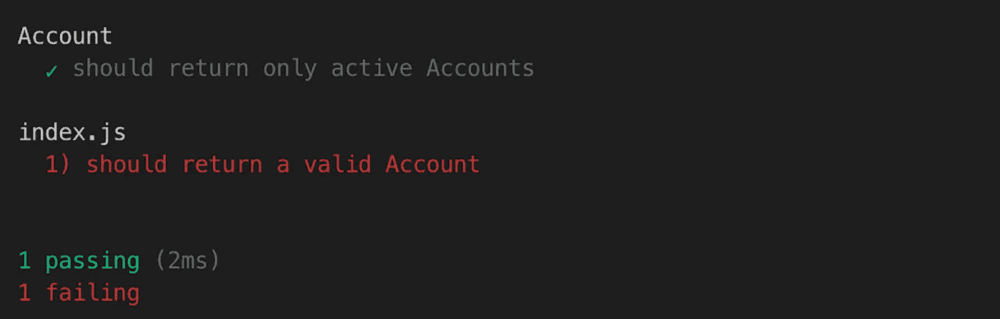
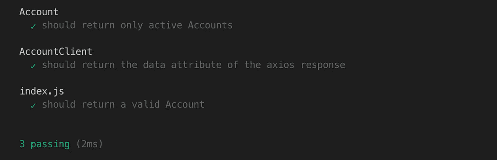

# Javascript:端到端单元测试？

> 原文：<https://medium.com/swlh/javascript-end-to-end-unit-tests-96df855d0ec8>


Image by [Dmitry Sutyagin](https://commons.wikimedia.org/wiki/User:%D0%94%D0%BC%D0%B8%D1%82%D1%80%D0%B8%D0%B9_%D0%A1%D1%83%D1%82%D1%8F%D0%B3%D0%B8%D0%BD), available under [**GNU Free Documentation License**](https://en.wikipedia.org/wiki/en:GNU_Free_Documentation_License)

**TL:DR** 本文将提供一个 javascript 架构，允许您:

*   在您工作的同时，以单元测试的速度连续测试您的代码
*   将副作用从应用程序的其余部分中分离出来
*   避免 ES6 类的所有怪异之处

# **问题**

我希望能够在我工作的时候连续不断地测试我的代码。我希望单元测试的速度和组件测试的覆盖率一样。

**一个解决方案**

为了研究这个问题和可能的解决方案，让我们看一个玩具应用程序，它包含以下文件:

```
src/
   index.js
   Account.js
   AccountFilter.js

   clients/
     AccountClient.jstest/
   index.spec.js
   Account.spec.js
   AccountFilter.spec.js

   clients/
     AccountClient.spec.js
.babelrc
package.json
```

和应用流程:



让我们从 *index.js* 到 *AccountClient.js* 来展示允许我们进行端到端测试的结构:

# 索引. js

**规则 1:具有异步方法的实体必须在程序入口初始化。**

为了启用端到端单元测试，我们需要实例化任何在 *index.js* 中有异步方法的实体。我们从一个在互联网上进行呼叫的实体开始，然后回溯到 *index.js* 。每个实体将依次被传递它所使用的任何依赖项，这些依赖项也有异步方法(第 8-9 行)。所以:

*   帐户客户端获取(axios)
*   帐户获取(帐户客户端)
*   index.js 调用帐户

现在我们已经在应用程序的入口点初始化了 http 客户端，它可以很容易地在我们的 *index.spec.js* 测试套件中进行存根化。

# 帐户. js

规则 2:使用工厂函数来表示实体。

上网要注意的第一件事。3 是我们使用工厂函数而不是 ES6 类。这是因为它们服务于完全相同的目的，但是比 ES6 类更加通用，正如我们将进一步看到的例子。

工厂函数的关键点在于，它的参数等同于类构造函数的参数，并且它的 return 语句传递回作为类实例的对象。 *Object.freeze* 不是强制的，它的目的是密封对象，防止进一步的改变。

Nb。如果你想更深入地研究工厂功能的主题，那么在这篇文章的底部有一个链接，链接到 Eric Elliott 的一篇很棒的文章。

您可能还会注意到，虽然第 3 行中的参数传递给了*帐户*帐户*帐户客户端*，但是第 4 行中的参数也对其进行了初始化。这是因为 AccountClient 是一个 curried 函数，我们接下来会看到它。

# 帐户客户端. js

**规则 3:除了在应用程序的入口处传递的异步依赖之外，接受其他参数的实体必须被处理。**

如前所述, *AccountClient* 在第 14 行导出时被处理。这意味着该函数可以一次调用一个参数(如果 currying 不是一个熟悉的术语，请查看本文底部的链接)。

首先，它的 http 客户端在 *index.js* 中被部分应用:

```
const accountClient = AccountClient(axios)
```

然后用 *Account.js* 中的 *accountId* 完全申请:

```
const account = AccountClient('account_001')
```

只有当它完全应用了它的两个参数时，它才会在其 return 语句中返回对象。

就这样，我们构建了我们的代码，使得具有异步函数的实体的依赖链[Account，AccountClient，axios]都在 *index.js.* 中初始化

现在我们有了一个可以进行端到端单元测试的结构，让我们使用测试驱动开发来编写一个完整的例子。

# 编写示例代码

```
mkdir -p funjs/{src,test}cd funjsnpm init -y
npm i ramda axios source-map-supportnpm install --save-dev chai mocha sinon proxyquire [@babel/cli](http://twitter.com/babel/cli) [@babel/core](http://twitter.com/babel/core) [@babel/node](http://twitter.com/babel/node) [@babel/register](http://twitter.com/babel/register) [@babel/preset-env](http://twitter.com/babel/preset-env) --save-dev
```

创建一个 babel 配置文件`touch .babelrc`并复制这个文本

```
{
  "presets": [
    [
      "@babel/preset-env", {
        "targets": {
          "node": "current"
        }
      }
    ]
  ]
}
```

替换 package.json 中的以下行:

```
"scripts": {
  "test": "echo \"Error: no test specified\" && exit 1"
}
```

使用:

```
"scripts": {
  "test:watch": "./node_modules/.bin/mocha --watch --recurse --require @babel/register"
}
```

让我们创建第一个测试文件`touch test/index.spec.js`来保存我们的端到端测试:

现在，我们可以在 *watch* 标志打开的情况下执行测试框架，以便对我们从这里开始编写的任何代码进行连续测试:

```
npm run test:watch
```

您现在应该看到您的第一个测试失败了，并显示消息:
>错误:找不到模块../src/index '

因此，让我们暂时取消测试运行程序，创建我们的入口文件`touch src/index.js`，并复制以下代码:

如果您尝试再次运行测试运行程序，您将得到一个堆栈跟踪，抱怨找不到 *Account.js* 或 *AccountClient.js* 。

这是我们从端到端测试开始所付出的代价。应用程序的入口点知道应用程序远边缘的依赖关系(ln . 8–9 ),但是如果您还没有为这些依赖关系编写代码，那么您将会看到堆栈跟踪，指出文件或方法不存在。

这不利于我们实践 TDD 的能力。我们希望为每个组件创建测试，同时端到端测试仍然在一个良好的测试报告中报告失败，而不是因为缺少文件或方法而被一个堆栈跟踪搞砸。

因此，为了保持恒定的覆盖率，我认为为每个依赖项创建带有空方法的框架文件和函数是可以接受的，这样我们就可以看到测试失败的正确测试报告，而不是堆栈跟踪。这是真的 TDD 吗？的确，我们在编写特定的单元测试之前编写代码，但是我们被端到端的测试所覆盖，所以我认为我们是部分合理的。如果这冒犯了任何人的 TDD 敏感性，那么我理解，我也喜欢正统的编程:)但是在这种情况下，我更想要端到端的测试。

因此，让我们为 *Account.js* 和 *AccountClient.js* : `touch Account.js clients/AccountClient.js`创建两个具有框架工厂函数的新文件，以便我们可以看到正确的测试报告:

```
function Account(AccountClient) {
    async function getActiveAccounts() {} return Object.freeze({
        getActiveAccounts
    })
}export default Account
```

和

```
import * as R from 'ramda'export function AccountClient(httpClient, accountId) {
    async function get() {} return Object.freeze({
        get
    })
}export default R.curry(AccountClient)
```

**目前进展:** 1 个端到端测试失败:



# 照常对 TDD 的确认

在“test”目录下创建一个新文件:`touch Account.spec.js`，并复制下面的代码。

并实现我们的帐户过滤器:

*Nb。为了简洁起见，我省略了 AccountFilter 的测试。它在应用程序中的主要目的是显示纯实体和不纯实体声明方式的差异。*

然后是我们的帐户域实体:

**迄今为止的进展:** 1/2 的测试通过:



接下来让我们为 *AccountClient.js* 设置一个单元测试:

和帐户客户端服务:

**迄今为止的进展:** 3/3 的测试通过:



# **总之**

通过将 ES6 类替换为工厂函数，修改它们的参数，并在程序的入口点部分应用依赖关系，我们可以以单元测试速度运行端到端测试。

另外，我们还通过传入引起副作用的代码而不是在实体中实例化它来实现解耦，这使我们更喜欢单一责任原则，因为实体不需要创建对象也不需要执行其业务功能。

我们唯一牺牲的是 ES6 类，它不能在这种模式下工作，因为我们不能像处理工厂函数的参数那样处理 ES6 类构造函数。

虽然 ES6 类看起来很熟悉，但它们只是工厂函数的受限版本，开发人员为了使用它们必须学习很多奇怪的东西。考虑以下关键字的价值:

*   **这个**:它的意思在不同的范围内变化
*   静态:对象可以有不改变状态的方法，我们不需要静态关键字
*   **扩展**:鼓励脆弱的继承架构
*   **bind** :一个解决“this”问题的方法
*   **类中的箭头 vs 普通函数**:另一种解决“this”问题的方法

# 潜在问题

拥有端到端的单元测试能力可能会鼓励人们只在 index.js 进行测试，或者在这个级别聚集太多的测试。

我认为支持为每个存在的 http 端点创建端到端测试的约定是明智的。这些将是[快乐之路](https://en.wikipedia.org/wiki/Happy_path)测试。一个普通的微服务不会调用许多不同的端点，所以这应该会限制端到端测试的数量。

没有 proxyquire，我们能完成吗？

是的，我们可以引入一个使用 *proxyquire* 的架构，但这会涉及更多的代码，这使得将这种模式改造成现有的代码有点麻烦。 *proxyquire* 的确增加了一点魔力，它用存根代替了我们的依赖关系，但它的使用仅限于 *index.js* 。

*我们应该这样做吗，这会破坏单元测试的最佳实践吗？*

我不确定，我想人们会有不同的意见，但它确实在你编码的同时，以单元测试的速度给出了明智的解耦和更好的代码覆盖率，所以我认为它引入的任何妥协都是值得的。只要您仍然坚持正常的 TDD 并对 index.js 下的每个文件进行单元测试，那么您应该是安全的。

# 参考

Currying，局部应用和功能组成:

[](/javascript-scene/curry-and-function-composition-2c208d774983) [## 咖喱与功能组合

### 注意:这是学习函数式编程和组合软件的“组合软件”系列的一部分…

medium.com](/javascript-scene/curry-and-function-composition-2c208d774983) 

工厂功能:

[](/javascript-scene/javascript-factory-functions-with-es6-4d224591a8b1) [## ES6+的 JavaScript 工厂功能

### 注:这是“作曲软件”系列的一部分(现在是一本书！)关于学习函数式编程和…

medium.com](/javascript-scene/javascript-factory-functions-with-es6-4d224591a8b1) 

应用程序的完整代码可以在这里找到:[https://github . com/jamesw 201/partially-applied-factory-functions](https://github.com/jamesw201/partially-applied-factory-functions)

***詹姆士·威尔森*** *是埃森哲云平台的程序员。*