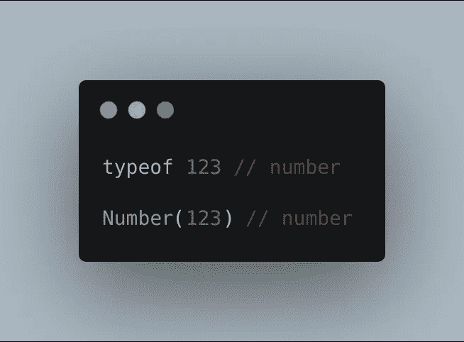
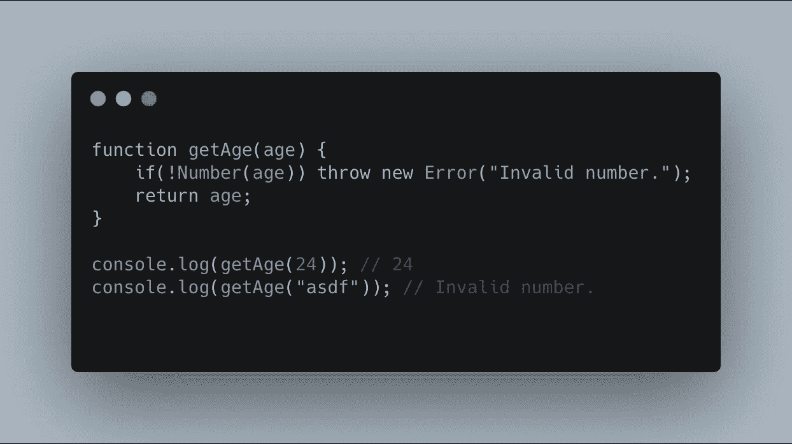
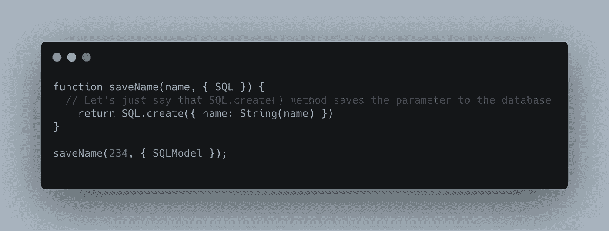
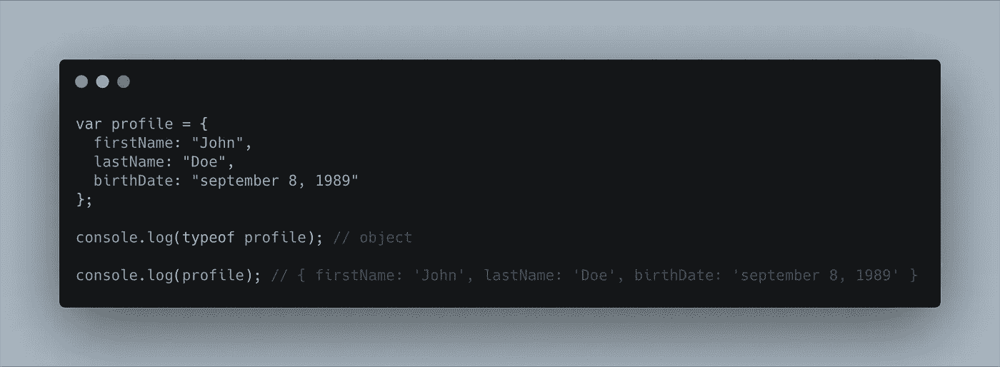
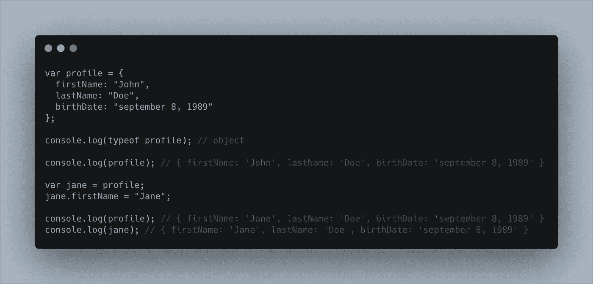
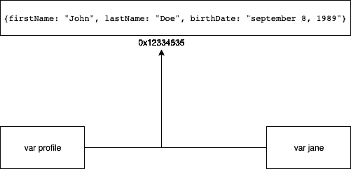

# JavaScript:原始值与参考值

> 原文：<https://medium.com/swlh/javascript-primitive-vs-reference-values-2836e8bb1c5d>

如何以及何时在你的日常发展中使用

有时，忽视学习原语和引用值如何在 JavaScript 上工作的误解在新开发人员中非常普遍。有时这只是一个简单的实践，有时会在长期开发中导致意外的复杂性。

# **原始值**

> **原始值:**是在**堆栈内存上有专用内存地址值的值。**它们是值，没有属性。

每种编程语言都有自己管理原始值的方式。通常原始值在存储方面更特殊。它在堆栈存储器上分配了一个固定的地址。

JavaScript 原语值类型列表有 ***字符串、数字、布尔、未定义、空。*** 但是他们也有他们可以使用的原始方法。

JavaScript 原始全局方法:**(字符串、布尔、数字)**

123 和数字(123)是一样的。全局原语方法通常用于返回全局对象的原语值。

# 例子:让我们举一个基本方法号()的例子

Different implementation but the same values

**Number()** 用于返回*一个表示同类数的对象否则将返回一个***也称为* ***【非数】。*** *它也和 String 一样，和 Boolean 一样。除了处理异常值之外，它们根据自己的种类返回相同的东西。**

*我使用原始类来检查传递给我的类或函数的值是否与需要的值相同。*

**

***数字(年龄)**检查给定参数是否为数字。如果不是；它将返回一个**【NaN】**值或者也称为**【非数字】***

# *另一个使用 String()的例子*

*在这种情况下，如果您不想将某个值保存为与预期的数据库列类型相同。您可以在保存到数据库之前转换表示值的参数，以确保满足要求。*

**

*saveName(234) supposed to be invalid since the SQL expects a string name value. But since we put a String method within the name value. any parameter before its been saved is converted to a string type.*

*这表明该值是函数 **saveName()** 给出的数字。 **234** 是数字的**原始类型**，如果要保存的预期列是字符串类型，它会导致数据库**出错；Yes value **234** 不是真名但是姑且说是真名吧。***

*JavaScript 是松散类型。以便至少按类型进行约束。我们可以使用这些全局原语方法来转换这些值。*

# *参考值*

> ***参考值:**是动态存储在**堆内存或自由存储器中的值。***
> 
> ***它们是由属性定义的。**这些属性要么是默认属性，要么是添加属性*

***堆内存:**动态存储在空闲存储上意味着数据被存储在一个具有随机内存地址的内存池中。*

*参考值通常用于大量数据。它们被分组为 **JavaScript 对象符号或 JSON、函数或类。至少对我来说是这样。***

***示例:***

*一个**变量配置文件**由一个具有**名、**和**出生日期**属性的对象分配*

**

*属性(名字、姓氏、出生日期)被分配给堆内存，并将分配的地址发送回 var 配置文件。*

> *属性不会被传递回 var 配置文件，而只是从**堆内存**中分配的地址*

***缺点:**拥有引用类型的缺点是如果你把它赋给另一个值，即使你把它改成下一个赋值的值也要改。第一个声明的值也会改变。当分配的值不是精确值，而只是分配地址时，参考值起作用。*

## *示例:*

**

***var profile** 被赋给 **var jane** 现在有了**var profile**的参考**值。***

*在将其保存到 var 配置文件之前。它被分配给堆内存，用该地址创建一个快照，并将对象地址返回给 **var 配置文件。***

*而当 **var profile** 被分配给 **var jane** 时。理想情况下，从**变量配置文件**中保存的地址也被传递给**变量简**。*

**

> *因此，引用是从 var profile 传递到 var jane 的地址。*

*现在我们修改**var**Jane 的 **firstName** 属性。这是因为该值并不是真正的**复制的**，而是**引用的**。 **var 配置文件的**属性**名字**也被更改。*

*下面的例子是使用**对象进行检查。is**ES6**的**方法检查 **var profile** 和 **var jane** 是否共享同一个引用*

**

> *因此，如果两个对象在同一个范围内，就要小心数据的改变。*