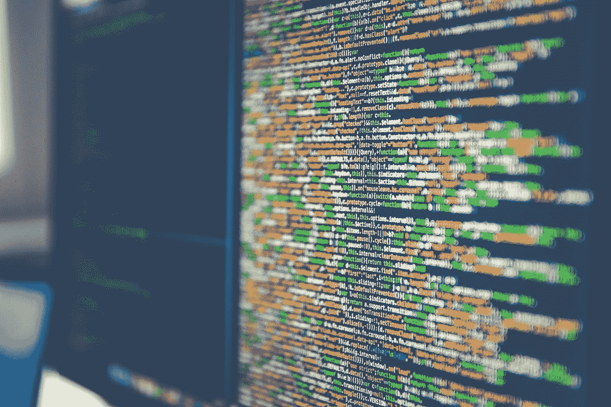

# 每个开发人员都应该记住的 JavaScript 的神奇技巧

> 原文：<https://medium.com/swlh/javascripts-magical-tips-every-developer-should-remember-38c71b1cbfba>

## 更干净地使用 JavaScript 的技巧

Photo by [Markus Spiske](https://unsplash.com/@markusspiske?utm_source=unsplash&utm_medium=referral&utm_content=creditCopyText) on [Unsplash](https://unsplash.com/search/photos/programming-tips?utm_source=unsplash&utm_medium=referral&utm_content=creditCopyText)

JavaScript 是全栈开发中最流行的技术。虽然我一直主要关注 Node.js，也有些关注 Angular.js，但我已经意识到，无论其存在的性质如何，每种编程语言都包含一些技巧和提示。