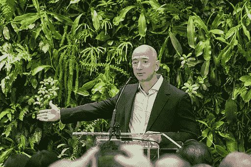

# 杰夫·贝索斯成功的 5 个最重要原则

> 原文：<https://medium.com/swlh/jeff-bezos-5-most-important-principles-for-success-bcb82bd5ea0e>

> "如果你擅长纠正错误，犯错的代价可能比你想象的要低."—杰夫·贝索斯

不管你爱他还是恨他，杰夫·贝索斯都是创业史上最伟大的成功故事之一。这个人看到了网上销售书籍的需求，然后破门而入，把亚马逊变成了……