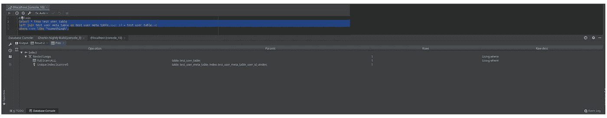
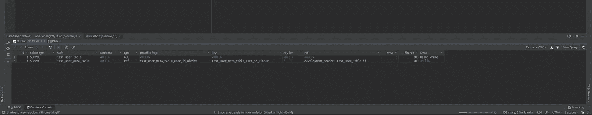

# JetBrains DataGrip 解释计划

> 原文：<https://medium.com/swlh/jetbrains-datagrip-explain-plan-ac406772c470>


我最近做了一个小任务，要求我提高页面加载或该页面的查询加载的性能。
我立即投入其中，试图找到分析我的查询的方法，因为我已经在使用 [DataGrip](https://www.jetbrains.com/datagrip/) 来处理数据库相关的东西，我决定检查他们有什么来分析查询。很明显，他们有一个叫做“解释计划”的东西，如果你熟悉 MySQL 的话，这没什么不同。但是，他们只是试图以不同的方式形象化它，或者以不同的方式展示它。
所以，基本上，我将解释 MySQL `Exaplin`是如何工作的，这足以让你理解 DataGrip 向你展示了什么。

没有更多的介绍，让我们直接进入它。

# 什么是“解释计划”

## 解释计划的输出表是什么



如果您运行“解释”部分，您可以看到更好的信息，如下所示:



现在让我们解释一下桌子里面有什么。

## 表格列和说明

*   **id** 这个 ID 将代表 MySQL 将要按顺序执行的语句的 ID。如果您有一个普通的查询，您只会看到 1。但是，如果您有一个连接查询和一个子查询，您会注意到它会显示主查询，然后是子查询 2nd，然后是连接 3rd。知道顺序很重要；).
*   **选择类型**
    为此，它可以是下列值之一(焦点是[]):
    —子查询:ex。(select actor_id，[select … from..etc]如表中之物)
    —派生:例如。select * from[select * from something _ else]
    —Union:join、Union 或诸如此类命令
    — Union Result:它连接所有连接结果的地方。
*   **Table**Table
    这将引用它为当前查询获取数据的表，有时它说代替表名< derived4 >意味着这个连接将等待它的内部命令 id=4 作为获取数据的表。通常，join 命令总是这样。
*   **型**
    有人说其叫`access_type`， 这些类型是:
    — ALL:通过正常扫描(正常选择查询)在表中查找数据
    — index:通过索引列查找数据(这种方式很好)
    — range:意味着它可以基于索引列限制结果并获取一个范围(快速查询)
    — ref:意味着这将匹配来自其他表的 ref
    —eq _ ref:如果 ref 是唯一键，意味着它将在匹配行的那一刻停止
    — const，system:匹配 a
*   **可能的键**
    这将尝试获取查询中使用的所有列，并将它们用作可能的列来过滤或用于执行。
*   **关键字**
    MySQL 决定用来优化所需数据访问的一个索引。
*   **Key _ len
    MySql 将在索引中使用的字节数。基于这个值，如果没有使用表中分配的字节，您可以调整查询以减少影响，或者将表的结构更改为更好的结构。**
*   **Ref** 
*   **行数** MySQL 估计需要读取的行数，以找到所需的行。
*   **Filtered**
    使用 where 条件或类似条件过滤的行的百分比。如果您将这个与`rows`相乘，您将得到这个查询将返回到前面查询的行数。
*   **Extra** 这包含一些额外的变量数据，如(` Using index` `,` `Using where '..)显示了过滤和数据挑选将如何进行。在文档中了解更多信息。

**【更新】:**

# MySQL 8.0

在 MySQL 8.0.18 之前，你可以在上面看到的解释主要是由引擎完成的估计。但是，现在在 MySQL 8 中，它实际上运行查询并找到更准确的结果。

```
mysql> explain analyze select count(*) from sbtest1 where k > 500000\G
*************************** 1\. row ***************************
EXPLAIN: -> Aggregate: count(0) (actual time=178.225..178.225 rows=1 loops=1)
-> Filter: (sbtest1.k > 500000) (cost=98896.53 rows=493204) (actual time=0.022..147.502 rows=625262 loops=1)
-> Index range scan on sbtest1 using idx3 (cost=98896.53 rows=493204) (actual time=0.021..96.488 rows=625262 loops=1)1 row in set (0.18 sec)
```

*上面的例子摘自下面的文章*

这里的这篇文章恰当地解释了所有的输出:

[](https://www.percona.com/blog/2019/10/28/using-explain-analyze-in-mysql-8/) [## 在 MySQL 8 - Percona 数据库性能博客中使用解释分析

### 在 MySQL 8.0.18 中有一个名为解释分析的新特性，而多年来我们大多只有传统的…

www.percona.com](https://www.percona.com/blog/2019/10/28/using-explain-analyze-in-mysql-8/) 

# 摘要

根据上面的信息，您可以注意到，如果您利用被触摸的行数、被过滤的行数，并且如果有可能的话，您的键列将帮助您改进您的查询。

如果你知道如何阅读这些数据，并能够利用这些数据，你将能够改善你的查询和你的网站。

当然，如你所见，这只是一个非常基本的简单解释，如果你想了解更多，请阅读 MySQL 的详细文档:

 [## MySQL :: MySQL 8.0 参考手册::8.8.2 解释输出格式

### 您可以通过对……的行列中的值进行乘积来很好地了解连接的好坏

dev.mysql.com](https://dev.mysql.com/doc/refman/8.0/en/explain-output.html)