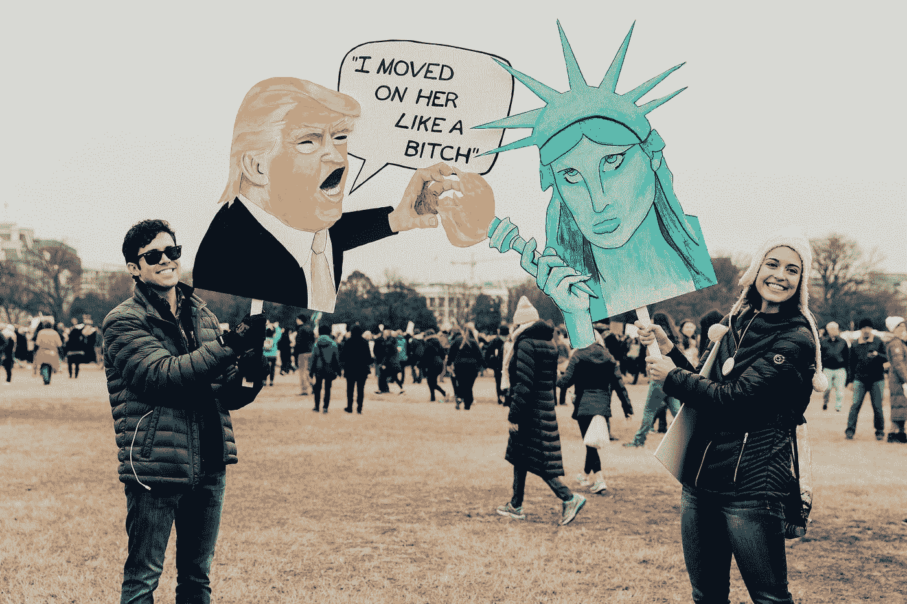

# 吉米·卡特说，如果没有俄罗斯的帮助，特朗普不会当选总统。

> 原文：<https://medium.com/swlh/jimmy-carter-said-that-trump-would-not-have-been-elected-president-without-russias-help-de145aa02991>

吉米·卡特提出了合理的要求。唐纳德·特朗普(Donald Trump)做出了幼稚的回应。让我们来看看这两种说法。

Photo by [roya ann miller](https://unsplash.com/@royaannmiller?utm_source=medium&utm_medium=referral) on [Unsplash](https://unsplash.com?utm_source=medium&utm_medium=referral)

伊米·卡特(immy Carter)在特朗普当选的问题上畅所欲言。特朗普用他一贯幼稚的侮辱回应道，卡特总统是一个被遗忘的总统，卡特总统是一个可怕的…