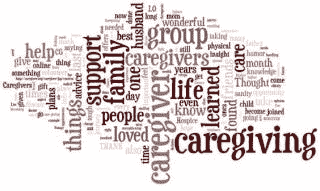

# 工作描述:家庭护理员

> 原文：<https://medium.com/swlh/job-description-family-caregiver-ca61cb7a9911>

[健康事务](https://www.healthaffairs.org/)博客有一篇很好的文章，区分了日常生活活动(ADLs)*和日常生活工具活动(iadl)* *。更重要的是，[一份 21 世纪的家庭护理工作描述](https://www.healthaffairs.org/do/10.1377/hblog20190612.959252/full/)解释了为什么在家庭护理的背景下使用任一术语都不能解释这些护理人员提供的服务范围。我个人很高兴得知这两个术语是在 50 多年前开发的，用来衡量一个人从髋部骨折或其他疾病中的恢复情况。我同意，随着我们继续将护理工作从医院转移到家庭护理人员身上，在今天复杂的医疗保健环境中还需要一些其他的东西。

我也同意[护理员职位描述](https://thielst.typepad.com/files/caregiver-job-description.pdf)是个好主意，所以我这个医院管理者坐下来，用我作为一个家庭护理员的知识打了一份出来；我从阅读别人的挑战中学到的。列出的角色和职责是任何家庭的起点，每个工作描述都应该定制，以适应所爱的人(患者)和资源的独特情况。这是任何雇主都应该做的，也应该适用于家庭单位。

有时，我从其他照顾者那里读到的挑战是家庭单位中的压力和冲突。这通常是由沟通错误或缺乏知识和理解造成的。在这种情况下，我认为对主要护理者以及那些同时支持主要护理者的人的书面和详细的工作描述可以帮助建立期望和责任——促进更有效的沟通。

我对家庭护理员的工作描述包括一份家庭成员有时会执行的潜在护理和医疗任务的清单；以及锻炼自己的需要。鉴于我对风险和安全的兴趣，我明确提到需要监测环境的安全性、剥削的证据以及当所爱的人对自己、他人或严重残疾构成威胁时。鉴于生命最终会走到尽头的现实，我已经认识到了生命终结的活动。[下载护理员职位描述模板](https://thielst.typepad.com/files/caregiver-job-description.pdf)，告诉我你喜欢什么，或者认为缺少什么。如果你想要 Word 版本，就给我发一封[邮件。](mailto:Christina@cthielst.com)

* **日常生活活动** —吃饭、洗澡、穿衣、如厕、转移和自制。

*** *日常生活的工具性活动** —打扫/维护房屋、管理金钱、在社区内活动、做饭、购物、服用处方药、使用通讯工具。

【https://thielst.typepad.com】最初发表于**。**