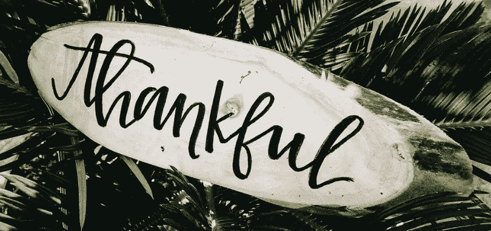

# 掌握感恩的 10 种方法

> 原文：<https://medium.com/swlh/joy-is-gratefulness-f953b0e0d283>

## "快乐的根源是感恩。"大卫·施泰因德尔·拉斯特

Jessica Castro @ [Unsplash](https://unsplash.com/photos/wZz4oS9ZOMo) — I give thanks.

毫无疑问，我认为个人幸福与感恩直接相关。这不仅仅是一种关联，我确信这是真正幸福的驱动力。心存感激不仅会让你变得更快乐，还会增强你的免疫系统，降低血压，减少…