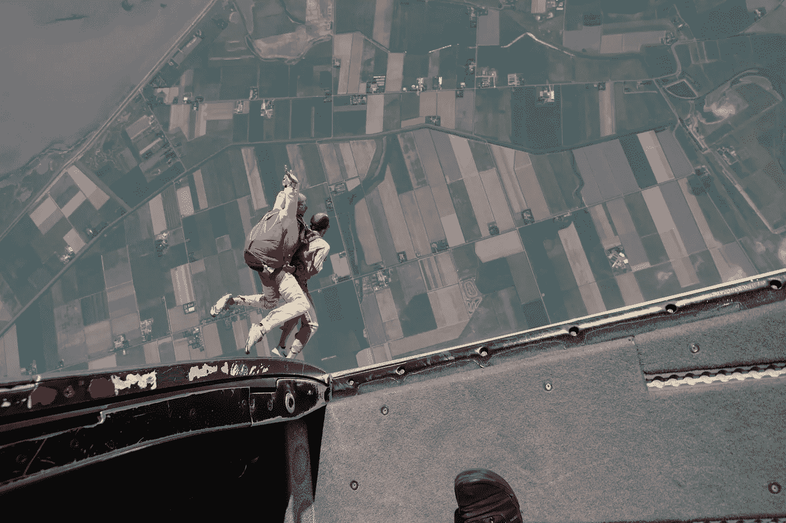

# 从飞机上跳下来

> 原文：<https://medium.com/swlh/jumping-out-of-a-airplane-59fe5e7087c>

正是对未知的恐惧阻止了我们去体验新事物。

*生活要么是一次大胆的冒险，要么什么都不是。引用海伦·凯勒的话，如果你对我们的工作和故事有点熟悉[，你就会知道这是我们生活的目的。](http://moij.co)*

全凭我们自己的能力。一个接着一个。这很好，只要我们在日常生活中努力追求幸福。

我爸爸的生日快到了，所以我和一些家庭成员一起决定这是最完美的礼物。

几年来，我一直梦想从飞机上跳下来。

几分钟后，我们订了票。

后来开车去机场，我超级兴奋，一点也不紧张。到达终点站并听取安全简报时，兴奋是真实的！

我喜欢飞行、飞机以及与此相关的一切——飞行 13 个小时？没问题。

等了一会儿，我们一行人准备登机了。你遇到了你的教练，你生命的依靠，你进入一架小飞机，准备起飞，上升到 13.000 英尺。

在 4000 英尺的高度，他们已经为一些早期的跳伞者打开了门，我就坐在门的右边。

现在我不再只是兴奋了…一些恐惧和焦虑进入了我的身体。开着门向飞机外看，会让你的身体和头脑做些事情。

一旦我们到达 13000 英尺，就是我们跳跃的时候了。我妹妹是第一个看到这里跳出飞机的人！

然后我该跳了。3….2….走吧。

在第一秒钟，我的身体处于一种强烈的恐惧状态，低着头，从飞机上掉下来，向下看…

…那一刻之后，恐惧完全消失了。在一瞬间，恐惧变成了我经历过的最史诗般的经历。

你以 200 公里/小时的速度飞行，景色很美！

没有语言可以描述我的经历和感受。

我完全*在场*。

当我写下这些的时候，我浑身又起了鸡皮疙瘩。

> 在恐惧的另一面，你将体验到生活中最幸福的体验。

引用威尔·史密斯的话，他描述了同样的经历(但更好的是，你应该看看视频)

这次经历以一种新的方式提醒了我，你必须战胜恐惧。

这不仅适用于这种冒险，也适用于创业或寻求帮助，决定设计或建造不同的东西或学习一门新语言！

正是对未知的恐惧阻止了我们去体验新事物。

这阻止了我们体验生活中最美好的时刻。

不，去做你做不到的事。

度过史诗般的一天

斯文

## 这篇文章发表在 [The Startup](https://medium.com/swlh) 上，这是 Medium 最大的创业刊物，拥有+418，678 名读者。

## 订阅接收[我们的头条](http://growthsupply.com/the-startup-newsletter/)。

