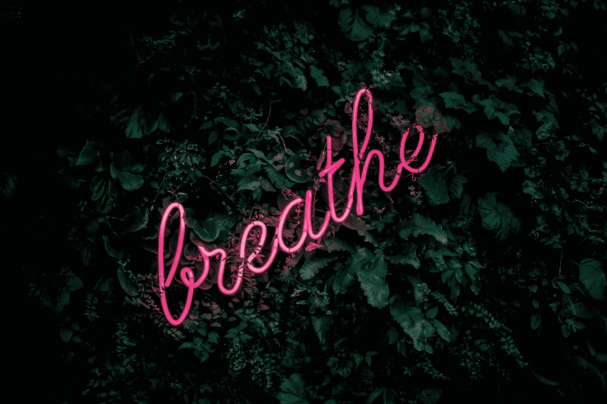

# 深呼吸

> 原文：<https://medium.com/swlh/just-breathe-dd46db3e31e2>

## 演讲中自信和控制的诀窍

Photo by [Fabian Møller](https://unsplash.com/photos/gI7zgb80QWY?utm_source=unsplash&utm_medium=referral&utm_content=creditCopyText) on [Unsplash](https://unsplash.com/search/photos/breathe?utm_source=unsplash&utm_medium=referral&utm_content=creditCopyText)

## 呼吸是自然的，对吗？

当你做报告或演讲时，你会呼吸困难吗？如果你这样做，你肯定不是一个人。公开演讲是世界上最常见的恐惧之一，当这些神经紧张时，呼吸似乎是第一个出问题的。