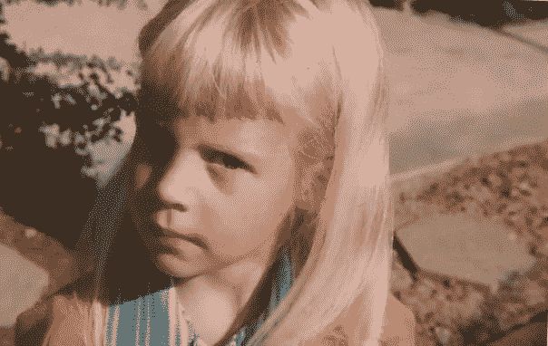

# 只是不要叫我苏西

> 原文：<https://medium.com/swlh/just-dont-call-me-suzie-cb79c7edb622>

## 不能透露姓名的人。

My reaction when someone calls me “Susan”

"他们怎么称呼你并不重要，重要的是你要回答什么。"厕所场地

我的出生证明上写着我的法定姓名是苏珊·布伦达·马丁森。这份出生证明列出了我母亲的地址，但没有列出我父亲的地址(因为在 1968 年，爸爸妈妈被认为是住在一起的)，而且只有一个框用于填写父亲的职业(因为在 1968 年，要列出…