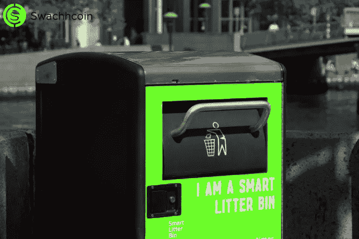

# 你的智能垃圾桶到底有多智能？

> 原文：<https://medium.com/swlh/just-how-smart-are-your-smart-bins-ab40ce74813b>

到目前为止，垃圾收集人员不得不检查每一个垃圾桶，而不知道它们的填充水平。如果不知道哪些垃圾箱是满的和空的，收集垃圾的任务就会变得不必要的漫长和乏味。随着智能垃圾箱的出现，灌装量将实时传达，收集垃圾和优化收集路线的最佳时间将通过对所提供数据的分析来确定。

## 标准智能垃圾桶模型的工作原理如下:

*对于距离传感器，输入垃圾箱的高度有助于计算垃圾箱中垃圾的百分比。然后将距离或超声波传感器安装在箱盖的内部。随着垃圾高度的增加，垃圾和传感器之间的距离同时减小。该实时信息被发送到传感器的微控制器。*

*微控制器处理垃圾箱产生的信息，并将其转化为数据。这些数据随后会通过 Wi-Fi 发送到一个应用程序。该应用程序向收集卡车司机或办公室管理人员直观地显示数据。*

*除了感应垃圾桶内的垃圾量，该应用还能预测垃圾桶装满的时间，并提供优化的替代路线、理想的垃圾桶尺寸建议和其他方法来改善这一过程。*

整个过程将指示需要立即关注的垃圾箱，这优化了垃圾收集。

*传感器还可以注意到突然的移动或晃动，从而自动激活恶意破坏警报。它们还能感应到垃圾箱温度的突然上升，从而触发火警。*

*配有太阳能电池板的智能垃圾箱收集来自太阳的能量，并使用传感器压缩沉积的废物，从而在此过程中增加垃圾箱的容量。*

*一些智能垃圾箱还配备了便于分类回收的技术。其中一些智能回收站扫描要处理的产品上的条形码，并告诉您处理它的合适垃圾桶。其他人有摄像头和传感器，一旦被丢弃的物品进入垃圾箱，它们就会进行分析。物品被称重，液体(如果存在)被排出。软件决定该物品是用于垃圾填埋场还是回收厂，并将其发送到适当的垃圾箱。现在“什么进入哪里”的问题已经得到了回答，因为你不再需要绞尽脑汁来整理你的材料；当你的垃圾桶为你做的时候就不会了。*

## 智能垃圾箱有很多优点，包括

*   二氧化碳和其他排放气体水平较低，这是因为减少了收集访问带来的交通流量减少。
*   智能垃圾箱已经标准化，可以使用现有的旧设备清空。
*   智能垃圾箱改善并提高了回收利用率。
*   随着智能垃圾箱的出现，我们再也不用担心灰尘溢出到街上了。

如果你不想错过以象征性价格购买 SCX 的最后机会，那么请访问 www.swachhcoin.com/sale

## 在此加入我们的社区:

[Official Telegram Discussion Group](https://t.me/swachhcoin)

[Twitter Channel](https://twitter.com/@swachhcoin)

[Facebook FanPage](https://www.facebook.com/swachhcoinofficial/)

[Swachhcoin Subreddit](https://www.reddit.com/r/swachhcoin/)

## 这篇文章发表在[《创业](https://medium.com/swlh)》上，这是 Medium 最大的创业刊物，有+419，678 人关注。

## 订阅接收[我们的头条新闻](http://growthsupply.com/the-startup-newsletter/)。

