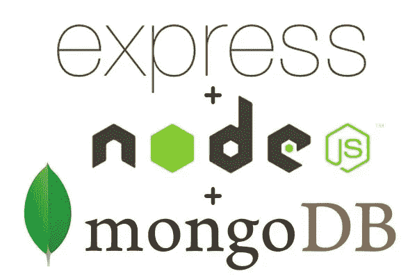

# NodeJs/Express 和 MongoDB REST APIs 中的 JWT 身份验证和授权(2019)

> 原文：<https://medium.com/swlh/jwt-authentication-authorization-in-nodejs-express-mongodb-rest-apis-2019-ad14ec818122>

在这个简单的教程中，我们将创建一个简单的 REST API，使我们能够创建一个用户，登录注册用户，获取用户配置文件，从一个设备注销一个用户，以及从多个设备注销一个用户。我们将使用`Node.js/Express`和`MongoDB`。我们将使用`[MongoDB Atlas](https://www.mongodb.com/cloud/atlas)`，一个托管 MongoDB 数据库的云数据库服务…