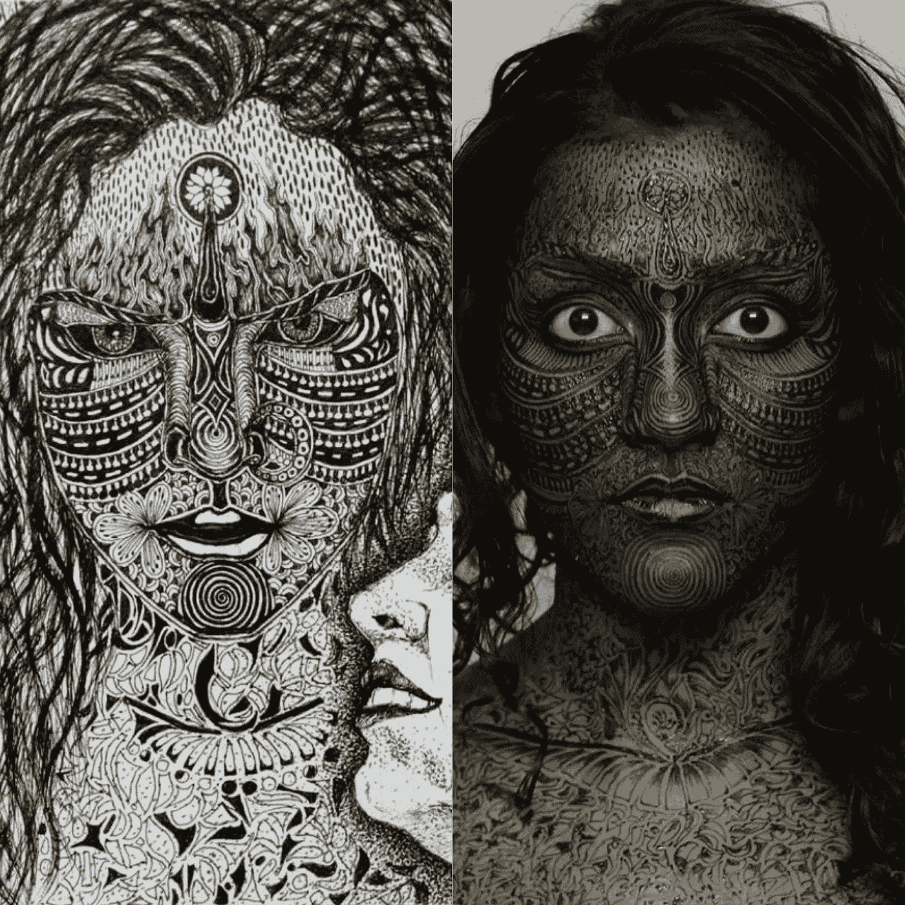

# 卡利——黑暗之王

> 原文：<https://medium.com/swlh/kali-the-dark-one-bd57d5d7c623>

我偶然遇到一位艺术家，她给我看了一幅她根据自己的想象画的素描，看起来很像我。这幅素描是她对卡莉女神的诠释。巧合的是，“kali”(未资本化，一个贬义词，意思是黑皮肤)也是用来嘲笑我黑皮肤的词。这种同步性改变了我的生活，让我走上了与色彩主义作斗争的道路。

Kali — The Dark One