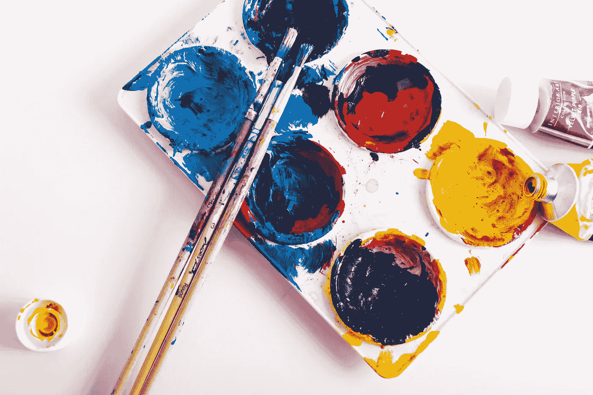

# 要么坚持下去，要么放弃:不要放任自流

> 原文：<https://medium.com/swlh/keep-it-up-or-give-it-up-dont-let-things-slide-35a017e65069>

## 我们在欺骗自己，是时候有目的地行动了

Photo by [Steve Johnson](https://unsplash.com/@steve_j?utm_source=unsplash&utm_medium=referral&utm_content=creditCopyText) on [Unsplash](https://unsplash.com/search/photos/hobby?utm_source=unsplash&utm_medium=referral&utm_content=creditCopyText)

你是否在脑海中列出了你已经开始但尚未完成的事情？你有一套多年没做过的爱好吗？你是否开始学习一门语言，但不知何故已经几个月没有学习了？几年？