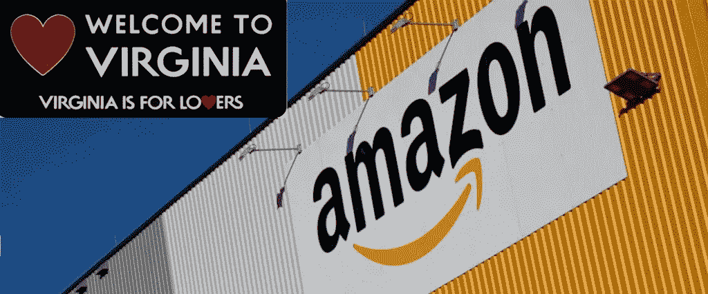
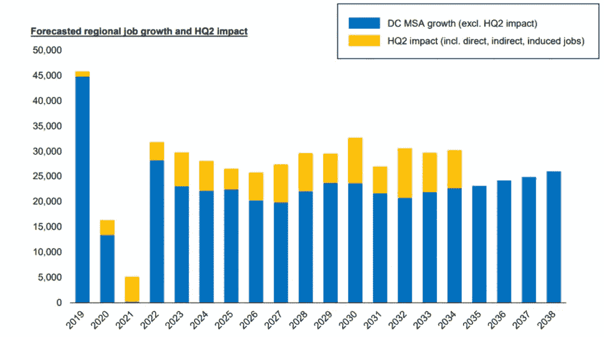
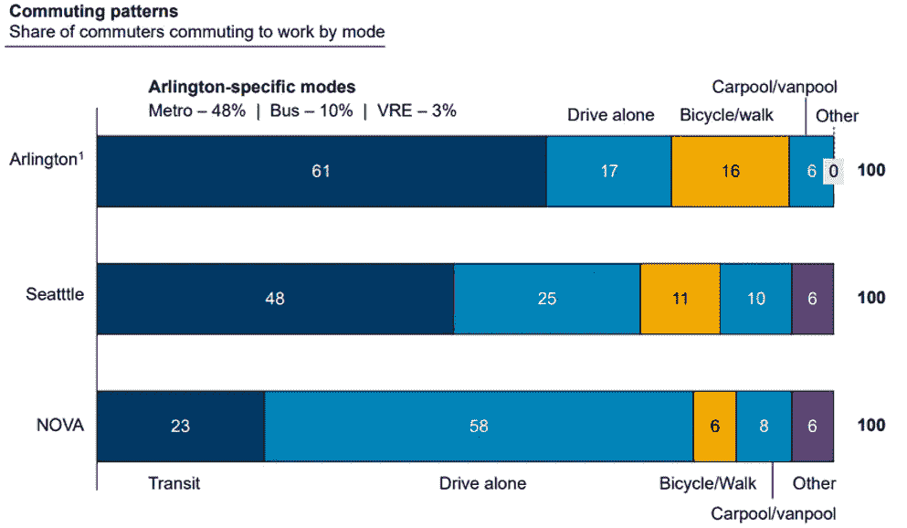
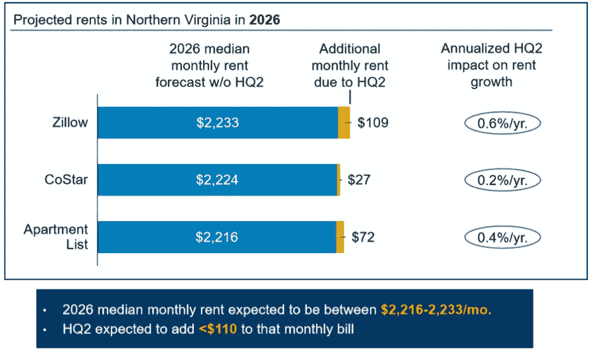

# 对弗吉尼亚的亚马逊保持“冷静”

> 原文：<https://medium.com/swlh/keeping-a-cool-head-about-amazon-in-virginia-140c95e40677>

经过漫长而高调的讨伐，亚马逊选择将第二总部(HQ2)拆分为纽约市皇后区的长岛市和弗吉尼亚州阿灵顿的水晶城(更名为“国家着陆”)。总部位于西雅图的亚马逊可以获得超过 20 亿美元的税收减免和其他激励措施，作为开设两个新办公室的交易的一部分，每个办公室都有超过 25，000 个新工作岗位。作为美国历史上最大的经济发展投资之一，这对于弗吉尼亚州来说是一笔惊人的交易——承诺在 20 年内投资 25 亿美元，净税收 32 亿美元，外加数千个平均工资为 15 万美元的工作岗位。然而，许多人预测这将对地区经济、住房市场和基础设施产生巨大影响(包括正面和负面影响)。亚马逊对联邦和华盛顿地区的影响可能不像许多人预测的那样巨大，这有多种原因。

*详情*

首先，让我们更仔细地看看细节，看看为什么弗吉尼亚获得了一笔相对不可思议的交易。弗吉尼亚州正在为亚马逊提供 5.73 亿美元的基于绩效的直接激励措施，这些激励措施基于平均工资超过 15 万美元的 25，000 个就业岗位。虽然这是相当可观的，但亚马逊获得的所有激励都取决于未来几年的就业创造。弗吉尼亚设计了这笔交易，以确保它对州预算有积极的现金流。弗吉尼亚在五年后支付第一笔奖金——在亚马逊开始雇佣员工并产生税收收入很久之后。相比之下，纽约州提供的[几乎是弗吉尼亚州提供的三倍](https://theweek.com/speedreads/807539/why-did-new-york-offer-amazon-3-times-tax-breaks-virginia-did)——15.25 亿美元——用于投资新工作岗位的类似承诺。这仍然只是其他州未能成功提供的一小部分——马里兰州和新泽西州分别提供了 85 亿美元和 70 亿美元。

为什么是弗吉尼亚？弗吉尼亚的大部分宣传不是通过拨款或税收抵免的方式，而是通过承诺对基础设施和教育的投资，即使亚马逊明天消失了，这些投资仍将存在。弗吉尼亚州将在交通项目上花费高达 2.95 亿美元，包括地铁系统的升级和从水晶城到国家机场的连接桥。弗吉尼亚州还宣布在 20 年内花费 11 亿美元扩大该州社区学院和大学的技术教育，以配合其激励协议。这包括建设一个近 10 亿美元的弗吉尼亚理工大学研究生院，专注于创新，将建在亚马逊新总部附近，每年将提供数百名合格的高科技工人。这些投资中有许多已经在进行中，或者政府承诺在有亚马逊参与或没有亚马逊参与的情况下使其成为 T2。

现有人才和弗吉尼亚愿意投资未来人才是亚马逊选择阿灵顿的最重要驱动因素。弗吉尼亚州[和亚马逊都表示](https://www.washingtonpost.com/local/a-phone-call-at-wendys-meant-half-of-amazon-hq2-and-an-economic-triumph-for-virginia/2018/11/14/05ece20c-e847-11e8-bbdb-72fdbf9d4fed_story.html?utm_term=.e52342d1d79f)让阿灵顿成为总部所在地的理想条件在协议之前就已经具备:受过高等教育的劳动力、多元化的人口、充满活力的城市生活以及良好的公共交通。这些因素都可能吸引年轻、高端的科技专业人士，他们是亚马逊最宝贵的资源。换句话说，比起阿灵顿需要亚马逊，亚马逊更需要阿灵顿。

**无需夸大影响:**

*经济影响*

亚马逊进入地区和国家经济可能值得注意，但它的直接影响相对来说微不足道。根据一份[谅解备忘录](https://www.scribd.com/document/393134588/Amazon-and-Virginia-Memorandum-of-Understanding#from_embed)，亚马逊预计 2019 年雇佣 400 人，2020 年雇佣 1180 人。到 2030 年，它预计将至少创造 25，000 个工作岗位，到 2034 年可能总共创造 37，850 个工作岗位，这相当于华盛顿大都会地区所有工作岗位的约四分之三个百分点。根据美国[劳工统计局的数据，近年来，华盛顿州每年增加约 5 万个工作岗位，相当于两个亚马逊人。亚马逊的逐步招聘确保了华盛顿地区的劳动力市场不会受到大的冲击。](https://www.bls.gov/regions/mid-atlantic/news-release/areaemployment_washingtondc.htm)

*资料来源:VEDP 分析，穆迪分析*

无论亚马逊是否进入，该地区都将继续增长。根据华盛顿大都会政府委员会的预测，到 2045 年，预计将有 150 万人搬到这个地区，这一估计远在亚马逊的搜索开始之前就有了。此外，阿灵顿已经拥有美国最具科技才华的员工队伍之一，亚马逊的许多新员工将从这个人才库中招聘，而不是从该地区以外招聘。随着时间的推移，HQ2 仍有可能加剧人口增长，但增长的渐进性质和预先通知将理想地允许额外的基础设施投资以减轻不利影响。

*基础设施影响*

不可否认的是，在水晶城(又名国定)这样一个很小的区域，增加这么一个有几千名工人的大公司，会造成一些交通上的头疼。然而，不管亚马逊如何，这些社区和整个地区都可能会在这个问题上挣扎。

该州、阿灵顿县和亚历山大市将花费数亿美元建设该地区的交通基础设施。这些改进中的许多已经包含在长期计划中，现在服务于亚马逊的需求，也有利于阿灵顿社区。亚马逊的交易也可能成为加速项目完成的催化剂。与亚马逊吸引的校园和劳动力类型相一致，阿灵顿预计 77%的亚马逊员工将步行、骑自行车、拼车或乘坐公共交通工具上班。由于这些预期的通勤模式，距离阿灵顿较远的通勤交通可能不会相对增加，因为基础设施改善不是交易的一部分。

*资料来源:VEDP 分析，西雅图(2017 年中心城市通勤方式拆分调查结果)；NOVA 包括赫恩登、麦克奈尔、亚历山大和阿灵顿(ACS，2012–2016)；阿灵顿的估计来自县规划*

*住房冲击*

多年来，北弗吉尼亚地区一直受到住房供应不足、价格快速上涨和市场竞争激烈的困扰。今年 10 月，阿灵顿的中值房价达到了 542，500 美元。有确凿的证据表明，亚马逊的到来只会加剧许多中低收入居民的住房负担能力挑战。虽然高薪技术工人的涌入肯定会对房地产市场产生一些影响，但亚马逊的影响将是渐进的，需要一段时间，而不是立竿见影的。

然而，随着人们对这个地区越来越熟悉，预计马上会发生的一个变化是租房的增加。大约一年后，可能会有更大的购房需求和持续上涨的价格压力。弗吉尼亚州经济发展合作组织(VEDP)预计，2026 年的平均月租金将在 2216 美元到 2233 美元之间。亚马逊预计每月将增加不到 110 美元。[当地官员报告称](https://wtop.com/real-estate/2018/11/alexandria-city-leaders-say-amazon-wont-quash-affordable-housing/)该地区的房屋租赁市场可能会出现 4%至 6%的短期增长——与近年来的情况类似。

*资料来源:VEDP 分析，Zillow，公寓名单，主演*

其他人间接提到了亚马逊和其他科技公司对西雅图的极端住房影响，并担心新总部所在的社区会遭受类似的影响。然而，华盛顿地区的住房市场要大得多，也很强劲，而且正在迅速扩张，即使没有亚马逊，预计房地产价值也会上涨——这与西雅图的情况不同。

在亚马逊宣布之前，缺乏负担得起的住房是一个存在的问题，阿灵顿和亚历山大在过去已经将负担得起的住房和劳动力住房作为优先事项。亚马逊的扩张可能会成为持续投资的催化剂。例如，这两个地方已经承诺将亚马逊的一部分新收入分配给经济适用房项目——足以支持 1000 多套经济适用房的开发。

地方政府可以采取的另一个有助于缓解未来十年预期价格上涨的措施是允许在某些走廊进行更密集的开发。导致该地区房价如此昂贵的原因之一是，人们反对在某些关键地区建设更多住房的分区和法令修改。

*结论*

亚马逊选择其第二总部突显了北弗吉尼亚不仅是联邦政府的附属品，还是技术之都。

在选择如此大型、发达的大都市地区时，该公司最终选择了可以轻松吸收亚马逊的地方，而不是亚马逊可以改造或振兴的地方。弗吉尼亚正在获得一项现金流积极的交易，包括高薪工作、新的税收以及作为技术资本的新品牌。这种求爱也引发了对高等教育和交通改善的大量投资，无论亚马逊的总部是否在那里，这些投资都将为社区提供良好的服务。亚马逊做了一个很好的商业决策，弗吉尼亚得到了一笔好交易。

