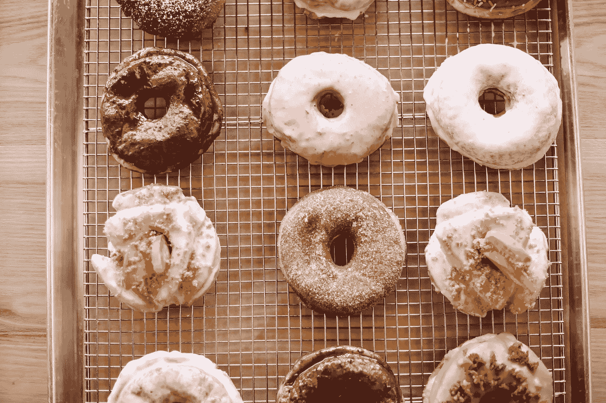

# 保留我的选择

> 原文：<https://medium.com/swlh/keeping-my-options-open-1b80ff8c0e73>

## 不要让决策瘫痪成为你的人质。

Photo by [Jessica Henderson](https://unsplash.com/@jesshenderson?utm_source=unsplash&utm_medium=referral&utm_content=creditCopyText) on [Unsplash](https://unsplash.com/search/photos/sweet-treats?utm_source=unsplash&utm_medium=referral&utm_content=creditCopyText)

## **让我给你呈现两个场景:**

*场景 1:你走向一个蛋糕摊，在你面前有三个选择:维多利亚海绵蛋糕、巧克力蛋糕或咖啡和核桃。*

*场景 2:你走向一个蛋糕摊，这次你面前有 20 多种选择* …