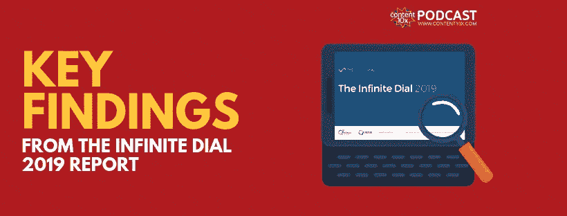

# 无限拨号 2019 报告的主要发现

> 原文：<https://medium.com/swlh/key-findings-from-the-infinite-dial-2019-report-baba60bb088f>

我们可以通过查看爱迪生研究公司和 Triton Digital 的 [Infinite Dial 2019 报告揭示的数据，了解社交媒体上的当前趋势和用户行为。](https://www.edisonresearch.com/wp-content/uploads/2019/03/Infinite-Dial-2019-PDF-1.pdf)

在播客的第 84 集，[“播客再利用从未如此重要，](https://www.content10x.com/podcast-repurposing-has-never-been-more-important/)”我分享了来自 Edison Research 的播客《2019 年消费者报告》的见解。我们深入研究了这份报告，披露了许多…