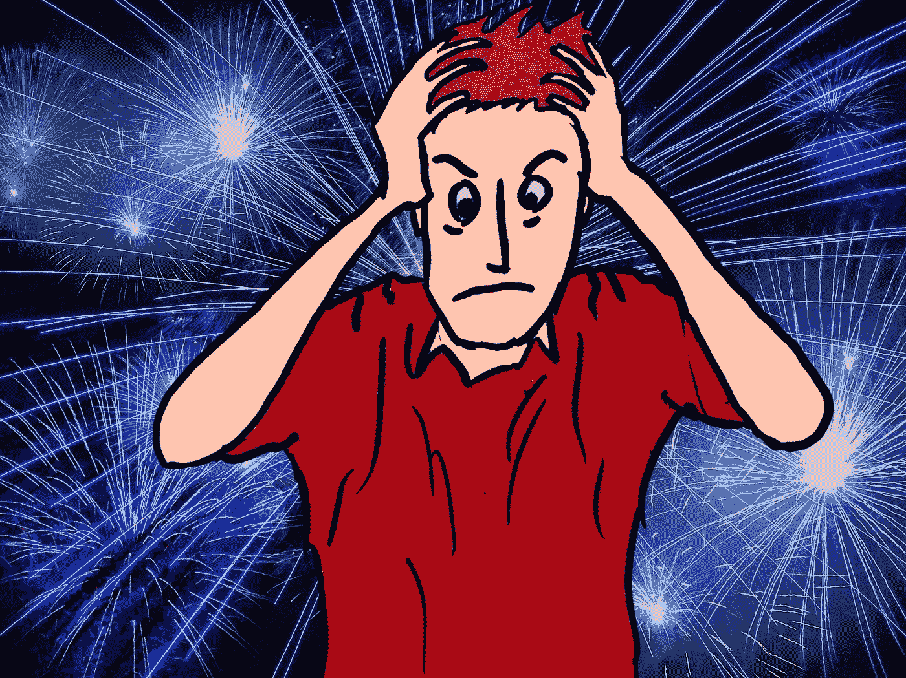

# 取消“我什么都没做！”负罪感

> 原文：<https://medium.com/swlh/kill-the-i-got-nothing-done-guilt-trip-65673e5c13da>

## 不要让目标设定给你的灵魂留下创伤

Background Image Pixabay, Illustration Rich Fink

如果你读过任何关于在生活中获得成功的书，你就会知道设定目标是成功的一部分。但这有点像酒。晚餐时喝一杯可能对你的心脏有好处，但一口气喝两三瓶确实是个问题。

> “每年新年前夕，我都会列出 100 个目标…