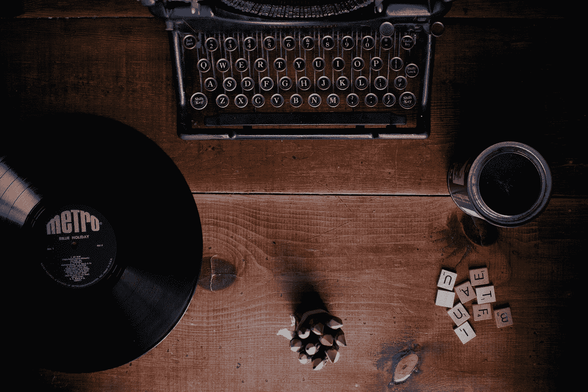

# 扼杀创造力

> 原文：<https://medium.com/swlh/killing-creativity-facd7268bd1e>

Photo by [Camille Orgel](https://unsplash.com/@cam_bam?utm_source=medium&utm_medium=referral) on [Unsplash](https://unsplash.com?utm_source=medium&utm_medium=referral)

当我在三年级的时候，我为我的班级做一个小组项目。我想是为了社会研究，或者科学。我们被要求绘制一幅国家地图，并用图例画出不同的符号来代表你在那个国家会看到的不同事物。我们标注了陆地的类型、地理位置和你可能在不同地区发现的动物种类。我发明了一种动物——一种鸟——并把它放到了地图上。我一直是个有创造力的孩子，所以这很正常。我也在报告中写了我的“M-birds”。这是一篇优秀的创意文章(我现在还保留着)。我的团队因为我的创造力而被扣分，班里的其他同学都取笑我。

我感到羞愧，开始试图隐藏自己的创造力，而不是与他人分享。我不再分享我的故事和我想写的书。当我们被要求“发明”一些东西时，我不再尝试做创造性的事情。当其他人看我的作品时，我很尴尬。我觉得用不同于同学的方式思考是一件坏事。

将近 30 年过去了，我仍然有着同样的感受。我试着写，但是我担心其他人会不喜欢。我开始写小说，并在完成一半时停下来。我觉得他们永远都不够好，何必呢？我从事了将近十年的创造性职业，但为了朝九晚五的舒适工作，我离开了那份工作。我继续阅读和写作，但我努力与他人分享。我已经开始探索这种感觉，我明白了一件事:社会在扼杀创造力。

> 社会正在扼杀创造力。

# 扼杀学校的创造力

K-12 教育的重点已经转移。教师被允许教授的内容是有限的。大多数学校希望教师关注标准化课程，确保学生达到基准。这些基准通过标准化测试进行评估。我们的教育体系已经变成了快餐教育。

教师不会因为鼓励创造性思维和创造性活动而得到奖励。家长、学校管理者和政治家越来越关心考试分数、毕业率和大学录取率(以及学生被哪些大学录取)。他们向高中生推广 IB 和 AP 课程以及双招生大学课程。我们要求孩子尽善尽美，但我们不鼓励他们以创造性的方式学习和探索。

有创造力的孩子经常受到羞辱或惩罚。我们希望孩子们表现得像商人或未来的首席执行官，但我们不鼓励他们追求创造性的努力。我知道——我是两个青少年的父母。很长一段时间，我告诉我的女儿不要追求艺术。我告诉她，她永远无法在经济上养活自己，这些活动作为一种爱好更好。我错了。

# 寻找创造力

这份朝九晚五的新工作几个月后，我意识到自己并不快乐。我开始探索旧的兴趣。我开始阅读更多的小说(这是我在之前的工作中从来没有时间去做的事情)，我重新开始尝试我的写作。我意识到我小时候喜欢做的事情才是我人生真正想要的。挑战:我对自己的创造能力失去了信心。我发现自己在问:这有什么好处吗？我不断质疑别人是否会读我写的东西。

我意识到我需要重新发现我创造性的一面。我的第一个解决办法是购买关于这门手艺的书籍。我读了超过 15 本关于写作技巧和策略的书。我读了关于如何概述一部小说和计划我的写作，我读了关于性格发展，我读了关于世界建设。我读过的每本书都有一个公式，可以让你的作品对出版商“有吸引力”。为我们的快餐教育写快餐。

通过阅读所有这些书，我意识到一件事。我不想根据让出版商愿意出版我的书的公式来写作。我绝对不想再写那本之前已经写了几百遍稍微改动的单调的书了。我渴望成为那种人们会记住几个世纪的作家。

我意识到我真正需要的是练习写作，找回自信。也许我写的第一批东西不会很好，但它们会让我试水，找到我的风格。

# 大学中的创造力

我们在 K-12 培养出千篇一律的孩子，但是一旦他们上了大学会发生什么呢？大学已经变成了高中的延伸。当我还是一名大学教授时，我观察到许多令人担忧的事情。我的许多同事只根据 2-3 道选择题来评估学生的表现。他们没有布置任何写作、论文或论文(太多了，无法评分)。他们期望学生阅读淡化内容的教科书。他们经常用教科书出版商提供的幻灯片来讲课。有时测试问题也是由出版商提供的。

其他教授希望学生被他们说的每一句话迷住。他们认为自己是知识的持有者，他们认为自己的学生非常幸运，甚至有机会和他们在一起。这些教授经常抱怨为什么他们的学生从不去上课。

然后还有其他教授。这些人被指责在教学上花费了太多的时间和精力。我有一个这样的教授。我仍然认为他是一个天才(我尽可能经常和他交谈)。他会走进教室，我们会作为一个小组进行对话。我们会讨论和辩论我们正在阅读的内容。我们会思考这些东西如何转化为实践经验。他挑战我们跳出框框思考。他布置了远远超出课堂内容的阅读材料。这一开始让学生们很困惑，但是到了学期末，一切都明白了。有联系。他过去是(现在也是)一名警务学者——我们经常谈论詹姆斯·乔伊丝、阿兰·罗布·格里耶和马赛尔·普鲁斯特等作家。我们讨论了海明威的作品。它总是与我的研究主题联系在一起，但往往是以意想不到的方式。他在我心中仍然占有一个珍贵的位置。

不幸的是，大多数大学教授只是急于给学生打分，让他们下课。他们争分夺秒到学期结束，为下一学期做准备。他们互相抱怨他们的学生。这给大学教育带来了不幸的影响，也挫伤了创造力。

> 当大学生被教导要记住书上的内容、教授在讲座上讲的内容和幻灯片上的内容时，我们怎么能指望他们有创新精神和创造能力呢？

当大学生被教导要记住书上的内容、教授在讲座上讲的内容和幻灯片上的内容时，我们怎么能指望他们有创新精神和创造能力呢？创新和创造性思维得不到回报。事实上，他们经常受到惩罚。教授们教导他们的学生创新和创造，即使这意味着失败，也经常受到惩罚。本科阶段尤其如此。有两个关键问题:对失败的恐惧，以及自我欺骗综合症的挑战。

# 害怕失败

创造力面临的最大威胁之一是对失败的普遍恐惧。我们从小就训练孩子害怕失败。这种恐惧会持续到成年。教人们害怕失败有一个问题——它阻碍了创造力。

创造力在失败中茁壮成长。我们许多最重要的发现都是失败的结果。失败的实验。失败的作业。在人生的某个阶段失败的人通常会从失败中吸取教训，这让他们成长。失败让我们成为我们应该成为的人。

> 创造力在失败中茁壮成长。

我最后一个学期的教学，我和我的学生谈论失败。我鼓励他们拥抱失败，从失败中学习——但永远不要害怕失败。这是我自己还在努力学习的一课。我想那学期我从学生身上学到的比他们从我身上学到的还要多。

失败是创造力的一个重要方面。画画？你必须尝试一些新的和创新的东西。最初的几幅画可能很糟糕，但它们让画家学习技巧，最终创作出一幅杰作。写一本书、短篇小说、文章或散文？前几个通常是糟糕的失败，但它们让作者学习写作技巧，找到自己的写作风格。学习演奏一种乐器？你必须犯一些细微的错误，才能找到产生美妙声音的技巧。关键是你必须进行实验——测试新方法，找到有效的方法。

# 自我冒充综合征

我最近观察到的另一个对创造力的威胁是自我和冒名顶替综合症的结合。这些人外表自我膨胀，但内心总是担心别人会意识到他们不属于这里。这些人担心他们不够好，最终其他人会意识到这一点，排斥或羞辱他们。为了弥补，他们花时间吹嘘或试图过分强调他们擅长的事情。它们就像孔雀在作秀，同时希望你不会看到受损的羽毛。

这些人在自我展示上投入了太多的精力，以至于他们忘记了思考、创造和创新。他们也不再听别人说话。我们可以建立创造力的最重要的方式之一是与他人联系。

# 寻找创造性的联系

在试图重新发现我创造性的一面时，我学到了一件重要的事情:创造性的联系是必不可少的。当我可以的时候，我会努力去联系那些激励我的创意人员。当我可以的时候，我会试着和其他作家交谈(不管他们是学术作家还是其他类型——有时我更喜欢非学术作家)。我在网上和作家联系——他们和我面临着同样的创作困境。我试着去参加芭蕾舞、歌剧、戏剧、交响乐以及其他能激发我更多创造性想象力的活动。

本质上，我正试图重新找到我的创作根源。最好的方法之一就是和其他创意人员交流。他们是如何走出创作的窠臼的？我发现许多其他人已经进入了创造性的深渊。好消息是，他们中的大多数人似乎已经找到了出路，而且往往有更多的想法。

# 正在阅读…

我也转向了多读书。我年轻的时候总是带着一本书。我一直在阅读。我又开始拥抱对阅读的热爱了。

我从多读书中学到的一个重要教训是，我需要拓展我的视野。很多年来，我只阅读与我所写的主题相关的东西。我没有阅读各种类型的书籍，而是专注于一个狭窄领域的一个狭窄子集。这限制了我的创造力。

通过阅读培养创造力的最好方法之一是跨体裁阅读。阅读你通常不会感兴趣的东西。令人惊讶的是，人类的大脑会在逻辑上不应该以任何方式连接的主题之间找到不寻常但有意义的联系。最近几周，我读了托尔金的传记，弗吉尼亚·伍尔夫的一篇文章，开始了一个关于英国历史的历史丛书，一本关于管理的书，几本小说，最近开始读法语版的《哈利·波特》。我发现托尔金和弗吉尼亚·伍尔夫之间的联系根植于我对英国历史的了解中。我正在寻找我的小说和管理技术之间的联系。我阅读的多样性使我能够进行创造性的联系，否则我不会观察到这种联系。

# 唤醒我们有创造力的自我

我们必须找到一种方法来重振我们的创造性灵魂。在寻找一个被三年级老师像踩死一只虫子一样的有创造力的孩子的过程中，我学到了很多。在反思同龄人的压力如何影响我看待自己的方式时，我也学到了很多。在别人让我自我感觉不好的情况下，我会试着后退一步，弄清楚这是对我的准确描述，还是更多地反映了那个人是谁。很多时候，不是我——或者不完全是。

重新唤醒你的创造力并不总是一个愉快的过程。这需要一点反思和自我意识。这有时会让人不舒服，但目的地绝对值得一走。当我努力拥抱我的创造力时，我再次找到了我的声音。这对我的心理健康、我对待他人的方式以及我现在享受生活的程度都产生了显著的影响。我认为现在是我们重新审视我们的社会对待创造力的方式的时候了——从出生到死亡。