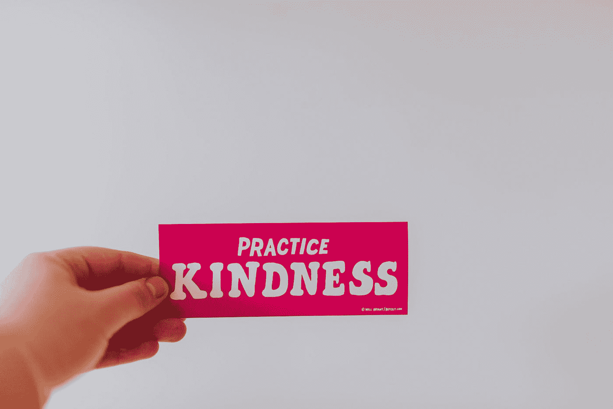

# 善良被观察和内化

> 原文：<https://medium.com/swlh/kindness-observed-and-internalized-50b833d98255>

Photo by [Sandrachile .](https://unsplash.com/@sandrachile?utm_source=medium&utm_medium=referral) on [Unsplash](https://unsplash.com?utm_source=medium&utm_medium=referral)

## 给人类同胞带来欢乐并不需要太多。小小的惊喜、善意的手势和微笑让日子更明亮，心情更轻松。

# 我见证仁慈的经历

在过去的一周里，作为一名观察者，我认真地关注着我周围发生的事情。我…