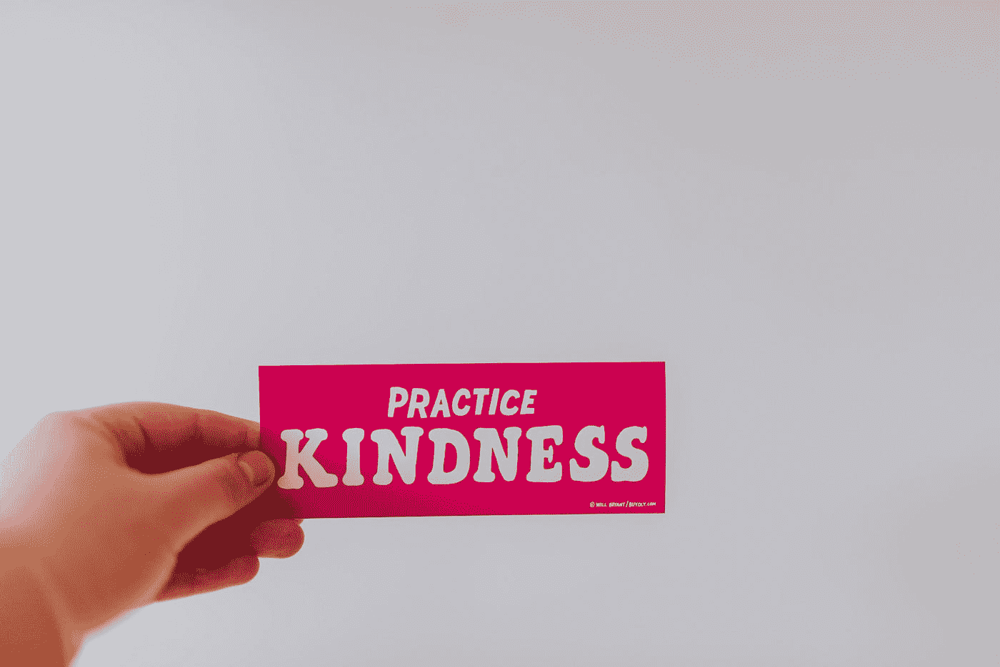

# 没有正义的善良？当前位置令人不安的是，在面对不公正时，善意被(错误地)用作保持中立的呼吁

> 原文：<https://medium.com/swlh/kindness-without-justice-efd66060d241>

*最近流行的对善良的关注是如何导致压迫的*

Photo by [Sandrachile .](https://unsplash.com/@sandrachile?utm_source=medium&utm_medium=referral) on [Unsplash](https://unsplash.com?utm_source=medium&utm_medium=referral)

不要误会我的意思，我喜欢现在我们文化中对#善良的关注。t 恤、网飞秀、博客、书籍、组织——每个人都想善良，选择善良，生活…