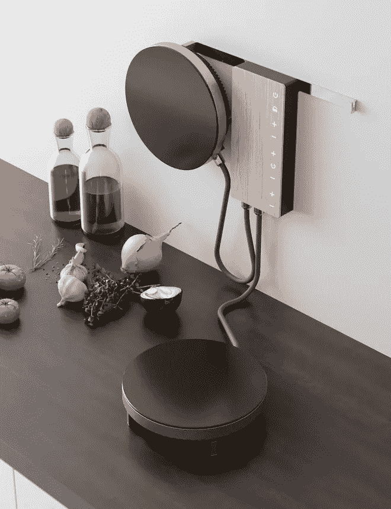
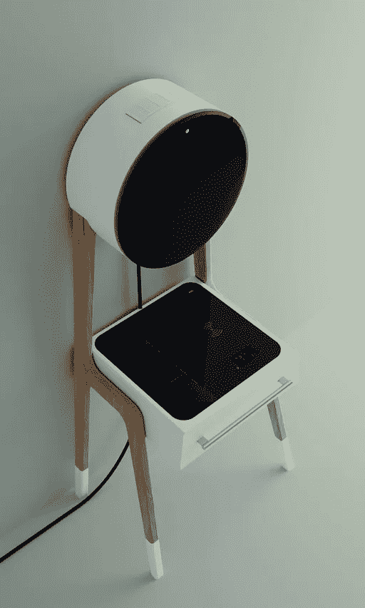

# 未来厨房的设计元素

> 原文：<https://medium.com/swlh/kitchens-of-the-future-32e084f97672>

Photo Courtesy: Adriano Design

空间正在缩小。曾经迷人的带围栏院子的 4 居室褐石房已经变成了玛丽·近藤(Marie Kondo)式的极简主义风格，占地 500 平方米。徒步天堂。我们有意地从我们的空间中移除多余和分散注意力的东西。我们希望创造有目的的空间，减少杂乱和物品。

技术和产品开发也朝着同一个方向发展。随着产品开发和发布的每一次迭代，我们都在不断努力，通过其功能和美观，做到事半功倍。

都灵的阿德里亚诺设计公司已经做到了这一点。他们为[法比达](https://www.fabita.it/index.html)开发了新产品概念，而且他们出现在了你最意想不到的地方:厨房。

Photo Courtesy: Adriano Design

对于一般的极简主义者来说，厨房往往是一个巨大的挑战。一个人怎么可能平衡实用性和审美呢？通过感应炉灶技术，Fabita 改变了传统炉灶僵化的定位，从而改变了我们对厨房的看法。

Adriano Design 放弃了在小空间内放置永久性炉灶的概念，取而代之的是在墙上安装了两个极简主义的火炉。用完燃烧器后，你可以把它挂在墙上，腾出空间。

[交互和体验设计中屡试不爽的原则](https://www.springboard.com/blog/ux-design-principles/)已被整合到加热和感应技术的早期设计流程中，最终彻底改造了厨房空间。

● [**少即是多。**](/1thing-design/less-is-really-more-simplifying-ux-pt-1-6de25ac3fdba) 少即是多的设计原则的目标是减少用户的操作或认知努力。通过简化体验中的交互和元素，设计的可用性得到了提高。

● [**可用性第一。**](https://www.interaction-design.org/literature/article/usability-a-part-of-the-user-experience) 由于 UX 的首要目标是通过解决用户的问题来提升体验，因此简单和支持性的体验比美观更重要——尽管法比塔在这两方面都做得非常好。

● [**使用常见的设计元素。**](https://www.webdesignerdepot.com/2018/05/7-ux-principles-for-creating-a-great-website/) 说到极简设计，产品的视觉美感应该是圆滑的，同时仍然允许用户与一个感觉熟悉的设计进行交互。不要重新发明新的 UI 模式。相反，使用常见的设计元素(+或-热量增加或减少)，看起来熟悉，促进可用性。

我们如何知道我们已经走上了解决用户问题和简化用户体验的正确道路？通过可用性测试让真实的人与设计互动。虽然 Adriano Design 发布的设计是概念性的，但他们让用户参与整个设计过程，以确保最终产品既实用又美观。

下图是阿德里亚诺设计的 Cucinotta。“一个简单的木质结构支撑着一个电磁炉顶部、一个抽屉(也可以是冰箱)和一个抽油烟机，它很容易运输和移动到任何地方，唯一的限制是一根谨慎的红色电源线。”

Photo Courtesy: Adriano Design

**我们走向未来**

法比达和阿德里亚诺设计公司的产品概念仍然只是，一个设计概念。Fabita 目前正在开发他们的生产设计，旨在 2019 年下半年发布极简主义电器系列。

一个接一个，工业正在被颠覆。从待客到叫出租车，我们这一代人正在改变前辈们树立的理想。随着我们每天回家的理想空间开始缩小，解决方案开始出现。Adriano Design 创造的产品的美学和用户体验可以随时满足厨房居住者的需求。