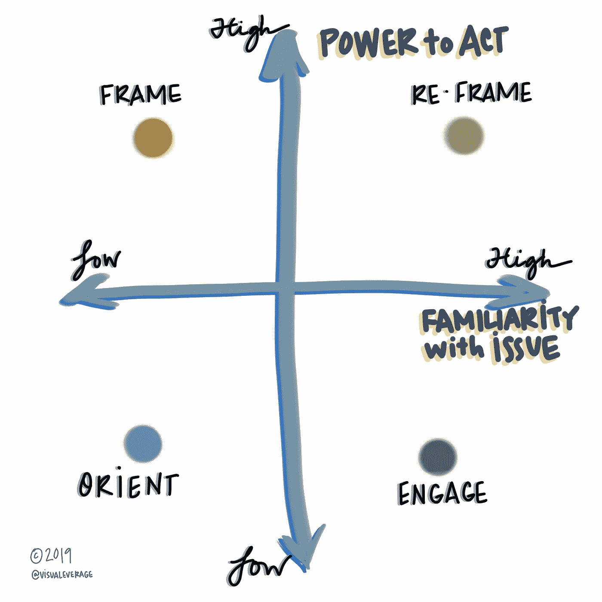
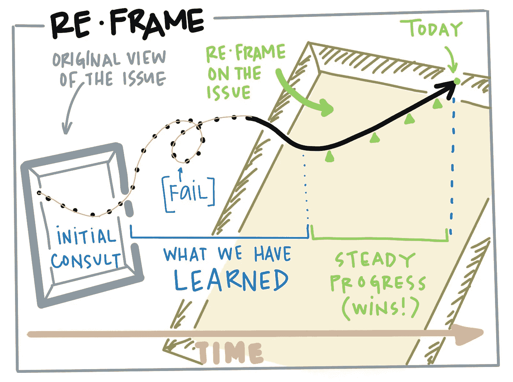

# 吸引你的观众

> 原文：<https://medium.com/swlh/know-your-audience-8eb7e05fac58>

## 帮助细分信息的视觉效果

当我在如何交流想法上挣扎太久时，这通常是一个迹象:我可能知道主题，但我还不知道观众。在交流变化时尤其如此。

在经历了太多耗时的猜谜游戏后，我开发了这个简单的矩阵来更有效地细分受众和信息。

根据成人学习理论，每个人都把重要的现有知识带到他们所学的东西中。换句话说，我们都有很多已经被装在相框里挂在墙上的脑海中的画面。好的沟通者尊重受众的价值观和现有框架:新的信息适合哪里？我怎样才能最好地补充现有的一系列“挂在墙上的图片”,而不会让人觉得我只是走进去重新排列它们？我是不是挂了一些根本不合适的东西？(如果你认为我听起来像是经历了惨痛的教训，那你就对了。)

在我的矩阵中，x 轴代表受众对该问题的总体熟悉程度。我的观众已经知道了多少？在*的所有*案例中，他们知道大量信息，但可能或多或少熟悉你正在交流的内容。每个人都通过价值观、文化模式和背景来看待你的信息。

“行动的力量”位于 y 轴。许多沟通策略的一个关键部分是“行动号召”但是如果你意识到你的听众没有采取行动的能力，那该怎么办呢？

免责声明:这些类别代表了一个简单的心智模型。“强大”和“较弱”显然代表了一种模糊、复杂的判断。通过明确这些假设，我们旨在设计我们的沟通方式，使平衡倾向于增加客户之间的自主权和代理权，或者倾向于我们组织中权力较小的人。

假设您在医疗行业工作，并且您正在支持一个新的工作流在一个提供者企业中的推广。不足为奇的是，每个象限都需要一种独特的信息传递方法，并且每个象限都描述了那些其兴趣对此次推广的成功至关重要的人。

在右上方坐着的是拥有明确职位权力的专家。假设你的观众是外科主席。她想要一个术后单位工作流程的更新。事实上，她负责启动你的程序。帮助 [**重新组织**](https://hbr.org/2009/04/leaders-frame-your-messages-fo) 关键信息很重要，这样她就可以拥有、支持和重复这些信息。关注早期的胜利、关键的经验教训和情况的变化，激发她支持这一计划的能力。与此同时，将此视为建立关系的机会，并欢迎她沿途的见解。

右下方的人对问题或环境非常熟悉，但似乎没有能力影响结果。

假设这是外科的一个周末单位文员。在这种情况下，检查你对权力的假设，更多地关注影响力！(如果你年纪够大，还记得 [M*A*S*H](https://www.newyorker.com/culture/culture-desk/what-mash-taught-us) 里的雷达·奥莱利，你就知道为什么了。)这些“高熟悉度、低权力”的观众可能会提供丰富的洞察力，他们通常会决定你的计划能否成功。

只要有可能，**就让**这些观众参与到信息的开发中。请他花一点时间来测试你的信息，并确保你的方法完全尊重他的观点。(比如，请他吃午饭。)你会学到很多。

左下方的人既不熟悉你的内容，也没有权力左右展示的结果。

假设这是一位新诊断患者的配偶，她感受到了新工作流程对流程等待时间的影响。或者甚至可能是一个刚刚找到自己立足点的新员工。信息传递应该温和地引导这个象限中的人，认识到他们可能会感受到一连串的情绪，并且可能会被信息淹没。

在这里，信使和信息一样重要。向信使——直接与你的观众互动的员工——提供及时的沟通培训、支持和指导是很好的。

左上角的人对这个问题不太熟悉，但是有很大的影响力。在这个象限中，您可能会发现跨部门的管理员、利用率审查人员，甚至慈善捐助者。(在政治领域，许多民选官员都属于这个象限。)

这里的消息传递采用 [**成帧**](https://www.prweek.com/article/1427827/why-framing-message-matters) 的形式。无论是简单还是快速，有效的框架都会随着时间的推移而产生回报，因为问题是否与该象限中人们的优先事项相匹配会对一个计划的成功与否产生重要影响。

根据你的目标，记住每个象限的人都可以为你的计划提供很多东西。将沟通视为建立关系(而不是单向努力)的一种手段，并将权力转移给那些可能感到无能为力的人，这将有助于你制定更有效的策略。