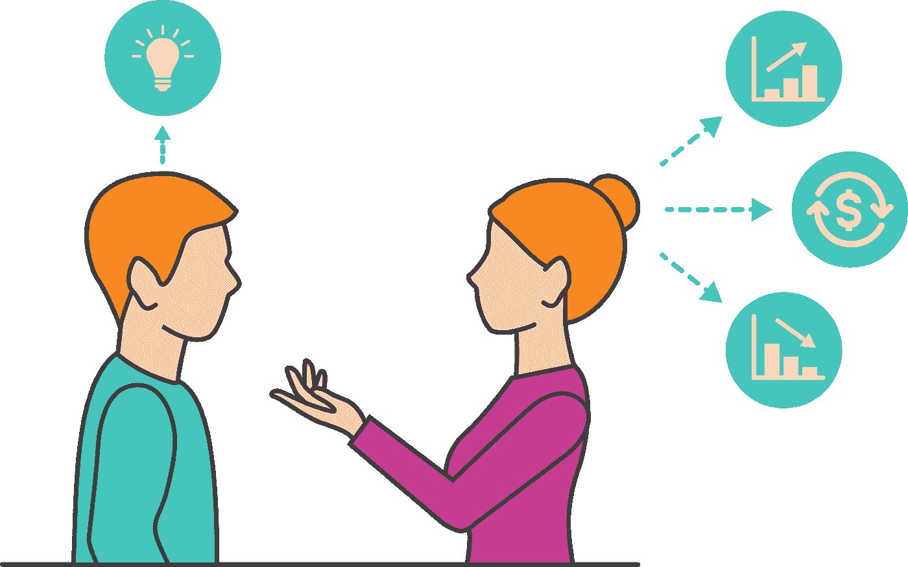

# 了解你的观众:框架的艺术

> 原文：<https://medium.com/swlh/know-your-audience-the-fine-art-of-framing-e6cde9529b7a>

> “框架偏见表明，某种东西的呈现方式(“框架”)会影响人们的选择。” —框架和框架理论

术语*框架*来自认知科学，它解释了人们基于选择呈现给他们的方式做出决定。当有人说“老虎”时，我们会自动想到像*大猫*、*牙齿*、*条纹*等东西。这些关联中的每一个都有次级关联。老虎的想法既令人兴奋又令人恐惧。

当有人告诉你他们有“一个伟大的新想法”时，你会想到什么？*投资机会*？*潜在财富*？*必然失败*？

如果你正在考虑向投资者寻求资金，以启动你的产品创意或让你的初创公司更上一层楼，了解你的受众将有助于你预测他们的处境。如果你的听众认为你的新想法是对他们未来或公司的投资，他们可能更倾向于相信你演讲中的数字。相反，如果一个“新想法”让人联想到风险、失败、成本或责任，他们会质疑你的事实和数据，不太可能相信它们。

当框架对齐时，你的听众会接受你的事实和数据，更有可能相信它们是准确的——增加你获得批准继续前进并达成交易的机会。

当谈到为投资者设计你的项目时，要记住的一个最基本的概念是*状态*。

地位是指一个人、一种产品或一家公司与做类似事情的其他人相比如何。知道如何运用和利用地位可以促进容易达成一致，或者引发嫉妒和沮丧，从而导致无法推销你的想法。学会围绕身份地位进行谈判，对于鼓励你的听众和推销你的想法至关重要。

如果你是在向投资者推销，那么很显然你是在试图展示财务回报将如何抵消财务风险。除此之外，通过描述投资将如何在除财务之外的其他方面获得回报，使你的想法与众不同。地位对投资者来说很重要。提高他们的影响力是获得资金的一个聪明的方法。事实上，它甚至比财务回报更重要。

在你面对投资者观众之前，做好你的研究。

## 了解他们喜欢什么样的投资。

硅谷的每个人都知道红杉资本这个名字，因为该公司资助了历史上一些最大的热门公司:苹果、谷歌、甲骨文、贝宝、YouTube、Instagram、英伟达、LinkedIn 和雅虎。红杉资本并不享受所有这些成功带来的自我膨胀；这样的成功有助于他们保持相关性，所以最好的想法首先出现在他们面前。你可能必须向投资者提供的东西之一是进入一个新的市场。你可能是帮助他们扩大投资组合和增加可信度的完美产品。

通过更好地了解你的听众，你会知道如何提高他们的地位，帮助他们在同龄人中建立更多的信任。如果你的演示能向他们展示一条改善他们地位的清晰道路，并解释他们将如何从与你的合作中获益，你就建立了可信度——这就产生了巨大的欲望。

## **向他人学习。**

在你做演示之前，最好去找那些已经向同样的观众演示过的人——特别是那些已经得到投资者资助的人。他们已经在这片水域航行过，显然留下了深刻的印象。他们是怎么做到的？

梦想成功的人喜欢谈论他们的方法。他们渴望分享他们的经历和故事。在你自己的演讲中引用这些故事，你会自动提升你的地位。通过理解他人的经历，你就为自己在类似情况下获得产品认可和资金做好了准备。当你在演讲中谈论你从别人那里学到的重要经验时，这显示了你的热情、承诺和一定程度的认真。

你通常可以在风投的网站上看到一系列吹嘘，但这类信息的另一个值得信赖的资源是 [Crunchbase](https://www.crunchbase.com/) ，它列出了哪些风投投资了哪些初创公司。

**现实一点。**

你可能对为什么你的产品比其他产品更好有一个清晰的概念，但是这种联系可能比你预期的更难让你的观众理解。当你制作演示文稿时，要时刻牢记你的特定受众。如果你将你的全新产品理念与一个成熟品牌进行比较，不要认为这是一个有用的比较。您还没有任何活跃用户；它们是一只价值 100 美元的 1B 独角兽。你的比较现实吗？还是你在伸手摘星？

## **建立信任。**

信任是随着时间的推移赢得的。如果你正在向你已经有固定工作关系的人寻求资助，你会有优势，因为你有机会发展一段值得信赖的关系。让我们换一种说法:如果你认为你可能会向你已经认识的人寻求资助，那么提前开始建立信任的基础。然后，当需要大笔资金或寻求项目批准时，你可以利用这种信任来达成交易。这种信任可以通过你在这个项目之外所做的任何其他工作来建立。当建立起信任关系时，你的听众会感觉更好，给你更多的回旋余地。

当然，你接触的投资者通常是你以前从未合作过，甚至没有见过面的人，所以你没有机会提前建立信任关系。如果你已经成功地将其他产品推向市场，或者是团队中的一员。包括那些吹嘘。它意味着信任和能力。

但是如果这是你有史以来的第一个产品，让潜在投资者信任你的最好办法是为你的羽翼未丰的产品拥有一个坚实的核心用户。这个“布丁中的证据”很能说明问题。

如果在演示过程中的任何一点，很明显一个人的框架与你自己的不同步，那么是时候立即放弃事实和数据，重新构建讨论或演示了。这可能是一个非常具有挑战性的过程，有时最好干脆中止任务，寻找新的观众。你将不得不努力尝试重新构建这一个可能不会是最好的利用你的时间。

**想继续下去吗？看过我们的书** [***有想法吗？如何将您的想法转化为人们想要使用的产品***](https://www.amazon.com/Got-Ideas-Turn-Products-People/dp/B07J5MRXZC/ref=sr_1_3?keywords=got+idea&qid=1551467768&s=gateway&sr=8-3-spell) **，它带领产品制作新手从他们的想象中创造出伟大的、用户友好的数字产品。有精装版、平装版、电子书和有声读物，这是一本为有抱负的企业家和内部企业家准备的实用手册。**