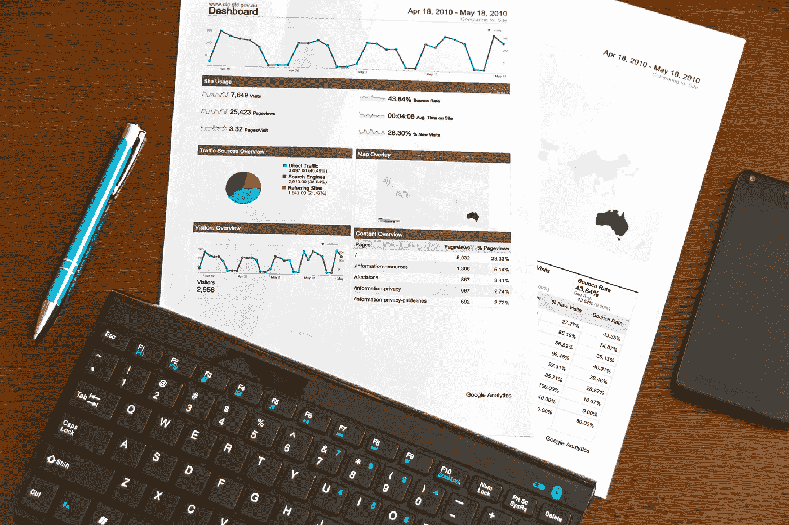

# 最后点击归因已经过时了——为什么营销人员还在使用它？

> 原文：<https://medium.com/swlh/last-click-attribution-is-outdated-why-are-marketers-still-using-it-e78b83070ee8>

# 最后一次接触或最后一次点击归因是一个过时和昂贵的测量模型，但大多数营销人员仍在使用它

Multichannel Attribution — Analytics Photo by [PhotoMIX Ltd.](https://www.pexels.com/@wdnet?utm_content=attributionCopyText&utm_medium=referral&utm_source=pexels) from [Pexels](https://www.pexels.com/photo/blue-click-pen-near-white-document-papers-on-top-of-brown-wooden-table-95916/?utm_content=attributionCopyText&utm_medium=referral&utm_source=pexels)

数字营销支出持续增长，消耗了大部分营销预算资源。来自研究的最新预测…