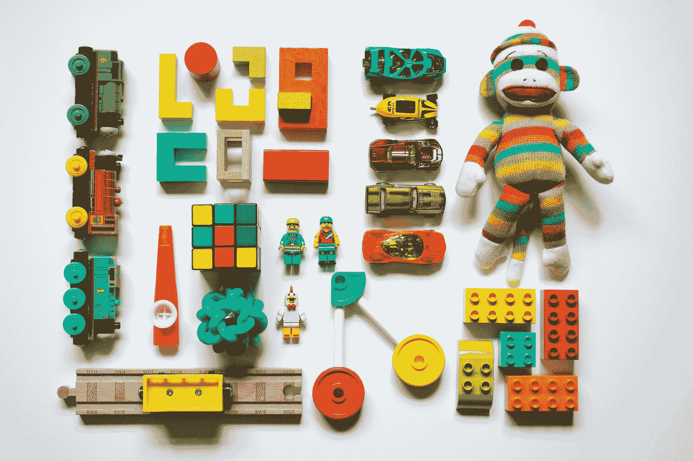

# 去年，我在儿童保育上花了 18000 美元

> 原文：<https://medium.com/swlh/last-year-i-spent-18-000-on-child-care-1e6957aed725>

## 职业母亲的“特权”代价很高——这还不包括性别工资差距。

Photo by [Vanessa Bucceri](https://unsplash.com/@vbcreative?utm_source=medium&utm_medium=referral) on [Unsplash](https://unsplash.com?utm_source=medium&utm_medium=referral)

根据我 2018 年的纳税申报表，我们家去年在儿童保育上的税后收入接近 18，000 美元。

18，000 美元——想想我们还能做些什么。在夏威夷的六周假期。付清我们的抵押贷款。一辆新车。退休储蓄。

你可能会想，这个数字肯定不止是一个孩子的，或者我和我丈夫把我们的儿子送到了希尔顿的日托所。可悲的事实是你错了——大错特错。

这 18000 美元是给一个孩子上全日制日托的——周一到周五 8:30 到 5:30。午餐和小吃也是那笔荒谬费用的一部分，尽管我不认为我 5 岁挑食的孩子让我们的钱花得值。

你可以算一算，发现我和我丈夫在各自的职业生涯中都做得很好，这对我们两个人工作都有意义。我们是平等的养家糊口者，去年我的收入第一次超过了他。那 18000 美元到底给我们带来了什么？

对我来说，这是作为职业母亲和追求事业的“特权”的代价。

我们不停地谈论让女性在生完孩子后无法进入职场的障碍。无论是结构性政策、陈旧的企业文化，还是管理层不合理的期望，我们都处于不利地位。

母亲们最终在工作场所获得成功所需的支持并不存在，而我已经亲身经历过了。把家人的需求放在雇主的需求之前，常常让我受到经理的冷嘲热讽。

这意味着我对工作的承诺总是受到质疑，我在同事面前被公开欺负。

我儿子在操场上摔了一跤，导致脑震荡，甚至在下午和他一起去急诊室时，我都被问到，“你错过了我们的领导会议，真是太糟糕了。”

想想我花了 18000 美元来忍受这一切。我不再做那份工作了，幸运的是我可以离开，但是很多其他职业母亲就没有这么幸运了。

他们被困在工作和保住工作之间，把面包放在桌子上，抚养他们的孩子，并试图保持他们的头上。

很难赚到足够的钱来证明儿童保育的成本，除非绝对必要，否则女性没有理由在成为母亲后重返工作岗位。

雪上加霜的是，男性每获得 1.00 美元，女性仍能获得 0.80 美元。根据国家妇女法律中心的数据，职业母亲的情况更糟，父亲带回家的每 1 美元中只有 0.71 美元来自 T2。

> “这对职业母亲来说更糟糕，根据国家妇女法律中心的数据，父亲带回家的每 1 美元中，只有 0.71 美元来自 T4。”

这意味着我们工作更努力，时间更长，甚至是为了和我们的男性同行竞争。

我的职业对我来说很重要，我必须付出很多努力才能达到现在的位置。我有硕士学位。从职业发展的角度来看，我做出了正确的决定，我在工作中牺牲了很多本可以用在其他地方的时间和精力。

这意味着我很幸运地发现自己的工作得到了相当不错的报酬。

大多数需要全职照顾孩子的有小孩的女性并不处于同样的位置。由于缺乏机会、技能、教育或其他结构性因素，他们被降级到薪酬较低的行业、职业和工作。

就职业女性而言，她们经常发现自己处于“妈妈轨道”，错过了新的机会、客户和职业发展，而这些都对收入潜力有着长期影响。

更为复杂的是，在大多数女性的简历中，花在照顾孩子上的时间往往会导致 5-10 年的就业缺口，这自然会使她们与就业同龄人相比处于劣势。大多数雇主会放弃一份失业时间如此之长的简历，因为失去了可转移的技能和呆在家里做母亲的感觉。

> “大多数雇主会拒绝一份失业时间如此之长的简历，因为这会丧失可转移的技能，而且会被认为是全职妈妈。”

当母亲们试图重新进入劳动力市场时，往往意味着她们发现自己在低薪服务或行政职位上工作，这进一步限制了增加家庭收入和教育或晋升的机会。

这给我们留下的是低收入和高收入人群之间的差距进一步扩大，而且只有那些能够负担得起让别人照看孩子的人，才享有成为有上进心的职业母亲的特权。

当所有这些因素都考虑在内时，就很容易理解为什么有些母亲选择退出职场。这个系统不是为我们的成功而设计的；我们只是被邀请参加游戏，却被迫遵守由人类书写和设计的规则。

有效的、关爱家庭的工作场所政策是一个开始，但真正的平等需要在思想上发生巨大转变，思考在任何就业情况下有职业母亲意味着什么。带薪育儿假/产假是必要的，但同样重要的是改革我们对工作、生产力以及我们如何重视和优先考虑我们的孩子的看法。

职业母亲不应该仅仅局限于高收入人群。这种做法是危险的，不仅威胁到我们眼前的生计，还威胁到下一代的机会和成果——我们努力支持的孩子们的生活。