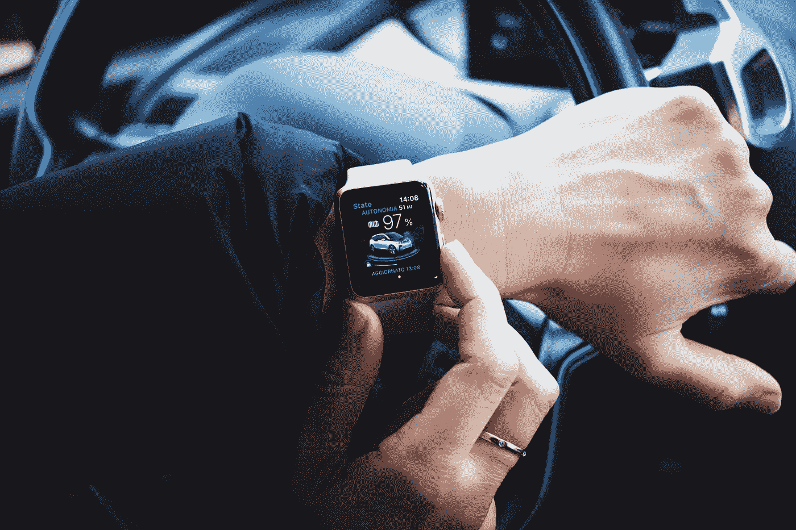

# 又迟到了。怪交通？不。怪你自己。下面是该怎么做

> 原文：<https://medium.com/swlh/late-again-blame-the-traffic-no-blame-yourself-heres-what-to-do-about-it-9fbc589a7101>

Photo by [Luca Bravo](https://unsplash.com/@lucabravo?utm_source=medium&utm_medium=referral) on [Unsplash](https://unsplash.com?utm_source=medium&utm_medium=referral)

珍妮特噗噗噗噗噗。“还有一件事。”

这是她第三次这么说了。我们已经落后 15 分钟了。即使我们现在离开，晚餐也已经开始了。

# *该死。*