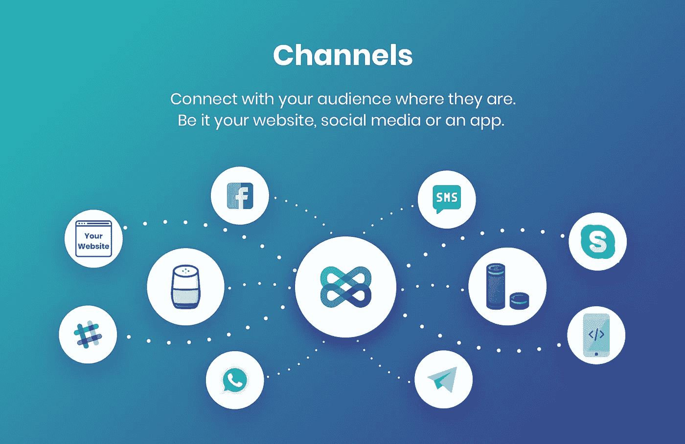
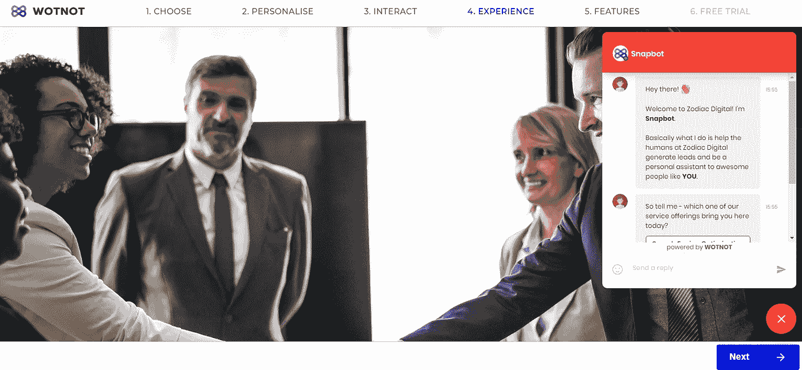
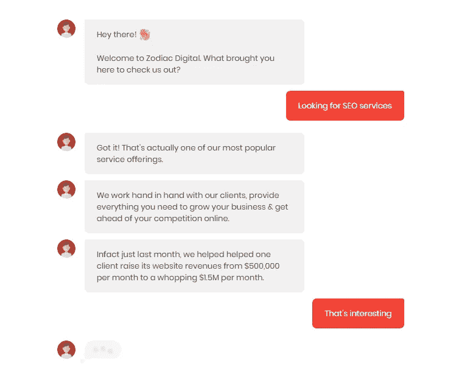

# 为您的企业创造商机

> 原文：<https://medium.com/swlh/lead-generation-machine-for-your-business-219585edbdca>

挖掘潜在客户是组织中最重要的流程之一。除了重要之外，对于 B2B 和 B2C 公司来说，销售线索的产生也是相当困难的。在日益激烈的竞争中，所有公司都在努力争取潜在客户的关注，这使得挖掘潜在客户变得更加困难。

电话营销、冷邮件、电视广告、在线展示广告、社交媒体营销是公司用来吸引潜在客户注意力的无数方式中的一部分。另一种潜在客户生成方式因其对话性质和优于传统潜在客户生成方式的优势而日益受到关注。

随着营销人员意识到为客户创造价值的重要性，集客营销正在兴起，传统的目标性差的营销正在靠边站。随着企业转向集客营销，实施聊天机器人只会更有意义。

聊天机器人参与你网站的流量，问他们相关的问题，与他们交谈，从而为你的业务创造有效的线索。

以下是您应该使用聊天机器人进行销售线索挖掘的原因:

# 1.可攀登的

成功的潜在客户开发很大程度上取决于时机。人类在给定时间只能处理少量的查询。如果你的网站上有超过 4-5 个人在寻找答案，他们必须等到客户代理解决了手头的问题。

谈到可伸缩性，聊天机器人显然是赢家。聊天机器人以个性化和优化的方式同时与成千上万的客户互动。立即解决所有潜在客户的疑问，确保不会因为漫长的等待时间而失去重要的线索。

# 2.24*7 全天候援助

由于人类受到时间的限制，你的实时聊天代理不能 24 小时工作。如果访问者在一天结束时通过谷歌搜索登陆你的网站，实时聊天或客户支持将无法满足他们的查询。这导致了机会的丧失，因为你身边没有人去探查访客并了解他们的需求。

进入聊天机器人，这个问题立即得到解决。聊天机器人每周 7 天、每天 24 小时都在你的网站上运行。通过与你的网站访问者互动，聊天机器人在你的数据库中捕捉到合格的线索。这样，你就不必在非工作时间错过任何线索。

# 3.多渠道支持

使用聊天机器人随时随地与您的客户见面。根据你的目标受众，你的业务需要通过各种渠道，如社交、网络、手机、短信等。吸引并留住潜在客户。通过客户喜欢的沟通渠道接触他们是一个好主意。

同一个聊天机器人可以跨多个渠道部署。这使得你的企业可以通过各种渠道接触到它的潜在客户。更重要的是，您不必担心记录您的机器人在不同通道上的所有交互。聊天机器人会跟踪你数据库中的所有交互，所以你可以在同一个地方访问所有内容。

# 4.性价比高

你需要雇佣多个代理同时回答许多客户。在此之前，您还需要确保您的代理训练有素，并具备与客户沟通的良好技能。这意味着你必须每月花 1000 美元来和访问你网站的访问者交流。这是一个既费时又费钱的过程。

有了聊天机器人，你只需要投资一次，它就会一直存在。此外，通过将聊天机器人添加到您的业务中，您将增加您的收入，因为您当前的员工将有时间专注于培养销售线索和完成销售，而聊天机器人则执行日常活动。

# 5.多语言

你可以通过用访问者的语言与他们交流来吸引他们的注意力。聊天机器人可以通过检测浏览器的语言偏好，用目标受众的语言与他们互动。

聊天机器人可以全天候用多种语言解决你的客户服务问题。这使您的企业能够将运营规模扩大到新的市场，同时为客户提供个性化体验。

# WotNot 可以帮助您的企业产生更多的线索

[https://wotnot.io/](https://wotnot.io/)

有了对话式界面，聊天机器人比静态形式更具互动性。最棒的是，聊天机器人可以 24*7 全天候自动为您的企业挖掘潜在客户，无需任何人工干预。此外，**聊天机器人甚至可以** [**将复杂的查询路由给代表**](https://wotnot.io/human-handover/) 。有了这个，你的员工就不用 24 小时监控聊天机器人的对话了。

聊天机器人还记录了迄今为止所有的对话。通过这种方式，可以识别客户和机器人交互之间的趋势。此外，还可以通过[**聊天机器人分析**](https://wotnot.io/analytics/) 获得洞察力，帮助您跟踪聊天机器人的表现。像**排名靠前的国家、漏斗分析、保留率、用户行为**等指标可以帮助你评估你的机器人的性能。

我们在 [**WotNot**](https://wotnot.io/) 与不同垂直行业的企业合作，为他们部署产生潜在客户的机器人。我们的语言专家研究您的定位，为您的企业设计卓越的会话体验，以吸引和留住客户。

我们已经预置了 [***LeadGen* 模板**](https://app.wotnot.io/preview/choose-template?url=&themeColor=%23F44336&alignment=right&templateKey=lead_generation) ，在这里你可以在你的网站上获得聊天机器人的实时感受。那么，你还在等什么？你可以在这里免费体验 30 天 WotNot。

Click [here](https://app.wotnot.io/preview/interact?url=&themeColor=%23F44336&alignment=right&templateKey=lead_generation) to have a look at the whole conversation

— — — — — — — — — — — — — — — — — — — — — — — — — — — — — — —

> 如果你喜欢这篇文章，请随意点击鼓掌按钮👏帮助其他人找到它。

## 这篇文章发表在 [The Startup](https://medium.com/swlh) 上，这是 Medium 最大的创业刊物，拥有+429，678 名读者。

## 在此订阅接收[我们的头条新闻](https://growthsupply.com/the-startup-newsletter/)。

