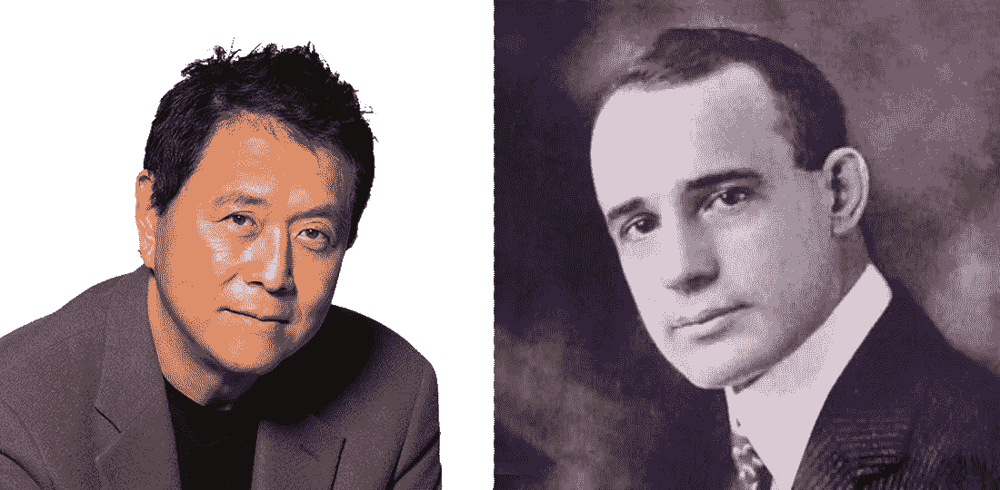

# 学习致富——富人的 7 项技能

> 原文：<https://medium.com/swlh/learn-and-grow-rich-7-skills-of-wealthy-people-2f990cc06e66>

Left: Robert Kiyosaki, Right: Napoleon Hill

## 一种永不失败的人生财富哲学

在经典著作《思考致富》中，拿破仑·希尔解释了当我们要实现生活中的任何目标，包括获得大笔金钱时，思考的力量。

除了这个理论，罗伯特·t·清崎在[的《富爸爸穷爸爸](https://amzn.to/2WWPdIX)中解释了…