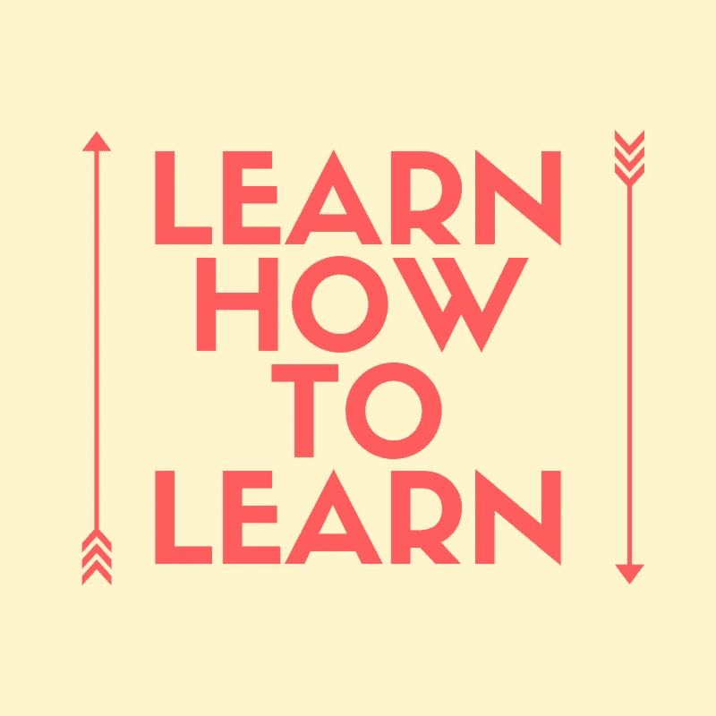

# 学习如何学习如何编程

> 原文：<https://medium.com/swlh/learn-how-to-learn-how-to-program-5fb4061a3b37>

关于如何学习 x 编程语言或工具的文章数不胜数，但是每一篇文章的背后都有一个人在尽最大努力学习一些东西。所有这些知识的获取可能有点令人不知所措，所以与其写一个新的工具或编程范例，我想我应该分享我的学习方法的元技巧。