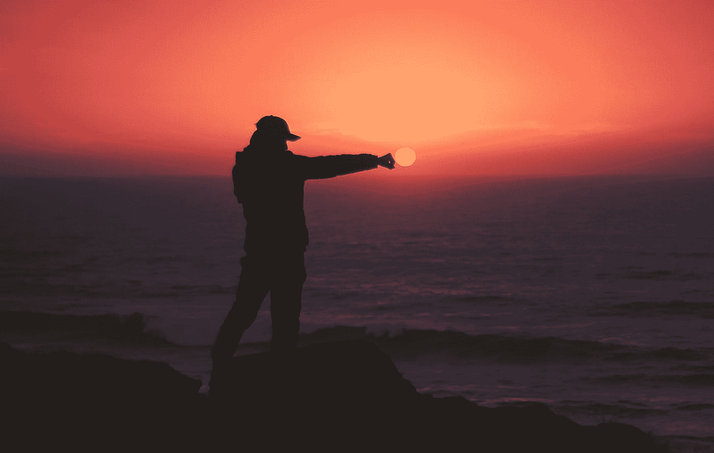

# 学会做梦

> 原文：<https://medium.com/swlh/learn-to-dream-b6314c945e8a>

## 伟大的梦想让你和世界前进

Photo by [Aziz Acharki](https://unsplash.com/@acharki95?utm_source=medium&utm_medium=referral) on [Unsplash](https://unsplash.com?utm_source=medium&utm_medium=referral)

几乎每一项创新、每一项新发明和发现都源于梦想！

> 赫尔曼·黑塞曾经说过:“你必须尝试不可能的事情，才能实现可能。”

记住:“没有什么是不可能的！

> 因为“未来属于那些相信梦想真实的人。”(埃莉诺…