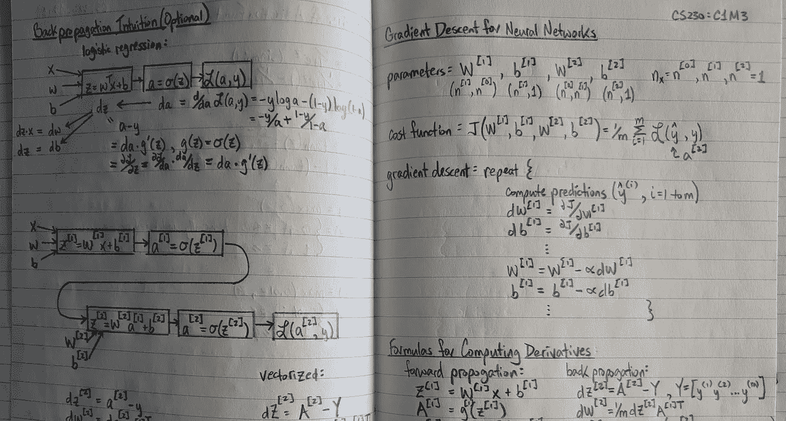

# 为产品管理学习所有这些人工智能的东西

> 原文：<https://medium.com/swlh/learnin-good-all-this-ai-stuff-for-product-management-1133b69aee>

My notes from CS230 — Stanford’s Deep Learning with Prof. Andrew Ng

# 产品经理如何学习他们需要知道的关于人工智能的知识，以达到最高效率

我从同事、产品经理和其他人那里得到的关于人工智能最常见的问题是，

> “我需要了解人工智能的什么，学习它的最好方法是什么？”