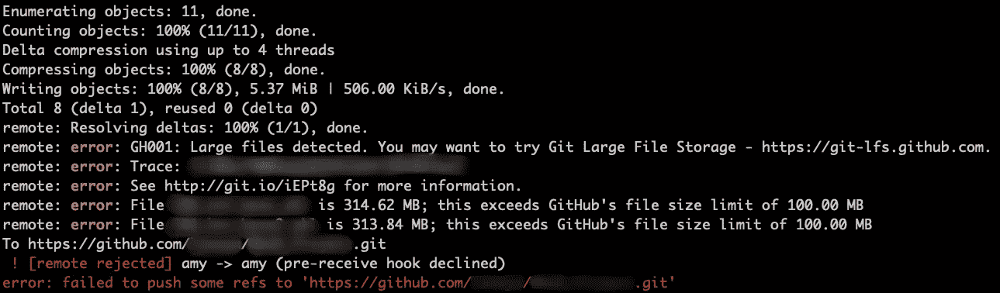
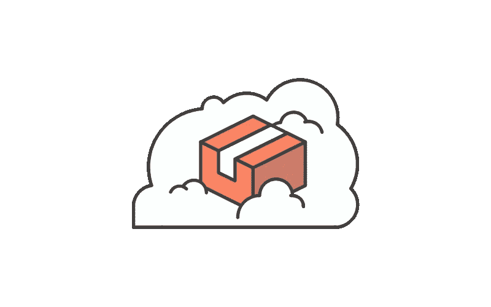
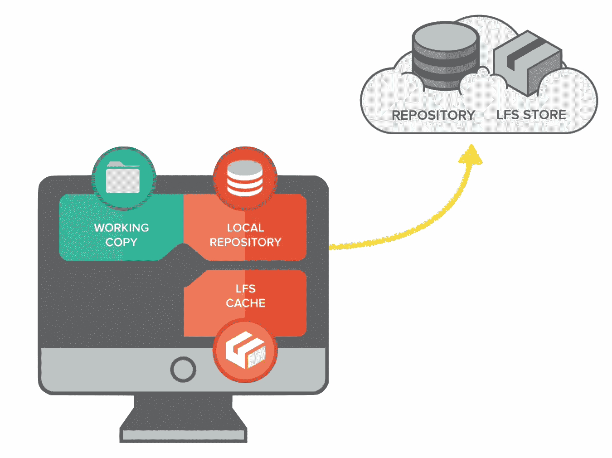
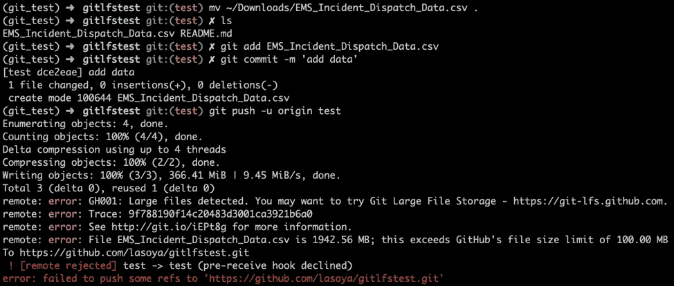
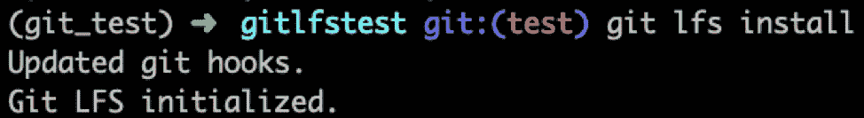
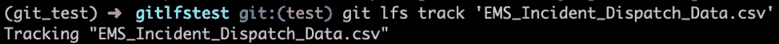
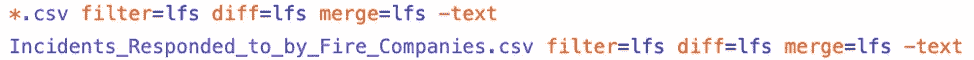
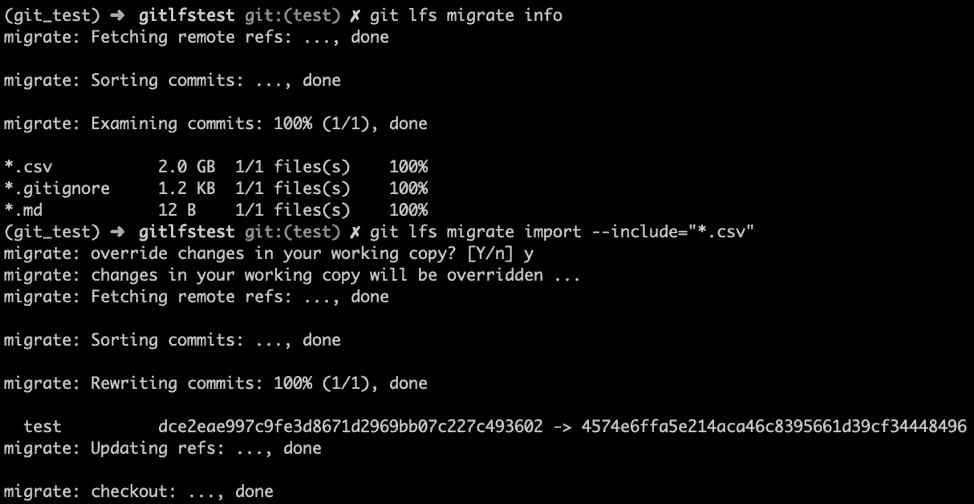
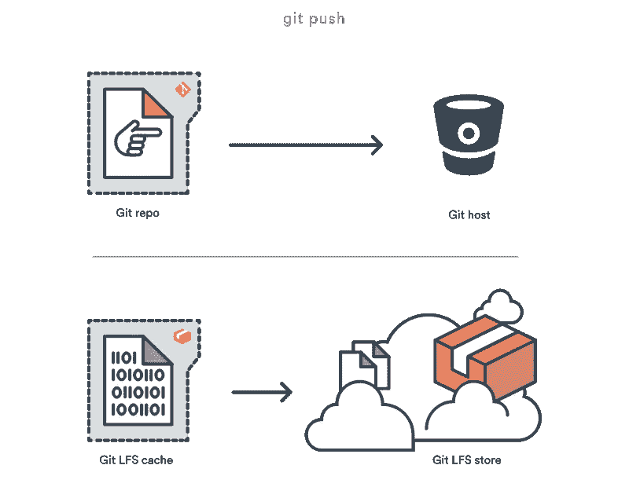
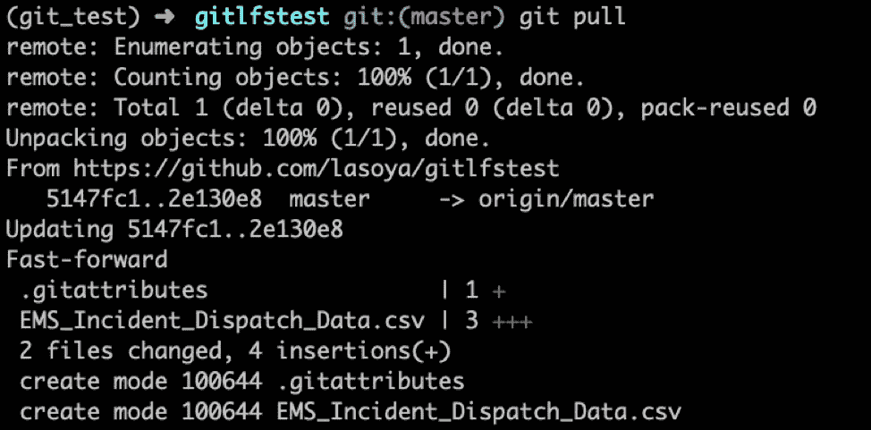

# 了解 Git 大文件系统(LFS)

> 原文：<https://medium.com/swlh/learning-about-git-large-file-system-lfs-72e0c86cfbaf>

我第一次遇到 Git LFS 是在我参加数据科学训练营的第三周。你们中的一些人可能已经在想——哇，git 已经够难的了，为什么还要学习 git 的另一个特性呢？或者最重要的是…什么是 Git LFS，为什么我现在应该继续阅读这篇文章？你并不孤单。刚开始了解的时候我也在问自己这些问题。

我想我应该提供一些我是如何听说 Git LFS 的背景来解释我为什么决定深入这个话题。我和我的搭档正在做一个项目，涉及对来自 OMDB、烂番茄和 IMDB 的信息进行电影数据分析。当我们将工作推送到 Github 时，我们在上传 IMDB 数据集时收到了一条错误消息，如下所示。

Error message received in git when trying to push large files to remote repository on Github

就是在这个时候，我才知道 git 和 Github 都有 100MB 的文件大小限制。大小为 50MB 的文件会触发一条警告消息，但仍可推送通过。

当时，我们在截止日期前提交项目，当然，作为 git 的初学者，我们想到的第一件事是:“好吧…让我们试着撤销它，然后一个接一个地把文件推上来。”

剧透:它不起作用。因此，我们选择了下一个选项，遵循错误消息并尝试 Git 大文件存储。

为了理解 Git LFS，了解一下 Git 是有帮助的。所以，在我深入这个话题之前，我们先简单说一下 git。

# Git 是什么？

Git logo from its website: [https://git-scm.com/downloads/logos](https://git-scm.com/downloads/logos).

根据 Atlassian 的 Bitbucket [网站](https://www.atlassian.com/git/tutorials/git-lfs):

> Git 是一个**分布式版本控制系统**，这意味着在克隆过程中，存储库的整个历史被转移到客户端。

让我们后退一点。什么是版本控制系统？一个**版本控制系统**是一个管理*对源代码、文件和其他形式信息的*变更的工具。变更在**提交**时被跟踪，提交是在特定时间编辑的*快照*。一个**分布式版本控制系统**是一个*类型的版本控制系统*，它允许整个代码库，包括它的所有历史(所有的变更)都在每个开发人员的计算机上。这使得从事该项目的每个开发人员都可以看到对项目进行编辑的整个时间线。

Git 最初是由 Linux 的创始人 Linus Torvalds 在 2005 年创建的，当时他和其他开发人员停止使用 Bitkeeper，一个专有的源代码控制管理(SCM)系统，因为它不再可以免费使用。根据[维基百科](https://en.wikipedia.org/wiki/Git)的说法，在试图寻找一个免费和开放的系统来取代 Bitkeeper 失败后，Linus 决定创建一个版本控制系统，该系统将是**小**、**快**(“耗时不超过 3 秒”)、支持**分支(**有助于团队协作和软件开发)、与[并发版本系统](https://en.wikipedia.org/wiki/Concurrent_Versions_System)完全相反，并包括用于数据保证的**安全措施**。

因为 git 是为了小而快而创建的，所以它主要是为了支持源代码，而不是大文件。请记住，它是一个*分布式*版本控制系统，这意味着每次克隆或提取项目时，项目变更的全部历史都会被转移。随着提交的增加，它会增加历史记录，从而增加整个项目的文件大小，随着时间的推移，它会变得难以处理。

然而，有许多领域在他们的项目中使用大文件，例如那些涉及音乐文件、图片文件和数据集的文件。在这些情况下我们能做什么？这就是吉特·LFS 的用武之地。

# 什么是 Git 大文件存储(LFS)？

Git LFS logo from Atlassian: [https://wac-cdn.atlassian.com/dam/jcr:83e62b1a-36ee-4fc1-82de-7a06640f7c87/hero.svg?cdnVersion=340](https://wac-cdn.atlassian.com/dam/jcr:83e62b1a-36ee-4fc1-82de-7a06640f7c87/hero.svg?cdnVersion=340)

Git LFS 是一个 Git 扩展，用 Go 编程，由 Atlassian 和 Github 以及其他开源合作者创建，以规避 git 中的文件大小限制。它通过将大文件存储在与存储库不同的位置，并在存储库中放置一个指向其位置的指针文件来实现这一点。

对我来说，理解这是如何工作的最好方法是先暂时忘记 Github、Bitbucket、Gitlab 和远程存储库。让我们只关注本地计算机，它被描绘成一个监视器，下面有三个部分(“工作副本”、“本地存储库”、“LFS 缓存”)。

Git LFS structure image from Tower: [https://www.git-tower.com/learn/content/01-git/01-ebook/en/02-desktop-gui/05-advanced-topics/07-git-lfs/03-setup-git-lfs.png](https://www.git-tower.com/learn/content/01-git/01-ebook/en/02-desktop-gui/05-advanced-topics/07-git-lfs/03-setup-git-lfs.png).

**本地存储库**是您在计算机上看到的目录或文件夹，它已经使用 *git init* 或*从远程存储库克隆的*初始化为 git 存储库。**工作副本**代表本地存储库中正在编辑的文件或文件夹。一旦大文件通过 git 推送，LFS 缓存就是大文件的独立存储。请记住这些术语——当我们在下一节介绍如何使用 Git LFS 时，它们会派上用场。

# 与吉特·LFS 合作

Git LFS 的伟大之处在于，我们可以继续使用我们都知道并喜欢的常用 Git 命令和工作流。唯一的变化是一些额外的命令和另一个需要记住的存储位置。

好了，现在我们有了一些关于 git 和 Git LFS 的信息，让我们来看看如何使用它。我将经历两种可能的场景，但首先，通过家酿( **brew install git-lfs** )或通过他们的网站(【https://github.com/git-lfs/git-lfs/releases】**)下载 Git LFS。**

*****场景 1* :在用常用的 Git 命令得到错误消息后使用 Git LFS。****

**这里我有一个新的存储库，我在其中放置了一个大数据文件(1.9GB)。我想确保对数据文件的任何更改都被跟踪，并最终被远程备份。首先，我使用常用的 git 命令来暂存文件( **git add** )，在本地存储库上保存一份更改副本( **git commit** )，并将副本推送到远程存储库( **git push** )。这是我得到的输出:**

****

**Error message after going through the usual git commands — note the error is because the file is too large**

**我应该如何解决这个错误？一种选择是使用 git reset 撤销更改，或者忘记保存文件，压缩文件以将其压缩到较小的大小，或者使用 Git LFS 重新启动。另一个选择是保持现状，集成 Git LFS，这样你就可以继续这个过程，这是我们在这里要关注的。**

****步骤 1:一旦安装了 Git LFS，通过运行 git lfs install 启用带有 Git LFS 的特定存储库。****

**虽然我们已经在你的计算机上安装了 Git LFS，但是我们需要告诉它哪些库需要它的服务。一个很好的类比是一家仓储公司。整个城市都有存储公司，我们可以选择存储您的物品，但他们不会自动敲门并开始存储物品。相反，第一步是通过打电话和签订协议与公司建立关系。这里也一样。要启用特定存储库中的 Git LFS“服务”或者告诉 Git LFS 存储库初始化它的“服务”，运行 **git lfs install** 。**

****

**Run git lfs install to initialize your repository with Git LFS. Successful initialization of Git LFS in the repository.**

**步骤 2:用命令 git lfs track "*告诉 Git LFS 要跟踪哪些文件。文件 _ 扩展名”。**

**同样，我们需要告诉 Git LFS 我们希望它跟踪什么文件或什么类型的文件，这样文件可以存储在一个单独的位置，而不是在 Git 中，以避免再次得到错误消息。为此，运行 **git lfs track "*。**文件 _ 扩展名。例如，如果需要跟踪所有 csv 文件，运行 git lfs track "*。或者，如果需要跟踪所有 jpeg 图像文件，请运行 git lfs track "*。jpg”。星号(*)代表所有文件。运行此代码时，引号(" ")是必需的。没有它们，后面就会出错。**

****

**Run git lfs track “*.csv” to tell Git LFS to start tracking all csv files. It is also possible to tell git lfs to track specific files like in the image above.**

**当我们用 Git LFS，一个**跟踪一个文件时，当向一个存储公司下订单开始存储一个项目时，将会收到一个收据。gitattributes** 文件将被创建。如果已经有一个. gitattributes 文件，该文件将作为新的一行添加到其中。**

****

**Once a file is tracked by Git LFS, a .gitattributes file is created and the file being tracked will be listed in this file.**

****第三步:Git 添加，提交。gitattributes 文件添加到您的 repo。****

**类似于。gitignore file，当 Git LFS 跟踪新文件时，会自动更新。gitattributes 文件。为了确保跟踪更改，每次。gitattributes 文件已更新，需要进行暂存和提交，否则以后可能会出现问题。**

**步骤 4:这个场景中真正的秘密是使用 git lfs migrate 将您的提交从 git 移动到 git lfs。**

**让我们停留在当前状态，而不必撤销提交并重新启动的是一行漂亮的代码，它让我们将提交从 git 移动或“迁移”到 Git LFS。为了移动我们的提交，我们可以运行**git lfs migrate import—include " *。**文件 _ 扩展名。为了查看提交中的文件类型以及 Git LFS 可以跟踪的文件类型，我们可以运行 **git lfs migrate info** 。通过转移我们的提交，我们可以继续下一步:将我们的更改推送到 Github。更多细节在下一节。**

****

**Run git lfs migrate info to obtain information on the types of files that are in the commits being moved over to Git LFS. Run git lfs migrate import — include “*.csv” to move the commits of csv files to Git LFS.**

***重要提示:移动提交包括重写历史。*可以添加一个标签来防止覆盖历史记录中列出的更改，但这将阻止这行代码运行。**

****第 5 步:最后，运行 git push 将更改推送到 Github 和大型提交(即大文件)给 LFS。****

**在将提交迁移到 Git LFS 之后，目前我们有一个本地 Git 存储库，它已经更新了一个更改(在这种情况下，添加了一个新的数据文件，由指向 Git LFS 的指针文件指示)和一个本地 Git LFS 缓存，它现在存储数据文件。下一步，我们将更改推送到 Github。包含文件大小标准内的文件的本地 git repo(即源代码，指针文件)将被存储到 Github，也就是下图所示的 Git 主机，Git LFS 缓存将被存储在云上的 Git LFS 存储中。**

****

**With git push, a copy of the git repo is pushed to Github and the Git LFS cache is pushed to Git LFS store on the cloud. Image source: [https://www.atlassian.com/git/tutorials/git-lfs](https://www.atlassian.com/git/tutorials/git-lfs)**

*****场景二:*从头开始使用 Git LFS。****

**如果知道存储库中有大文件，我们可以从头开始使用 Git LFS，执行上面列出的步骤 1 到 3。在完成这些步骤之后，返回到通常的 git 命令(git add、git commit)来暂存和保存本地 repo 中的更改。然后，完成上面列出的步骤 5，将更改推送到 Github 或其他 Git 主机和远程 Git LFS 存储。**

# **结论**

**看起来很简单，对吗？只要记住上面的五个步骤，我们就可以开始了。从远程存储库中提取变更也很简单。这与我们通常使用的 git 命令集相同:git pull 或 git fetch 和 git merge。**

****

**Using git pull to pull down the changes which include the data file saved in Git LFS. When pulling down changes from the remote repo, changes from the remote repo will be pulled (as usual) and any objects saved in Git LFS will replace the pointer file in the pull down to the local computer.**

**嗯，实际上一开始学起来很困惑。以下是我在摸索过程中学到的一些东西:**

*   **对于那些不习惯 git 的人来说，这又增加了一层复杂性。这是我在学习 Git LFS 时遇到的最大挑战。学习更多关于 git 命令、git 工作流以及 Git LFS 如何适应 Git 的知识是学习这些步骤的关键。Atlassian 网站上的这个[视频](https://www.atlassian.com/git/tutorials/git-lfs)给了我一个“顿悟”,我需要把所有这些放在一起。**
*   **即使使用 Git LFS，仍然有 2GB 的文件大小限制，这是 Github 设置的限制。更重要的是，现在可能是时候考虑云存储了。**
*   **Git LFS 是一个正在不断改进的开放源码项目。他们的 github 有一个当前问题的列表[在这里](https://github.com/git-lfs/git-lfs/issues)。**
*   **尝试解决合并冲突时仍有问题。在推动任何改变和合并之前，最好在团队内部进行沟通。**
*   **较大的文件在被推送到远程存储库时仍然会有点慢。**

**总的来说，我真的很喜欢学习这个资源，它对我使用 git 非常有帮助。**

# **资源**

**如果没有从下面的资源中收集到的知识，我不可能理解这个话题的任何内容。我建议去看看。**

*   **https://git-lfs.github.com/**Git LFS 网站**:**
*   ****https://www.atlassian.com/git/tutorials/git-lfsLFS**:[亚特拉斯 Git 教程](https://www.atlassian.com/git/tutorials/git-lfs)**
*   ****GitLab Git LFS 文档:**[https://docs . Git lab . com/ee/workflow/lfs/manage _ large _ binaries _ with _ Git _ lfs . html](https://docs.gitlab.com/ee/workflow/lfs/manage_large_binaries_with_git_lfs.html)**
*   ****Dzone——什么是饭桶 LFS**:【https://dzone.com/articles/learning-git-what-is-git-lfs】T2**
*   **【https://ohshitgit.com/】哦，该死的饭桶:**
*   ****观想 Git**:[https://git-school.github.io/visualizing-git/](https://git-school.github.io/visualizing-git/)**