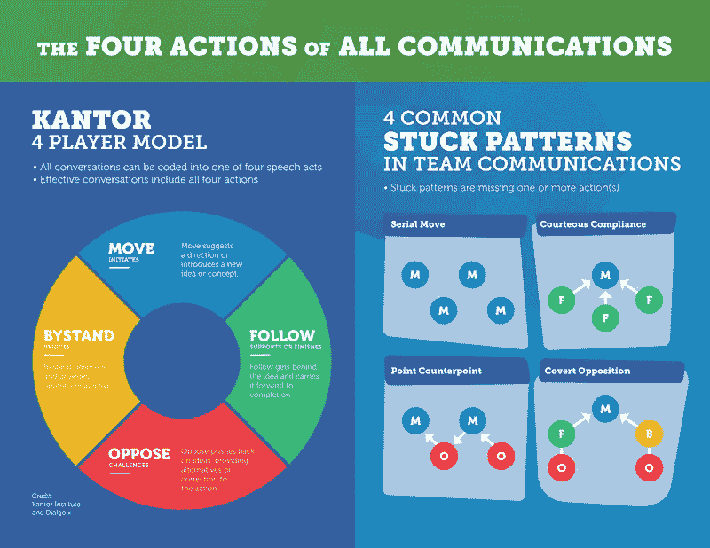

# 学会通过影响而不是支配来领导

> 原文：<https://medium.com/swlh/learning-to-lead-through-influence-not-dominance-b54058995a0d>

## 领导能力常常与等级制度相混淆，等级制度是一种暗示高层稀缺的结构。要进步，就必须有人下来。这是一种工业思维，当应用到领导力上时，就完全不是这样了。

我们每天都看到这些权力斗争。争夺地位以决定谁先发言，更重要的是决定谁最后发言(也就是最后的发言权)。

这些互动的结果经常被误认为是影响，但更常见的是，它们是由主导决定的。说话最大声的人，最努力的人，当他们厌倦了假装他们想要合作，但最终他们想要达成共识时，他们会“利用职权”。

这是一个容易陷入的陷阱，但它既不可持续，也不值得尊敬，而且有许多领导者在用更好的方式照亮前方。

# 通过授权获得影响力。

我共事过的最伟大的领导者从来没有依靠优势来获得影响力——相反，他们愿意与优势共舞。

他们鼓励周围的人轮流。带头感受承担责任和决定下一步的感觉。

他们提供了参数，但在这些界限内，他们鼓励我们探索边缘。发挥我们的创造力和想象力，尝试以前从未做过的事情，当我们迷失方向时，总是迫不及待地帮助我们。

当一个领导者完全做到这一点时，我从来没有忘记他们最终是负责人的事实(这种恐惧阻碍了许多经理完全致力于这一方法)。相反，通过他们的信任和慷慨，我觉得我被看到了，我被听到了，我被重视了，我最终比我想象的更有能力。

我之所以有这种感觉，不是因为他们保护我免受任何伤害，而是因为他们没有让我逃避作为领导者所带来的权力和责任。他们促使我去拥抱它，去探索我如何能以不同的方式去做，去发现我自己的风格，最重要的是，去拥有它。

对于弱势管理者来说，这种地位的转变代表着一种风险，这种风险对他们来说太大了，无法考虑。权力的转移有失去影响力的风险，他们的相关性的降低对他们的等级领导风格构成了威胁。

然而，对于伟大的领袖来说，这是创造更多领袖的机会。他们不担心会失去自己的角色，而是扮演团队需要他们扮演的角色，展示他们的多面性和适应能力，只在团队需要时介入。

# 了解你的团队需要你扮演什么角色。

这种角色扮演的概念是我最近一直在探索的，在与[卡伦·莫利](https://www.linkedin.com/in/karenmorley/)博士的一次精彩的领导力会议上，我被介绍给[大卫·坎特的](https://www.strategy-business.com/article/00154?gko=d4421)“行动姿态”。

[坎特](https://www.strategy-business.com/article/00154?gko=d4421)研究了人们在做决定时参与讨论的方式，并断言“每一次对话都是由单独的言语行为组成的:陈述和问题……每一次发言都可以采取四种行动(移动、反对、跟随或袖手旁观)。”

Kantor 提供了一个例子来说明这些角色在日常会议中是如何互动的。

*   行动:发起并提供指导(“我们需要在这些会议上少花时间。”)
*   跟随:支持并提供完成(“是的，我一直在关注同样的事情。”)
*   反对:挑战并提供纠正(“我认为那不对。我们需要时间来讨论议程上的每一个话题。”)
*   袖手旁观:观察并提供观点(“Ian 希望会议短一些，Ralph 希望会议保持同样的长度。其他人怎么想？”)

现在这仅仅是坎特的一套更复杂的理论的开始，但即使在发现这些行动姿态后，我也立即开始意识到我最初的倾向是“移动”还是“反对”。

# 问问你自己:如果我改变了，会有什么改变？

我开始想如果我改变我扮演的角色会有什么变化？

如果我成为旁观者，环境会有什么变化？

如果其他人有机会成为“推动者”或“追随者”，他们的观点会如何改变？这将如何帮助我们建立一个更强大的团队，并看到我们作为一个新兴的领导者群体而成长？

这是一个如此有趣的概念，但也令人生畏，因为在许多方面，这些行为感觉像是我身份的一部分。我能改变一系列根深蒂固的行为吗？

# 学习有目的地领导。

我意识到，最伟大的领导者并不依赖于扮演感觉最自然的角色，而是有目的地领导，并根据团队的需要改变自己的立场。

他们毫不费力地变换着每一个姿势，展示着扮演每一个角色时应该采取的姿势，为其他人提供了强有力的榜样，充满了慷慨和同情心，这些行为往往是性格和文化的经典指标。

正是这种有意的领导，我确信有时我低估了它，而我是如此渴望更严格地探索它。

这需要深刻的自省和自我反省，以及知道自己是问题一部分的勇气。

对一些人来说，这将意味着抵制首先发言的冲动，对另一些人来说，需要停止窃取那些启示的时刻，因为它需要认识到，只有通过慷慨和信任的行为，我们才能期望建立两者的回报。

因此，当我开始这个新的挑战时，我鼓励你们问自己这些问题:

*   如果我有勇气扮演另一个角色，我怎样才能成为一个更好的领导者？
*   更重要的是，如果我愿意扮演团队需要我扮演的角色，我如何才能培养出更好的领导者？
*   最后，为了做出这个改变，我必须放弃什么，我愿意从今天开始吗？

我很想听听你的发现，以及你是否准备好和我一起迈出下一步。

感谢你花时间阅读这篇文章，我希望你能理解，让我成为你旅程的一部分。

## 这篇文章发表在 [The Startup](https://medium.com/swlh) 上，这是 Medium 最大的创业刊物，拥有+414，678 名读者。

## 订阅接收[我们的头条新闻](http://growthsupply.com/the-startup-newsletter/)。

