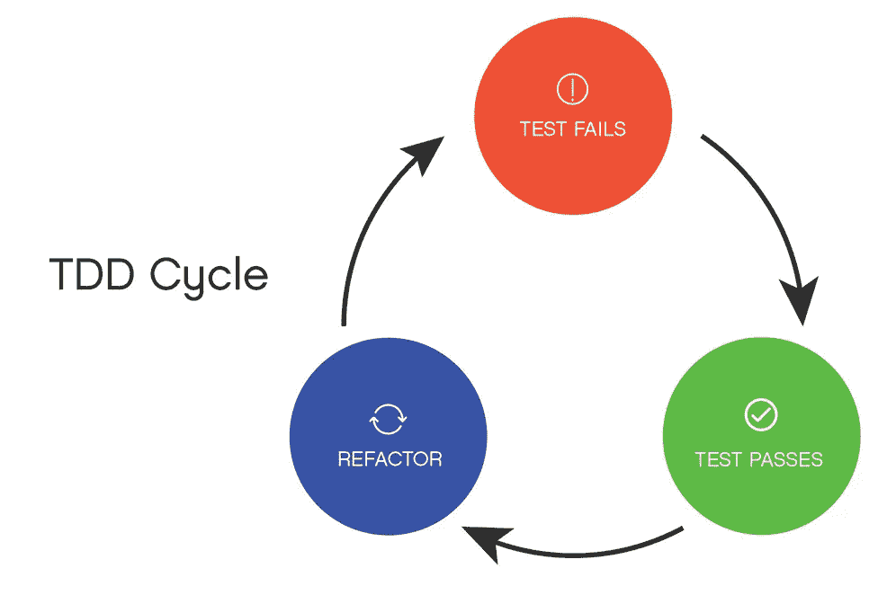

# 学会爱上 TDD

> 原文：<https://medium.com/swlh/learning-to-love-tdd-f8eb60739a69>

[Red, Green, Refactor](https://brainhub.eu/blog/wp-content/uploads/2018/12/test-driven-development-tdd-cycle.jpg)

如果我告诉你有一种方法可以显著减少生产代码中的潜在错误，会怎么样？毫无疑问，大多数程序员会毫不犹豫地抓住这个机会，无论代价如何。正如许多程序员所知道的，对于用户来说，遇到一个 bug，对于开发团队来说，试图重现这个 bug 并在生产中尽快修复它，可能是一种非常不愉快的经历。