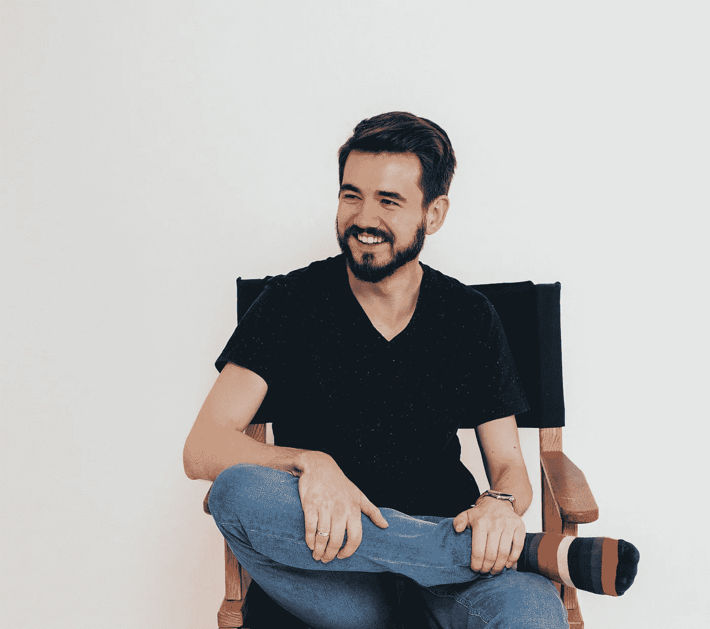
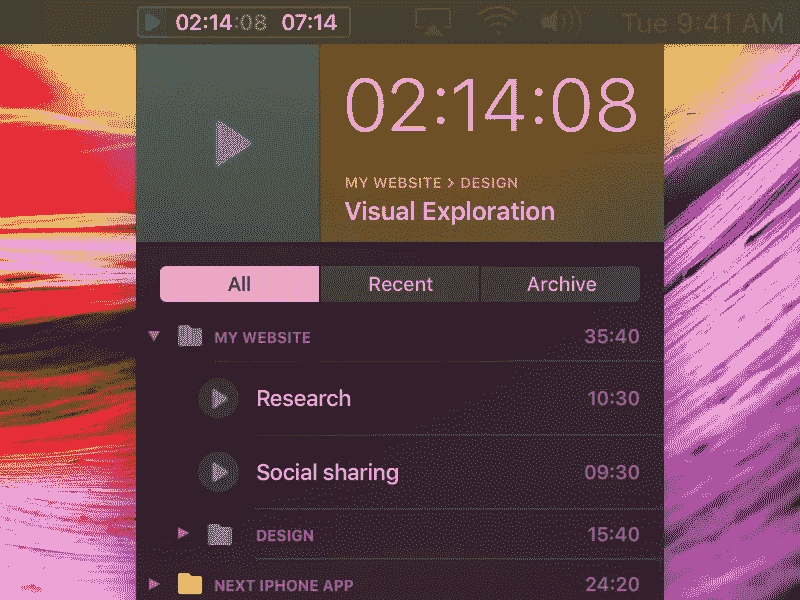

# 丢下一份好工作，带着妻子，几乎没有钱——我有多幸运？

> 原文：<https://medium.com/swlh/left-a-great-job-with-a-wife-and-almost-no-money-how-lucky-am-i-519e013c3302>

这是一个关于我的错误、目标和梦想开始变成现实的故事。

Me. One of those “I am a startup guy” type of photos.

# 我为什么要写这个？

答案非常简单——我想！写作一直是我想做的事情。已经做了几次尝试，但我发表的所有东西似乎都毫无意义，至少对我来说是这样。我想当时我做这件事是出于错误的原因。这次我想每个月至少写一篇关于生产力、生活、工作，当然还有设计的文章。就算没人看，我也是为了我自己。

# 我到底是谁？

嗯，我的名字是斯塔斯——一个可爱妻子的丈夫，一个可爱的小公司的联合创始人和设计师。我总是纠结于回答这个问题:“你是哪里人？”。希望有一天，我可以说我是一个世界的人，不仅仅是通过语言，还通过我护照上的一个印章。

> 但我一直梦想的是用自己的想法为他人提供价值。

# 我成功失败了

当我 18 岁时，我对新发布的 iPhone 感到兴奋，所以我和我的一个朋友共同创建了三个应用程序。尽管他们几乎没给我们赚到钱，但我了解了自己重要的一点——我明白我想设计和创造东西。因此，多亏了这些应用程序，我得到了作为设计师的第一份工作，我不得不拼命保住这份工作。

快进到 2014 年——为 iPhone 打造简单却有用的东西的新尝试。我们租了一间办公室(因为那是你的工作🤦‍♂️)，几个月后，我们手中就有了最终产品。我们非常自豪地把它交给苹果公司审批。日子一天天过去，然后是答案——“你的应用太简单了，请增加功能”。我想从那以后“火花”开始消失，与此同时，我决定从德国搬到俄罗斯。

> 这个项目已经结束了，但是它让我更加渴望自己创造东西。于是，后来又有了一次尝试，又一个 app，又一次失手。

每一次尝试，我都能感觉到我离目标越来越近了。每次你学习新的东西，然后你重新利用这些知识来推动自己前进。

# 新的尝试

那是 2017 年，我哥哥找到我，向我请教他的一个老项目 iPhone 时间追踪器。在那次讨论中，我们得出了一个结论——如果我们想创造出能为人们解决实际问题的东西，那么让我们抛弃几乎所有的东西。

Photo by [Daniel Korpai](https://unsplash.com/photos/HyTwtsk8XqA?utm_source=unsplash&utm_medium=referral&utm_content=creditCopyText) on [Unsplash](https://unsplash.com/?utm_source=unsplash&utm_medium=referral&utm_content=creditCopyText)

# 前方漫漫长夜

那时我们都有工作，所以唯一能做这个项目的时间就是晚上和周末。最初的几个月很有趣，我们充满了动力，为那个美好的目标而奋斗。但是，和人类一样，如果事情需要太长时间才能完成，他们往往会失去兴趣。因此，这项工作一直在放缓，在某些时候，它感觉像一个永无止境的项目。

> 在这样一个低谷，你必须自己决定，你是愿意继续前进还是就此结束。

我相信，如果你找到不放弃的意愿和力量，你会得到另一种推动。一旦我们看到事情进展顺利，我们就不能停下来——我们必须让它发挥作用。

# 辞掉一份好工作

2018 年 8 月我面临一个艰难的决定，要辞掉一份很棒的工作，不可思议的人和很多很好的机会向我袭来。我知道如果这次我想让它成功，我需要全力以赴。

九月，我开始在我们的项目上全职工作。谢天谢地，我和妻子存了一点钱，如果我们把开销降到最低——没有房租、没有车、没有漂亮衣服或晚餐，只要最低限度，这些钱应该够我们维持一年。

> 有趣的是，旅行是这个问题的答案。

# 大释放

11 月底— [时间片](https://timepal-app.com)上市了。从那时起，每一天都是难以置信的快乐和充满惊喜。到目前为止，我们很幸运地只收到了很好的反馈，但我们离盈利还很远。

> 这很可怕，但我不会改变任何事情，甚至是错误。否则——你如何真正地学习？

[Timepal](https://timepal-app.com) — time-tracking for Mac

# 最后的话

正如我在开始时说的，我想为我自己而写作，但也可能激励一些人向实现他们的梦想迈出一步。不要不考虑如何生存就贸然辞职。攒钱，攒知识，不断尝试，直到你成功！不一定要赚几百万或者拥有豪华汽车。能够活出自己的想法，并希望以此帮助他人，已经是生活中不可思议的礼物。

感谢您花时间阅读这篇文章！❤️

*如果你觉得这很有趣，并想继续关注，我邀请你关注我在 Medium 上或在* [*Twitter*](http://twitter.com/moorstas) *上的帖子。*

非常感谢我亲爱的朋友 Rishat 为我校对混乱的文字，并且总是以身作则。去看看他，他写的东西很棒。

## 这篇文章发表在 [The Startup](https://medium.com/swlh) 上，这是 Medium 最大的创业刊物，拥有+418，678 名读者。

## 在这里订阅接收[我们的头条新闻](http://growthsupply.com/the-startup-newsletter/)。

