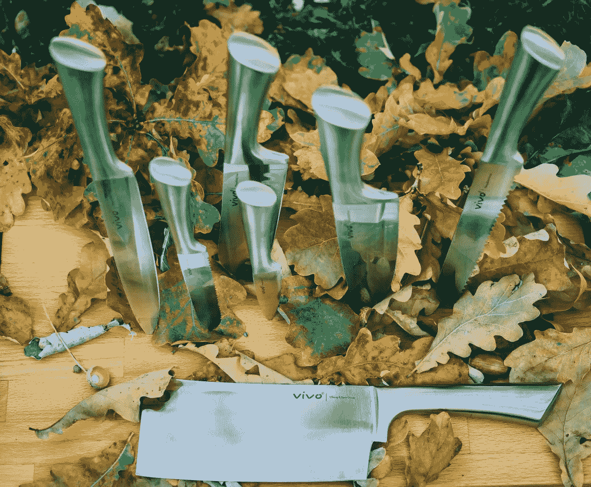

# 我第一份销售工作的经验

> 原文：<https://medium.com/swlh/lessons-from-my-first-sales-job-e2ed16d9c323>

Unsplash.com

“你确定要做*那个*？”我母亲问道，既关心又支持。

那是我大学二年级前的暑假。刚做完肩部手术，我无法继续我传统的暑期工作，去教授一个网球夏令营。我想，也许今年夏天是时候去找一份“真正的工作”了。