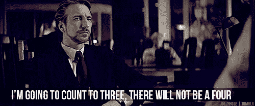

# 欢迎参加派对，朋友:有史以来最伟大的动作片可以教会你如何打造品牌和培养铁杆粉丝。

> 原文：<https://medium.com/swlh/lessons-in-branding-from-die-hard-9c2af1d69e69>

“Hold on, don’t give up on this article just yet.”

灵感可能来自最奇怪的地方。有时你看到一个新的营销活动，你想写下来，有时你对一个新的方法或策略有了深刻的见解，而其他时候，你拿着啤酒和电影休息，你不能停止思考工作。

**我让你猜猜这是哪一个……**

然而，严肃地说，《虎胆龙威》不仅仅是*有史以来最伟大的动作片，它还包含了一些与一群《虎胆龙威》粉丝建立品牌的奇妙经验。*

不，说真的。

(嗯，半认真。)

但是我不会把它们都列出来，我会把这篇文章限制在其中的三个。

为什么？

因为这是汉斯想要的。

# **提示 1:与众不同，脱颖而出**

你可能不知道，尽管他在《虎胆龙威》后的职业生涯轨迹，老布鲁斯并不是约翰·麦克莱恩这个角色的第一选择。工作室最初想让像阿尼或西尔维斯特·史泰龙这样久经考验的动作明星来扮演这个角色。

> 你能想象如果阿尼说“welcaaaahmmm to tha pahhhty pahhhl”或者西尔维斯特·史泰龙喃喃自语着“出来吧，到海岸来!”,这部电影会有多大的不同吗？我们会聚在一起，开怀大笑。”

当时，布鲁斯主要是一名喜剧演员，而不是动作明星。

这也是《虎胆龙威》如此成功的主要原因之一。

布鲁斯不是一个充满活力、肌肉发达的杀人机器，他是一个处在非常情况下的普通人。他的普通人幽默和脆弱是 80 年代睾丸激素刺激的嬉戏中的一股新鲜空气。

这部电影因此而更加精彩。

**三堂营销课的第一堂课来了，我正在给《虎胆龙威》写一封情书**

> 你的市场已经被你的阿尼哥和狡猾的史泰龙统治了。更像布鲁斯。

即使你出售的产品或服务与你的竞争对手或市场领导者的*相似*，你也不需要努力成为他们。(或者更糟，对它们的拙劣模仿。)

拥有让你的品牌与众不同、独一无二、与众不同的东西。不要隐藏或逃避。向它倾斜。

记住，理论上，《虎胆龙威》是一部动作片，由*突击队*和*跑男*编剧和*捕食者*导演。它*应该*只是又一部 80 年代动作片。

但事实并非如此。是自己的片子。它有自己的性格和声音，学习这些东西会更好。

## 四部《虎胆龙威》续集就是最好的证明。

如果你看了《虎胆龙威 2–5》(帮你自己一个忙，跳过《虎胆龙威 5》)，你会看到一个完美的例子，说明如果你忽略了让你的品牌与众不同的东西会发生什么。

在原版《虎胆龙威》中，他们有一个独特的英雄。他有自己的声音，自己的幽默感和自己的行动。

他是可信的真实的。他在掉头发，他没有被顶起，他害怕飞行(后面会有更多)。

在《虎胆龙威 5》中，约翰只是一个普通的持枪动作电影角色。每一部后续的电影都因为看不到是什么让原作如此伟大、如此与众不同、如此令人难忘而变得更加糟糕。

> 如果你的品牌有勇气发展——并坚持——自己的声音和个性，你会吸引大量的粉丝，他们会被你的个性所吸引，会因为你打破了模式而记住你。

在行为科学中，这被称为[冯·雷斯托夫效应](https://en.wikipedia.org/wiki/Von_Restorff_effect)；我们记得不同的事情。

(如果你读过我写的任何东西，你应该已经知道了，因为我不会超过 500 字而不提及它……)

> **要点:**更布鲁斯。拥有让你与众不同的东西，不要随波逐流。

# 技巧 2，给更多的小费:给你的顾客一个机会去了解你的品牌，包括所有的缺点

约翰不是你心目中典型的动作英雄。我们已经确定了。

但是《虎胆龙威》的一个方面是*真正*有趣的是在这个场景中表现出来的:

还有哪部动作片的主人公害怕自己会死去，并为自己在个人生活中所做的选择而哭泣？

更具体地说，还有哪部 80 年代的动作片是这样的？

《虎胆龙威》是一部以我们的英雄对飞行感到焦虑为开头的电影。事实上，他整部电影都没有穿鞋，因为他试图克服对飞行的恐惧。

约翰很脆弱。因为他的脆弱和不完美，我们认同他。

**你的客户(以及即将成为客户的人)完全一样。**

作为人类，我们天生不信任完美的事物。

当你看到亚马逊上有 1000 个 5 星评价的商品，却没有 1、2、3 或 4 星评价，你会怎么想？**假的**。

当你在 Instagram 上看到有人生活在海边，没有工作，没有糟糕的日子，你会怎么想？**可疑。**

当一个品牌总是被超级打磨的时候，你怎么看？**不真实的。**

在行为科学中，这也有一个名字:Pratfall 效应。

当我们展示一个缺点时，我们会变得更可爱，更有人情味。同样，过于完美会让你不值得信任。

正如[卫报](https://www.theguardian.com/media-network/2015/oct/28/pratfall-effect-brands-flaunt-flaws)指出的:

> 有史以来最成功的三个广告宣传活动:“好事降临在等待的人身上”(吉尼斯)、“令人放心的昂贵”(斯特拉·阿托伊斯)和“淘气但可爱”(里昂奶油蛋糕)，都通过承认弱点，使其核心主张更加可信。

但是很多品牌都忘记了这一点。

陷入需要销售和完美的想法中，我们经常忘记让顾客看到我们品牌和我们个性中不那么完美，但更真实的一面*。*

当然，我并不是说传播所有幕后的失误和内部争吵(“贝基喝了最后一杯牛奶，没有换掉它……”)，而是承认你并不总是*完美，变得更加真实、诚实和可理解，这对任何寻求建立信任的品牌来说都至关重要。*

看看 Oatly，Slack，Drift，Innocent，Brewdog，Monzo，Virgin，KFC(特别是 FCK 广告)…

他们都接受自己的缺陷和不完美——也就是让他们成为人类的东西——并将它们作为他们品牌声音的组成部分。

他们因此变得更好。

> **要点:**不要因为*仅*发布五星评论或人们对你品牌的好评而感到有压力。不要因为总是传递优雅的信息而感到有压力。持续真实可信(有一些失误或错误)比做史历克·里克好 10 倍。

# **大力提示:使用客户的语言**

在《虎胆龙威》中有一个场景，约翰打开收音机，和中富广场外的警官艾尔说话。

打完电话后，Al 和他的上司聊天，他说:

> 艾尔·鲍威尔警官:事实上，我认为他是一名警察。也许不是 LAPD，但他绝对是一枚徽章。
> 
> 上级军官:你怎么知道的？
> 
> 艾尔·鲍威尔中士:一种预感，他说的事情。比如能识别假身份证。

在那个场景中，约翰没有说他是警察，但是艾尔因为他说话的方式而认出了 T21。

你的观众是一样的。

他们可以从你使用的语言和说话的方式来判断你是否适合他们。

2013 年，约翰·布莱登教授、塞巴斯蒂安·芬克教授(今日最棒名字奖获得者)和文森特·詹森教授发现，社交媒体上的不同群体已经发展出了他们自己的语言。⁣⠀
⁣⠀
事实上，詹森教授说，“就像人们有不同的地方口音一样，他们也发现不同的社区会以不同的方式拼错单词。"

(贾斯汀比伯的粉丝喜欢以 ee 结尾，比如 pleasee。你知道的越多…)

在你的个人生活中，你可能已经注意到了这一点，但却没有记录下来。

在你最亲密的朋友中，你可能有一些奇怪的语调，一些小众的笑话和一种让外人很难立即融入的语言。⁣⠀
⁣
现在，想象两个新人加入你的圈子。一个很好，但不太能*凝聚在一起或领会你的团队沟通方式的细微差别，另一个能领会细微差别，理解参考资料并马上凝聚在一起。⁣⠀
⁣⠀
⁣⠀*

你的品牌说话的方式也是一样。你可以是很棒但不太正确的品牌，也可以是你的团队喜欢的品牌。⁣⠀

> **你的客户有他们自己的语言，知道如何说可以让你立即建立联系，表示“我们了解你”。**
> 
> 你将作为他们想再次交往的对象而被记住，而不是“哦，是的，他们很好”的品牌。
> 
> **好的品牌排在最后。**

## 但是你如何学习客户的语言呢？

去了解他们。观察他们如何在网上交谈，看看他们在备忘录、电子邮件和评论中使用的语言，找出他们在网上闲逛的地方，观察他们如何谈论 there…⁣⠀
⁣⠀
**你很快就会发现这些细微的差别。**

然后，以一种真实可信的方式把它们编织到你的文案中，你会从“嗯，它们还可以”变成“我靠！“它们是我的品牌，”非常快。⁣

或者，换句话说，你的 Als 会知道你是警察，而不用你告诉他们。

> 要点:说你客户的语言。不要模仿他们或强行使用不适合你的品牌的词语，但要确保你的品牌语言与你的受众的思维和说话方式相协调。

# **品牌，bubbe…**

TLDR: Be more John and less this guy. ☝️

从很多方面来说，约翰·麦克莱恩是优秀品牌如何吸引铁杆粉丝的活化身。

他可能在一部典型的 80 年代动作电影中，但他对正在发生的事情不断的评论和独白与观众建立了联系，就像你的品牌声音与观众的联系一样。

他也打破了常规。他并不试图像其他英雄一样(无论是在影片中还是在元意义上)。正因为如此，他令人难忘，就像一个好品牌应该做的那样。

当然，他对自己是完全真实的。再次，就像一个好的品牌应该是。

所以，下次当你厌倦了阅读另一篇***13 条打造杰出品牌的顶级建议**帖子时，就去喝杯啤酒，看一部有史以来最伟大的动作片放松一下。*

*(但是，我再强调一次，不要看第五部。)*

*********************************************************************

## *想要更多这种类型的东西吗(尽管《虎胆龙威》的参考资料较少)？*

*每周一早上，我都会给营销人员和企业家发一封电子邮件，讨论如何使用文字来打造你的品牌。*

*它包含了建议，我那周读过的最好的东西的综述，以及使用词汇建立和发展一个杀手级品牌的可行建议。*

*想要加入吗？下面报名！👇*

****

## *这篇文章发表在[《创业](https://medium.com/swlh)》上，这是 Medium 最大的创业刊物，有+442，678 人关注。*

## *订阅接收[我们的头条新闻](https://growthsupply.com/the-startup-newsletter/)。*

**