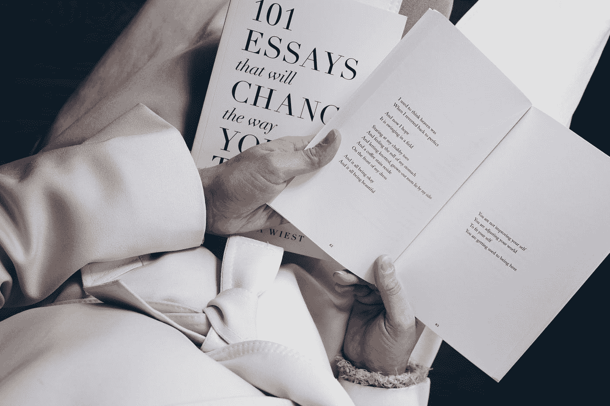

# 我从写 1100 多篇中型论文中学到的经验

> 原文：<https://medium.com/swlh/lessons-ive-learned-from-writing-over-1-100-medium-essays-a8b2d672b331>

(一课:中等可能有更年期倾向？)

Photo by [Thought Catalog](https://unsplash.com/@thoughtcatalog?utm_source=medium&utm_medium=referral) on [Unsplash](https://unsplash.com?utm_source=medium&utm_medium=referral)

我刚刚注意到我已经在 Medium 上“练习”了一段时间了。我已经发表了 1100 多篇帖子。自从我开始涉足这里，写作之旅就变得相当有趣。

当我开始在 Medium 上写作时，我发现它是我发挥创造力的好地方。我真的想要一个地方…