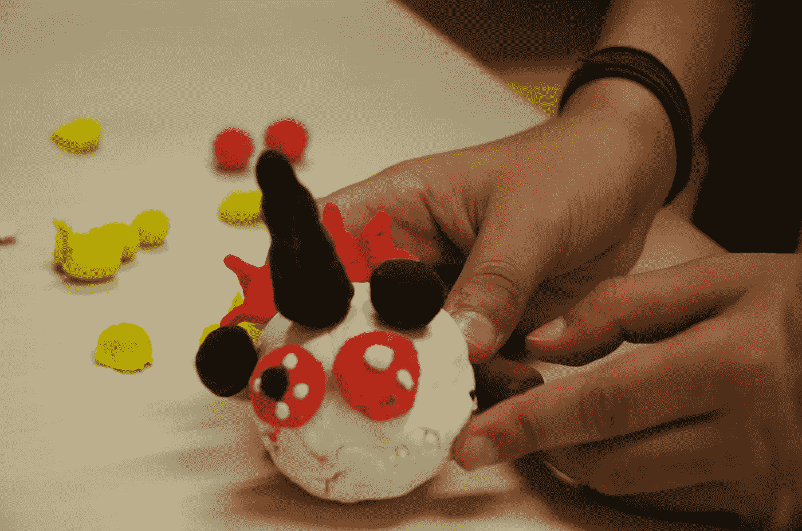

# 为孩子设计的经验教训

> 原文：<https://medium.com/swlh/lessons-learned-on-designing-for-kids-3590df32505d>

## 孩子们想象力丰富，精力充沛，可能会引起相当多的麻烦。

经过 30 多次采访、研讨会、可用性测试、共同设计会议和与孩子们玩耍，我写下了我的见解。

希望他们能帮助你。

这一切都是基于我创建 TAQA 的经历，这是一个帮助患有 PTSD 的难民儿童提高弹性的智能对象(PoC)。

# 游戏引发讨论/将任务变成游戏

准备好离开的时候，你的衬衫上到处都是培乐多。

尤其是年幼害羞的孩子非常保守。常规的面试问题是不够的。为了让他们感觉舒服，试着以身作则，开始建造/画一些东西，让他们一起玩。

给明确的任务足够的自由度。长篇大论？困了。约束太多？无聊！

不要要求他们建造一个带有聚变喷气发动机的三级火箭，只要求他们想出一些能飞的东西。一些更小的孩子首先要求举例。接下来的会议，我确保我已经准备好了。

在给他们一些事情做和玩之后，我发现他们更愿意分享他们的想法和感受。谈论他们的绘画/创作比直接谈论更容易。

所以，掸掉你的旧乐高玩具，带上许多玩具&艺术品和工艺材料。

one of the co-designing sessions with plenty of materials

# 面试和测试中的互动

文字只是交流的一种方式，对吗？蜡笔是嘴巴的绝佳替代品。

不要只是让孩子们玩，一起玩。还是那句话，以身作则。这有助于进入他们的思维模式，弥合研究者和参与者之间的差距。孩子们比成年人需要更多的后续问题，因为他们还没有自我意识。

通常会有帮助，但会很累的是让他们和一两个朋友配对。这有助于感觉舒适，他们在工作时互相即兴发挥，他们只是采访自己。你什么都不用做！(当然是开玩笑)有一次，我有两个叙利亚女孩，其中只有一个会说荷兰语，她非常友好地帮忙翻译一切。

# 打破僵局，营造气氛

陌生人很可怕。

幸好你是伪装的朋友！

大多数孩子刚开始都会感到不安。给你的脸起个名字很有帮助。所以在问他们任何事情之前，先简单地问一句“你好，我叫……”你叫什么名字？"

蹲下来面对他们会得到加分。我发现这会让他们觉得你是个志同道合的人。一些背景音乐，当然还有一些小点心，有助于营造良好的情绪，让他们更加开放。

另外，在介绍过程中的一些自我意识练习对为测试做准备有奇效。“你今天做了什么？”足以帮助他们有意识地反思，提高他们的自我意识。

creating their ideal avatar

# 设定清晰的界限

如果你必须不断探索你周围的世界，短暂的注意力持续时间是很好的。

不太适合深度采访。

尤其是创伤较重的男生，一般都比较冲动，精力充沛。一个有好结果的会议需要一个明确的目标和设定的界限。

第一次，我让两个男孩互相追逐，结果我追得汗流浃背。我意识到我没有很好地解释界限，当我解释了接下来的步骤以及我们将要玩的游戏后，他们非常高兴地完成了练习，他们的热情和创造力甚至让我吃惊。

# 注意儿童的发展阶段

孩子长得快；有些孩子在某一方面或全部方面比其他孩子发展得快。

年龄是一个很好的区分因素，但作为技能的指标并不太好。6 岁的孩子在运动技能方面可能比 8 岁的孩子更有经验:

*   运动技能(数字/身体能力)
*   社交技能(语言、人际关系)
*   认知技能(记忆)

GDPR 和 DPA 2018 还规定，如果您的在线服务的任何方面依赖于同意，您需要为 13 岁以下的儿童获得父母的授权。

来源:[适龄设计规范公众咨询](https://ico.org.uk/media/about-the-ico/consultations/2614762/age-appropriate-design-code-for-public-consultation.pdf?utm_source=hootsuite&utm_medium=&utm_term=&utm_content=&utm_campaign=codeconsultation)

# 玩得开心

不要太认真，留些空间让自己玩耍。也许从他们身上可以学到一两件事，他们有着非常有趣的世界观，并且惊人地意识到他们的社会背景:

另外，这是你玩玩具的机会！

One of the creations

# 关键要点

即使在经历了这么多之后，孩子们还是出奇地富有想象力和乐观。也许正是因为他们所经历的。他们想出了我做梦都想不到的东西，他们只是需要更多的刺激和安慰。

我相信我使用的大多数技术也适用于成年人。变得舒适，说同样的语言等等。它们都有助于增加设计师和用户之间的互动性。

感谢 [Berit](http://berit-kruse.de/) 的评论，感谢 Rory 的校对

# 来源和延伸阅读

[https://www . nn group . com/articles/children-UX-physical-development/](https://www.nngroup.com/articles/children-ux-physical-development/)

[https://www.nngroup.com/articles/kids-cognition/](https://www.nngroup.com/articles/kids-cognition/)

[https://www . nn group . com/articles/children-websites-usability-issues/](https://www.nngroup.com/articles/childrens-websites-usability-issues/)

[为儿童设计时的用户研究方法::UXmatters](#)

[http://blog.invisionapp.com/building-apps-for-children/](http://blog.invisionapp.com/building-apps-for-children/)

[https://www . UX matters . com/mt/archives/2011/03/approads-to-user-research-when-design-for-children . PHP](https://www.uxmatters.com/mt/archives/2011/03/approaches-to-user-research-when-designing-for-children.php)

【http://designingwithchildren.net/ 

[http://www . UX matters . com/mt/archives/2015/11/how-to-balance-design-guidelines-for-children . PHP](http://www.uxmatters.com/mt/archives/2015/11/how-to-balance-design-guidelines-for-children.php)

[https://www . UX matters . com/mt/archives/2012/04/co-design-with-children . PHP](https://www.uxmatters.com/mt/archives/2012/04/co-designing-with-children.php)

[https://ico . org . uk/media/about-the-ico/consultations/2614762/age-accurate-design-code-for-public-consultation . pdf](https://ico.org.uk/media/about-the-ico/consultations/2614762/age-appropriate-design-code-for-public-consultation.pdf)[？](https://ico.org.uk/media/about-the-ico/consultations/2614762/age-appropriate-design-code-for-public-consultation.pdf?)

[https://www.nngroup.com/articles/usability-testing-minors/](https://www.nngroup.com/articles/usability-testing-minors/)