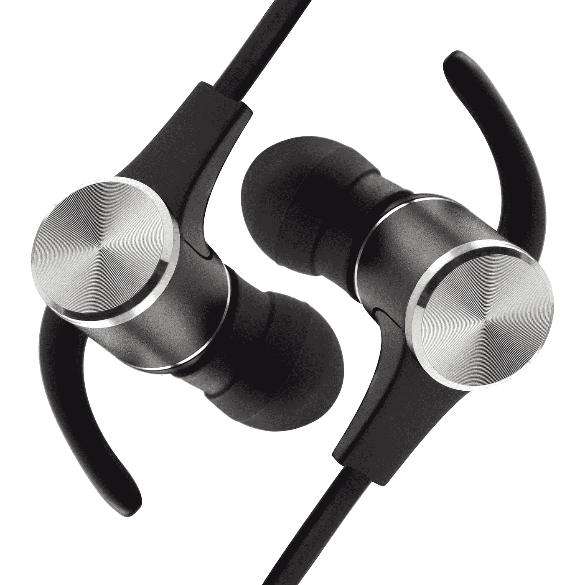

# 在亚马逊上销售廉价电子产品的经验教训

> 原文：<https://medium.com/swlh/lessons-learned-selling-cheap-electronics-on-amazon-7941dfe3eaac>

packaging (and earbuds)

## 背景

今年夏天，我们学校的一位校友给我提供了一个机会，让我学习如何寻找原始设备制造商的产品，在亚马逊上发布，并根据亚马逊的产品排名算法进行优化，从而产生有机销售。我想分享我在亚马逊上销售的经验和我学到的一些教训。

## 该产品

亚马逊上的许多产品列表都是[自有品牌](https://en.wikipedia.org/wiki/Private_label)的产品。我卖的蓝牙耳塞(下图)也不例外。制造商生产这样的产品，第三方卖家为其打上品牌，并通过亚马逊和 Ebay 等电子商务渠道销售。售价仅为 12.99 美元，这是一套非常实惠的耳塞。同样值得注意的是，这些耳塞因其独特的包装设计/品牌而在价格范围内脱颖而出。在这个价格范围内，许多竞争对手的包装设计没有吸引力，他们的标志/品牌名称也很普通。在许多情况下，亚马逊消费者会根据产品/列表的美感来决定购买，这有助于这些耳塞快速销售。讽刺的是，音质是耳塞最大的弱点。它们在高频缺乏清晰度，无法传递嘻哈音乐和电子音乐中常见的低频低音。也就是说，它们非常适合在健身房听音乐或跑步，尤其是价格低于 13 美元的时候。对于不想担心丢失或损坏昂贵耳塞的买家来说，这是一个不错的选择。

The Earbuds

## 事情的商业方面

在亚马逊上发布产品清单后的两个月内，我卖掉了全部库存(2400 台)。早期的日子是缓慢的；我不得不利用亚马逊的点击付费广告来提高产品在亚马逊搜索引擎上的排名。这意味着无论排名如何，该产品都会显示为指定搜索词的顶级列表之一，并且上面有一个表示“赞助商”的标签。每个搜索项的 ACOS(广告销售成本)各不相同，但整个赞助列表活动的成本为 306.92 美元，销售额为 623.52 美元。这是 49.46%的 ACOS。整个点击付费活动让我获得了 25276 次展示，这让我感到非常惊讶。平均每次点击成本为 1.73 美元，总共有 177 次点击。这些赞助列表的[点击率](https://en.wikipedia.org/wiki/Click-through_rate)为 0.7%，在亚马逊上相对较高。这有助于产生有机销售，因为赞助列表的高点击率鼓励亚马逊的算法在消费者搜索广告中的关键词时显示产品。因此，在点击付费活动中使用的关键词是我有兴趣让产品排名的术语。

在销售的两个月里，我的收入超过了 30，000 美元，利润率约为 40%。降低利润率的主要原因是退货次数过多。该产品的回报率约为 4%，这对亚马逊来说是相当高的。这是因为它是一款廉价产品，蓝牙功能不可靠。事后看来，我认识到电子产品比其他商品更有可能存在缺陷。预测这些挑战应该是我产品研究的重要部分。另一个重要的教训是对制造商进行大量的尽职调查。由于这不是一个长期项目，与消费者的关系远不如亚马逊上的其他卖家重要，他们一年多次持续销售相同的产品并补充库存。

## 采购

这款耳塞的制造商是在阿里巴巴上找到的。找到一个好的制造商是这一过程的重要组成部分，但这需要尽职调查。在许多情况下，有必要联系 30 家或更多的制造商。如果他们以专业的方式回复了交货时间和产品清单，你可以从他们那里得到样品来测试他们的质量。即使找到样品，也很难找到高质量的制造商。在这个项目中使用的耳塞之前有 10 个样本，但最终它们仍然不是很好的质量。阿里巴巴是一个坚实的平台，但是这里有太多的工厂(和[贸易公司](https://www.quora.com/What-is-the-difference-between-manufacturing-and-trading-business-registration)，找到好的需要时间。

## 物流

我使用亚马逊的 [FBA](https://services.amazon.com/fulfillment-by-amazon/benefits.html) 来处理订单履行，因为我没有时间单独发送订单。这意味着我只需将一个装有产品的大箱子运送到他们的履行中心，其余的由他们处理(包括退货)。我很欣赏这种便利，尤其是在我卖出 100 多台的日子里。对于该产品，FBA 成本约为 3.19 美元。FBA 成本中最大的因素是物品的重量。此外，使用亚马逊的 FBA 可以使产品符合亚马逊 Prime 的资格，因此 Prime 成员可以获得免费的两天运输。

如果顾客的耳塞出了问题，他们会给我发电子邮件或在亚马逊上给我发信息。这很有趣，因为很多人认为我是一家大公司的客户服务代表。当我在一个小时或更短的时间内回复时，他们印象非常深刻(我可以用手机回复，所以很简单)。

## 关键要点

对于电子商务企业来说，亚马逊是一个非常强大的分销渠道。许多消费者已经去亚马逊购买特定的产品；这减轻了创业者获得客户的压力。也就是说，亚马逊上有成千上万的产品每天都没有售出。为亚马逊的搜索引擎优化产品对有机销售至关重要。这些耳塞卖得很好，因为它们在现有的高容量市场中排名很好。在未来的项目中，寻找最好的销售产品将成为我工作过程中越来越重要的一部分。

**寻找要卖的东西**

*   在亚马逊上销售的最好的产品是大批量(>每月 1000 件)和低竞争
*   市场深度也很重要——第 50 次上市的销量是远远低于第一次上市的销量，还是两次上市的销量相当？像[丛林侦察兵](https://www.junglescout.com/)这样的分析工具在这里很有用，因为它们可以让你看到一件产品卖出了多少件
*   如果顶级列表的排名少于 50 条评论，那么竞争就相当低
*   理想价格是 20 美元以上(因为亚马逊 FBA 费用)

我认为企业家会喜欢在亚马逊上销售产品，如果他们:

*   有风险承受能力投资制造商的 1000 多台设备
*   享受直接与消费者互动和执行他们自己的客户支持的个人接触，但没有技术技能或资源来开发他们自己的平台
*   对提高产品的搜索引擎优化/销量的前景感到兴奋

## 这篇文章发表在[《创业](https://medium.com/swlh)》上，这是 Medium 最大的创业刊物，有+412，714 人关注。

## 订阅接收[我们的头条新闻](http://growthsupply.com/the-startup-newsletter/)。

