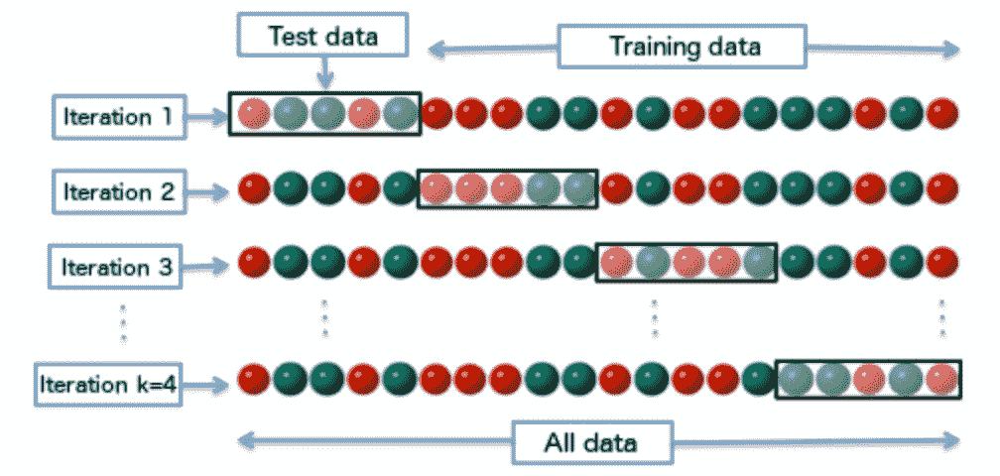

# 让我们开始学习机器学习的基础知识

> 原文：<https://medium.com/swlh/let-us-get-in-on-the-basics-of-machine-learning-c2ba274c8c58>

当你学习新的东西时，从基础开始总是好的，因为它的根源为以后的事情奠定了基础。在这篇文章中，我想分享一些我学到的机器学习术语的基础知识。

机器学习是人工智能的一个子领域，包括使用线性代数、概率论和统计学来建立模型，以从手头的数据中学习。Python 是机器学习的同义词，因为它开发了如此多的库来帮助建立这些模型。NumPy、Pands、SciPy、Scikit-learn、TernsorFlow 是 Python 中最常用的几个库。正如我在以前的一篇文章中提到的，使用 Anaconda 和 conda 包管理器，管理所有这些依赖项变得更加容易。

机器学习的主要目标是利用从历史数据中收集的知识进行预测。机器学习任务可以进一步分为四类；

*   **无监督学习**

主要处理未标记的数据，目标是找到底层数据的结构，并从中提取我们需要的信息。示例包括欺诈检测、营销活动的客户聚类。

*   **监督学习**

我们有完整描述和期望输出的数据。这里的目标是有一个通用的模型，它可以很好地处理输入并映射到期望的输出。例子包括语音识别、电影或购物推荐。

监督学习可以进一步分解为回归和分类。

*   **半监督学习**

在这种情况下，并不是所有的样本都会被标记，通常会有大量的未标记数据和标记数据。

*   **强化学习**

在这种情况下，系统根据确定的最终目标适应动态行为。它基于奖励和反馈循环机制工作。这方面的例子包括 AlphaGo 等应用程序，它们击败了世界上最好的围棋选手。自动驾驶汽车是这一领域的另一个好例子。

一般来说，建立一个机器学习模型包括以下步骤:

1.  了解业务
2.  理解数据
3.  数据预处理
4.  系统模型化
5.  估价
6.  部署

第 3 步到第 5 步通常以迭代的方式完成，并随着我们的进展进行微调。如果在理解数据方面有任何问题，那将需要更多的工作来清理、理解和验证数据。与任何软件应用程序一样，它应该以将系统提升到生产环境的标准方式结束。

# **训练你的模型**

当您获得将用于训练您的模型的数据集时，它通常分为三类:

*   训练集
*   测试装置
*   验证集

您将开始使用训练集训练您的模型。在这一点上，作为你想从你的模型中得到的概括的一部分，会产生两个问题，我们称之为过度拟合和欠拟合。

过度拟合是指模型试图进行补偿，以充分满足训练集中的所有样本，使其不再一般化，而是更具体地针对训练集。由于模型从训练集中学习了太多，这导致了机器学习中所谓的**低偏差**。当用除训练集之外的任何其他样本集测试该模型时，该模型将具有很高的方差。

另一方面，适配不足恰恰相反。该模型不适用于训练集样本，这反过来意味着它不适用于任何其他样本。这通常是使用一小组样本进行训练的结果。与过度拟合一样，这会导致**高偏差**和较低的方差。

学习模型产生的错误被称为**回忆偏差。**我们需要一种折衷偏差和方差的方法，称为**偏差-方差折衷**。为此，我们用“**均方误差(MSE)”、**来衡量估计的误差。

与合身不足相反，合身过度更像是一种欺骗。对于欠拟合，你知道你的模型不工作，你可以努力使它变得更好。但是过度适应的话，你可能会变得自满和快乐，因为它在训练集中表现得很好。

那么，如何克服过度拟合的问题呢？

# **交叉验证**

交叉验证就是在训练、测试和验证之间划分数据集，以便在训练期间几乎每个样本都通过模型。**穷举**和**非穷举**是用来进行交叉验证的两种方案。

穷举方案包括省去固定数量的样本用于训练，并使用剩余的样本用于测试和验证。**留一法交叉验证(LOOCV)** 是一种可用于每个样品都处于测试阶段的情况下的方法。

**注意:当数据集太大时，不建议执行穷举方案，因为用多轮训练模型的计算成本太高。**

顾名思义，非穷举方案采用不同的方法。 **K 倍交叉验证**是该方案中使用的机制之一，其中数据被随机分成 **k 倍大小的**倍。然后在一个折叠上完成训练集，并且在每次迭代中，折叠改变到下一个。一张图片将有助于更好地形象化这一点；

**正规化**

根据奥卡姆剃刀的[原理](https://simple.wikipedia.org/wiki/Occam%27s_razor)，简单的方法比复杂的方法更受青睐。过度拟合通常是一个复杂模型的结果，正则化会给误差函数增加额外的参数。

有不同的方法来控制模型的复杂性。**提前停止**是一种用于提前停止模型训练的机制，这样它将最终产生一个更简单的模型，而不是一个容易过度拟合的复杂模型。

# **功能选择**

当我们得到最初的数据集时，当你浏览它时，你会发现所有的数据都与你试图解决的问题无关。事实上，将它们作为训练模型的一部分只会增加过程的随机性，从而导致过度拟合。作为功能选择的一部分，了解哪些功能对问题实际上是重要的是很重要的。一般来说，您可以通过两种方式进行特征选择。一种方法是在每次迭代中使用所有的特性并根据需要删除它们，第二种方法是从最少的一组特性开始，并随着您的进展迭代地添加特性。

# **降维**

数据通常表示为矩阵。对于某些类型的数据，如文本、图像，维度会非常大。拥有更高维度的问题是，不容易将数据可视化。此外，它增加了导致过度拟合的复杂性。

减少复杂性和过度拟合的一个常用方法是将其转换到一个更低的维度空间(在后面的帖子中会详细介绍)。

这就是这篇文章的全部内容。我将在接下来的帖子中分享更多关于我在这篇帖子中无法详细介绍的一些方面的内容。再次感谢阅读，一如既往，欢迎评论。