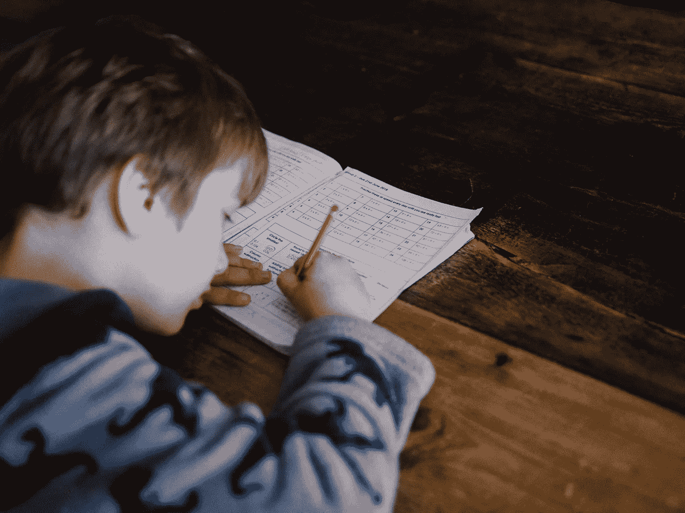
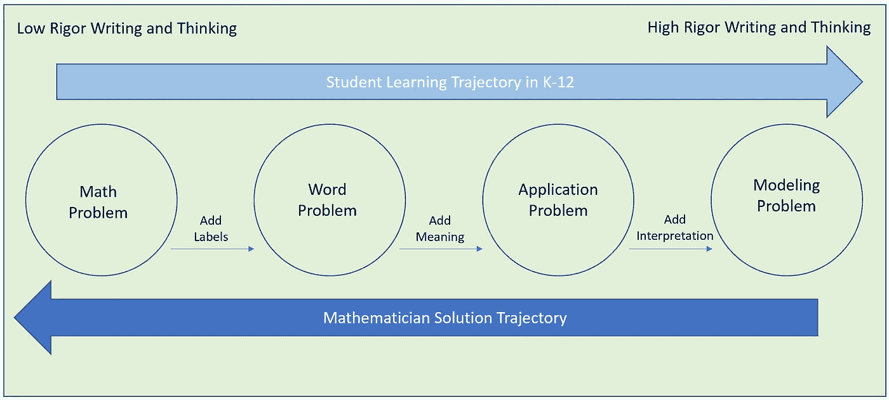
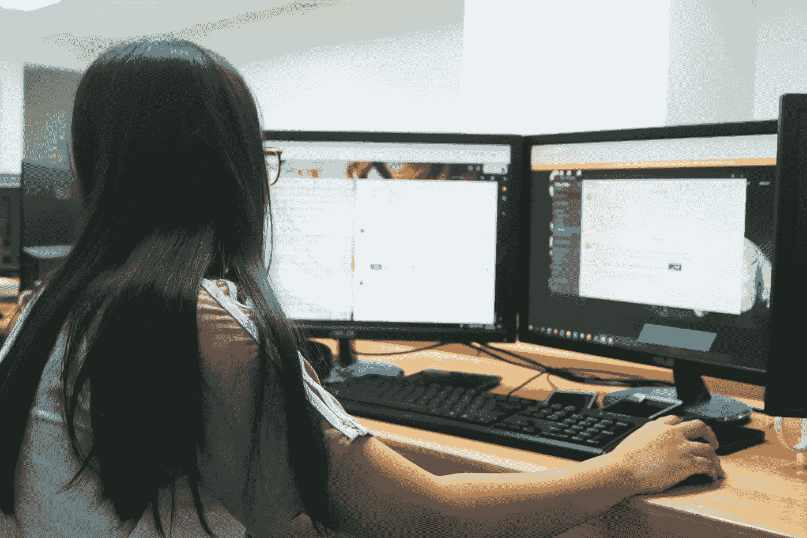

# 让我们在数学写作中加入编码

> 原文：<https://medium.com/swlh/lets-add-coding-to-writing-in-mathematics-ea6406b5f8ba>

Photo by [Annie Spratt](https://unsplash.com/@anniespratt?utm_source=unsplash&utm_medium=referral&utm_content=creditCopyText) on [Unsplash](https://unsplash.com/search/photos/math-equations?utm_source=unsplash&utm_medium=referral&utm_content=creditCopyText)

我大学期间最难忘的经历之一是有一位完全用完整句子说话的英语教授。没有说出的句子片段、悬而未决的想法或滥用形容词、动词或名词。当我第一次见到他时，我被他对这一原则的承诺程度惊呆了。我经常想这对他来说是多么具有挑战性，这个旅程是否有这样的例子，一个想法开始了，然后不得不优雅地放弃，变成一句平凡的妥协。可能也很难没有一个在语言上等同于删除键的键。如果没有排练过，这怎么可能呢？

我立即开始考虑在数学领域做同样的事情需要多大程度的投入。**一个人能用完整的数学句子说话吗？**数学思维有什么规律？同样的规则也适用于数学写作吗？再者，数学写作有什么规律？**如果因为各种各样的符号和算法规则，学习数学就像学习一门外语，那么教师是否可以利用这些机会，让学生有更多的机会来交流他们的数学思维和想法？**有一个事实是肯定的，目前教授数学的方式通常缺乏背景和动机，并且疏远了学生。数学家需要给学生提供不同的内容入口。简单地提供一个方程、公式、图表、插图或文本而没有清楚的解释，加深了大众无法接触数学的神话。

# 数学中的第一次写作

对于大多数学生来说，第一次数学写作经历通常涉及数字的书写。计数标记为记录和总结“数字”概念提供了一个很好的过渡。然后，常常会有一个跳跃到加法、减法和乘法的算法思维，仅仅表现为以传统格式设置问题。在与各种年龄的学生一起工作后，很明显，这种方法支持算法思维，而不是概念理解。**事实上，让学生写下使用算法的过程，并描述他们如何工作，比仅仅解决问题更有助于他们的概念理解**。

早年数学句子的例子包括:1+2=3，5×4 = 20 和 12–7 = 5。最简单的形式是，数学句子反映了数学事实，使用简单的运算符，如{+，—，x}，并且包括至少两个操作数。更重要的是，让学生写下他们正在做的事情更有价值。此外，通过将其中一个操作数变成问号来稍微改变问题，可以打开他们的思维，使其包含多个答案。比如:？- 4 = 17, 50 - ?=23 还是？x？= 34 都提倡写更深层次的思考任务。除了这个数学句子的概念之外，还有一个更深层次的数学思维的概念。因此，这不是句子结构的问题，而是我们如何培养学生更广泛地思考解决问题的能力。

# 数学问题类型

尽管数学中的**应用题**可以在小学阶段引入，但中学阶段往往要花相当多的时间来培养学生解决这类问题的技能。这些技能可以最好地描述为以下能力:

*   识别应用题中的重要信息
*   确定变量和常数
*   理解问题在问什么
*   识别变量之间的关系
*   构建一个可以得出答案的等式
*   求解给定的代数方程

这些都是需要培养和磨练的非常重要的技能。然而，这些技能也强调了解决问题的单一方法导致单一解决方案的概念。这与数学家解决现实世界问题的方式相反。**对于数学家来说，相当多的时间花在了写作和思考多种方法上，以获得基于优化内容的各种解决方案。**提出正确的问题有助于找到解决方案。使用这种方法会导致基于许多必须对问题解决方法做出的决定的多种解决方案。鉴于这些事实，这里有一个关于学生如何花时间写作和思考数学与数学家如何做同样事情的例子。

Rigor in mathematical writing and thinking increases from left to right. Note that some students have K-12 experiences that focus on obtaining a single solution and never move beyond the word problem stage. Whereas, mathematicians approach problem solving by spending considerable time detailing and describing possible mathematical models, often leading to multiple solutions, effectively communicate their solutions and publish their work for others to review. Adapted from SIAM “Guidelines for Assessment & Instruction in Mathematical Modeling Education”

**应用问题**通常与特定领域或背景相关，可能包含学生的真实世界数据。然而，这些问题仍然是封闭的，因为许多决策、变量和值已经预先确定了。它可以采用一个预先确定的方程的形式，描述球在投掷或下落时的行为，并使用真实世界的测量来测试该模型。**数学建模问题**不同之处在于，如何构建模型、确定使用哪些变量、确定收集哪些数据以及选择什么是重要的，大部分决策都留给了学生。学生很快理解到可能有多种解决方案，并且解决方案的质量很重要。关于解决方案和方法的问题开始出现，例如:*我的解决方案与现象的表现有多接近？我可以用这个模型来预测未来或过去的行为吗？这个模型能解决其他类似的基于现象的问题吗？*建模问题所涉及的写作和思考远远超过应用算法解决计算问题所涉及的写作和思考。

Photo by [Patrick Amoy](https://unsplash.com/@napzphoto?utm_source=unsplash&utm_medium=referral&utm_content=creditCopyText) on [Unsplash](https://unsplash.com/search/photos/programmer-girls?utm_source=unsplash&utm_medium=referral&utm_content=creditCopyText)

# 数学中的编码写作

如果写作是思维的一种表达，那么是时候让每一个学数学的学生学习如何写代码了。编码现在被认为是发展算法思维的一项基本技能。**它不仅仅适用于工程、技术或数学专业，它是所有学生学习解题的必备技能。当我上高中的时候，我的数学课程中教授了编码，如果我们幸运的话，我们会有一个单独的计算机课来学习各种语言。简单来说，不经过实验和调查，是无法完全掌握一些数学概念的。编码允许这样做。不允许学生在数学中编码，类似于在没有画布和画笔的情况下教授艺术，或者在没有笔的情况下教授写作。编码应该被视为表达数学思想的工具。这是理解数学所必需的一种思维和写作形式。**

# 书写工具

**数学中排版的黄金标准是 LaTeX。这是一种类似于 html 的标记语言，被全球的数学研究人员使用。当谈到可用于书写数学的工具时，有一个巨大的挑战。**许多可用的应用程序，包括 TeX 和 LaTeX，对教师和学生来说都是不可访问的。**微软的 Word 应用程序中的公式编辑器对于学生来说很麻烦，他们需要搜索和使用各种运算符和符号来表达自己的想法。对于老师和学生来说，大多数数学写作应用程序都有一个重要的学习曲线。挑战的一部分在于数学有非常复杂的文本要求。**一个数学书写工具将需要允许创建图形，表格，特殊字符，特殊操作符和格式化文本。****

为了让数学写作更容易理解，许多公司都在遵循 Wolfram 的 Mathematica 多年前最初提出的目标。也就是说，他们创建了一个工具，允许学生将他们的想法、图表、脚本、算法和格式化文本收集到一个名为应用程序中的笔记本的单个文档中。其他几家公司也在效仿。例子包括用于 Python 脚本的 **Jupyter 笔记本**，MathWorks 的 **Matlab Live 编辑器**，MacKichan Software 的**科学笔记本**和 R-Studio 的 **R-Markdown** 。这些程序中的许多还允许嵌入 TeX 或 LaTeX 脚本作为其特性集的一部分。

# 结论

我还是做不到我的大学英语教授多年前做的事。但是有了计算机，我可以更广泛地思考各种领域的问题解决方案。是改变的时候了！让我们把编码作为学生每门数学课的必修课。我们可以从支持大学教师培训项目开始，开发一个面向所有教师的编码课程。**教师需要培养技能、意愿和能力，以了解编码的相关性和重要性。**

在大学教授数学史课程后，令我惊讶的是数学发展的有机性。统治宇宙的复杂数学规则是在许多世纪前从描述一个数字概念的简单需要发展而来的。只有通过实验、建模、试错、近似和记录的迭代过程，我们人类才能够在科学、技术工程和数学领域取得许多飞跃。**现在，计算技术为我们提供了加快体验和学习的工具。**我们应该拥抱这些工具，通过让学生写下他们的经历，将数学提升到一个新的水平。让我们也不要忘记不可思议的，容易获得的技术，如纸和笔的力量。