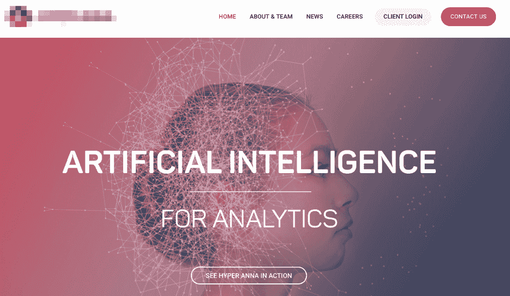

# 让我们停止关于人工智能的废话

> 原文：<https://medium.com/swlh/lets-stop-the-bullshit-with-artificial-intelligence-31ea0c49f808>

让我们承认:人工智能坏了。除了该技术的一些优秀用例，它似乎都是关于炒作。信不信由你，反人工智能运动是来拯救人工智能的。你站在哪一边？

# 人工智能将会一直存在。

人工智能已经成为过去两年的最大趋势之一，成为继移动革命之后的下一个重大技术天堂。

数十亿风险投资资金已经投入，成千上万的人工智能初创公司已经出现，使用人工智能构建许多不同的应用程序。

于是，AI 行业进步了很多；[在这里](https://es.slideshare.net/nb410/the-state-of-artificial-intelligence-in-2018-a-good-old-fashioned-report-103568798)我们看到一份关于 2018 年人工智能状态的出色报告。由于人工智能的引入，许多行业都被打乱了，一些相关的例子是:

**广告** : FB 和谷歌已经使用人工智能多年，根据他们从每个用户那里收集的数据显示最佳广告。

**娱乐** : Spotify 或网飞使用人工智能推荐可能吸引每个客户的内容(歌曲/电视节目)，这大大提高了用户参与度。

**医疗保健**:癌症诊断非常昂贵，负担过重；因此，该行业正在使用计算机视觉等人工智能技术来帮助医生更好地管理更多的患者病例，并将诊断错误降至最低。

# 当人工智能成为最终目标而不是手段

如你所见，当正确应用时，人工智能可以提供真正的价值；然而，当风投开始向各种承诺用人工智能改变世界的初创公司投资数十亿美元时，事情开始变糟。我们开始看到这样的场景，几乎每一家初创公司都在集成人工智能，以便获得竞争优势。

当参加商业会议时， **90%的初创公司声称他们使用人工智能解决方案。**

Artificial Intelligence for Analytics

Artificial Intelligence for Social Media Analytics

Artificial Intelligence for influencer marketplace

Artificial Intelligence for Sales

**AI-beer 创业公司？**看起来好得难以置信！

Artificial Intelligence for ‘beers’ 😱

# 企业正在误解人工智能

加上现有的人工智能限制，以及如此多的金钱处于危险之中，该行业已经迷失了方向。我们看到一些人工智能厂商在销售他们的技术时做了一些不好的做法:

## 夸大价值主张。

在我看来*客户满意度=感知价值——期望值*，这意味着期望值越高，客户对你提供的解决方案就越不满意。然而，**许多人工智能企业试图夸大其解决方案的影响，以达成交易**。

此外，像《终结者》这样的好莱坞电影给了消费者对人工智能不切实际的期望，提供了目前这种技术无法实现的愚蠢例子。

## 仅仅通过提到人工智能来提高定价。

在“网络泡沫”时代，许多人试图通过简单地将域名附加到他们的名字上来增加他们的股票价值。

人工智能也是如此:Price Intelligently 最近的研究显示，现在更愿意掌握这种技术的公司的购买意向增加了**30%**,这只是因为注意到产品中集成了人工智能。

## 人工智能一词的误导。

根据上述观点，随着人工智能被认为是一个神奇的词，一些精明的公司使用人工智能来指代事实上**没有单一“智能”组件**的功能。

很多时候只是简单的关键字匹配或者硬编码的决策树。

风险投资人 Leo Polovets 在他的一条推文中提到过:

## 技术不透明。

许多大型科技公司，如谷歌、亚马逊或脸书，已经以 API 的形式启用并提供了他们的人工智能技术，因此第三方公司可以开始开发解决方案，并利用内置的算法和学习。

然而，在许多情况下，人工智能系统根本不透明，就像一个黑匣子，公司对它几乎没有控制权。更糟糕的是，人工智能如此复杂，甚至其创造者都难以解释[它是如何工作的。](https://qz.com/1146753/ai-is-now-so-complex-its-creators-cant-trust-why-it-makes-decisions/)

# 第一步是承认它。

像其他人一样，我也在喝同样的苦艾酒。

两年前，当扎克伯格宣布聊天机器人将接管世界时，我的团队很快开始研究机器人解决方案。我们尝试了市场上所有可用的 NLP(自然语言处理=只是另一种人工智能技术)解决方案:IBM Watson、Wit.ai、Bot framework 等。

令我们惊讶的是，他们都有很多不足之处。他们甚至不能准确预报天气。他们只擅长开糟糕的玩笑…

但是，无论是谁出售配备 NLP 聊天机器人，都希望它被视为网站或应用程序的潜在替代品。

在那个时候，我们意识到这个行业显然正朝着错误的方向前进。此外，由于所有的不良行为都发生在人工智能领域，我最终决定**公开分享这一情况，并为反人工智能运动**做一个案例。

# 反艾的体现。为了救艾。

在一些 AI 爱好者想把我撕成碎片之前，让我解释一下我所说的反 AI 是什么意思。我不反对人工智能技术本身；相反，我相信人工智能有巨大的潜力来帮助社会发展和利用它。

然而，我反对的是我们在这个行业看到的不良做法。

对我来说，反人工智能的概念是关于以下几点:

*   **无 BS 推销**:不要过度销售 AI 容量。在你的推销中要诚实，清楚地解释它能做什么和不能做什么。
*   **关注客户**:不要为了使用而使用 AI。思考客户的使用案例，以及他们如何从人工智能中受益。
*   **增强人类的能力，而不是取代它**:人工智能是为了让我们人类变得更好。我们应该把重点放在如何把 AI 和人类的力量结合起来。
*   将伦理融入人工智能的设计中:在设计人工智能时，我们应该考虑诸如刻板印象、歧视和种族主义等问题。

很明显，AI 会留在这里。但是我们不应该认为这是拯救我们的企业或行业的唯一办法。由于人工智能本身毫无意义，所以它完全取决于我们如何在我们的分析、流程和服务中实现它，这将塑造未来的趋势。在一天结束的时候，

> 人工智能永远不应该是“火箭”，而是让它飞起来的“燃料”。

想了解我的更多内容，请订阅我的 [WhatsApp 简讯](https://bit.ly/DC_WA_newsletter)。