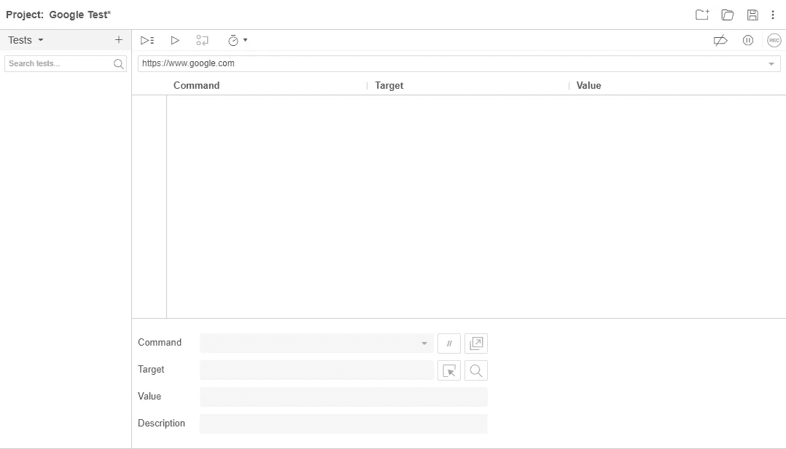
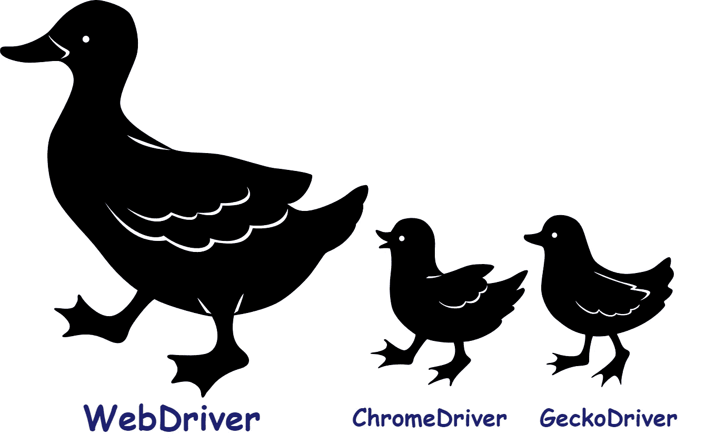
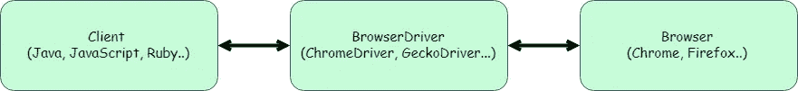
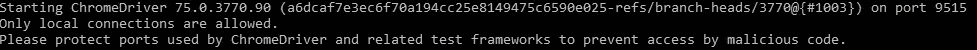
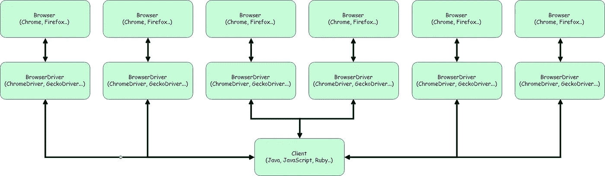
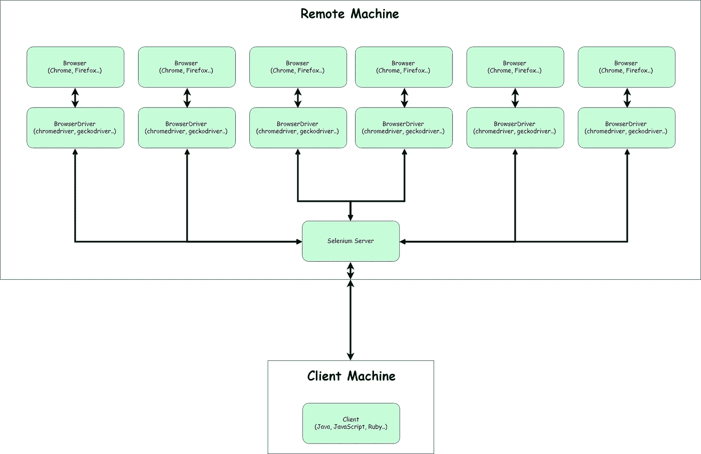
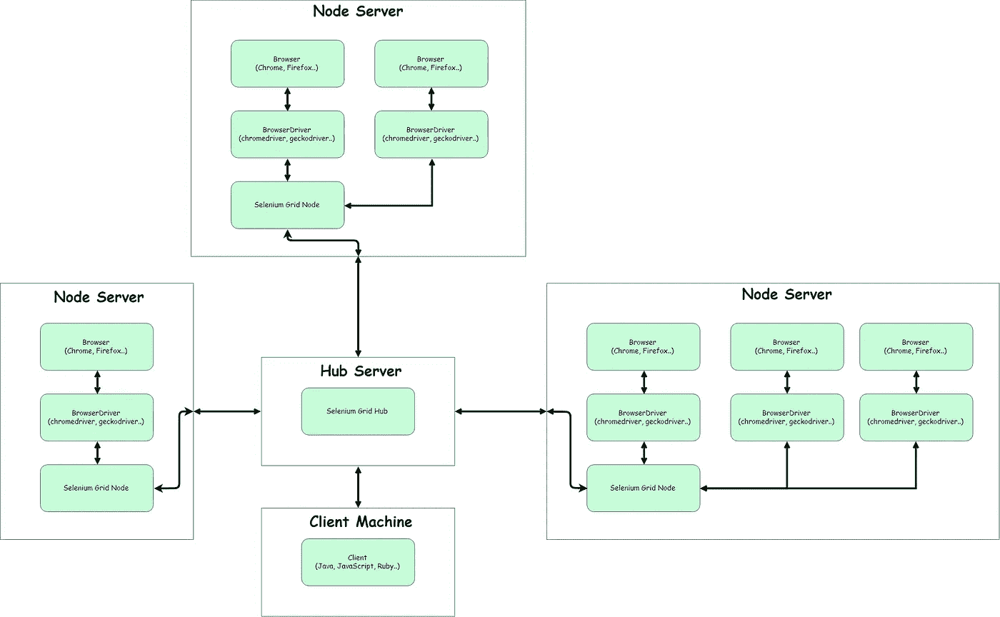
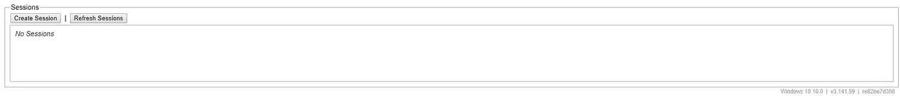
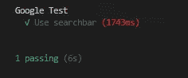

# 让我们来看看:硒

> 原文：<https://medium.com/swlh/lets-take-a-look-at-selenium-d8640539ee23>

## 综合指南

## 什么是硒，你如何使用它？


Photo by [Franck V.](https://unsplash.com/@franckinjapan?utm_source=unsplash&utm_medium=referral&utm_content=creditCopyText) on [Unsplash](https://unsplash.com/search/photos/automation?utm_source=unsplash&utm_medium=referral&utm_content=creditCopyText)

# 硒是什么？

大多数听说过硒的人说起硒会想到什么？这是我一次又一次听到那些不太理解它的人说的话。

> 运行自动化测试的那个东西。

虽然这是正确的，但硒的含量比这多一点。有许多不同的部分、层和工具组成了硒。

这是我第一次研究编写自动化测试时希望拥有的文章。

## 目录

[Selenium IDE](/@stephenboyd09/d8640539ee23#b939) [Selenium RC](/@stephenboyd09/d8640539ee23#3912)
[Selenium web driver](/@stephenboyd09/d8640539ee23#d3bb)
—[browser driver](/@stephenboyd09/d8640539ee23#cb4d)
[Selenium Server](/@stephenboyd09/d8640539ee23#c707)
[Selenium Grid](/@stephenboyd09/d8640539ee23#619d)
[Frameworks](/@stephenboyd09/d8640539ee23#4117)
[入门](/@stephenboyd09/d8640539ee23#2198)
— [玩浏览器驱动](/@stephenboyd09/d8640539ee23#ff32)
— [用 Chromedriver 设置 Selenium Server](/@stephenboyd09/d8640539ee23#9050)

# 硒 IDE

Selenium IDE 实际上是一个浏览器插件。

当你打开这个插件时，你会看到一个类似这样的屏幕:



Image of Selenium IDE initial start

从这里您可以创建新的测试。当你创建一个新的测试时，它会在网络浏览器中监控你的行为。

然后，它将保存这些操作以再次运行测试。虽然 IDE 可以用于许多不同的功能，但大规模自动化套件不是这样创建的。它不支持编程语言所具有的条件或其他特性。

有一些非常棒的特性，所以如果你知道你的应用程序不是动态的，而是静态的，我会推荐它。

我不使用 IDE，但是如果你使用它并且在复杂的应用程序中使用过，请在评论中告诉我！我很想听听他们的故事。

# 硒 RC

Selenium Remote Control (RC)，也称为 Selenium 1.0，将 JavaScript 注入浏览器。

因为 Selenium WebDriver 已经取代了它，所以我们不会过多讨论这个问题。

# Selenium WebDriver

Selenium WebDriver 是 Selenium RC 的继任者。

Selenium WebDriver 是一个 API，有许多语言可以使用它。这种对每种语言的集成支持只是一种可以与浏览器驱动程序通信的依赖关系。

简单地说，Selenium WebDriver 向浏览器驱动程序发送 HTTP 请求(RESTful API)并处理响应。

## **浏览器驱动程序**

每种浏览器的工作和行为都不同。我们不能指望 Selenium 跟上每个浏览器的工作方式。所以我们需要某种标准的功能来控制浏览器。

因此，每个浏览器都必须维护自己的*网络驱动标准*的实现。

这些驱动程序是控制浏览器的网络服务器，是根据 W3C 标准中指定的[网络驱动程序规范](https://w3c.github.io/webdriver/)创建的。

[***不要脸的塞给理解 W3C***](/@stephenboyd09/w3c-whatwg-standards-437b375cb793)

## **那么 Selenium WebDriver 和浏览器驱动有什么区别呢？**



**这里是很多困惑的来源**。WebDriver 标准与 Selenium WebDriver。两个不同的东西，名字非常相似。

Selenium WebDriver 是由 Selenium 团队创建的 API，用于与任何使用 WebDriver 标准创建的浏览器驱动程序进行交互。

WebDriver 标准是用于创建浏览器驱动程序的规范。浏览器驱动程序是与浏览器通信的 WebDriver 标准的实际实现。

> Selenium WebDriver 是与 WebDriver 标准的实现对话的 API 依赖项。

我将使用 BrowserDriver 这个术语来指代它的所有实现，包括 ChromeDriver、GeckoDriver 等。Selenium WebDriver 将是 API。

在您的代码中，您将导入 Selenium WebDriver 依赖项。光是这一点还不足以开始使用你想要的浏览器。

*补充说明:您并不总是需要导入 Selenium WebDriver API。只要你有可以向 BrowserDriver 发出 HTTP 请求的东西，并且遵循 W3C 标准。就像一个* [*框架*](/@stephenboyd09/d8640539ee23#4117) *。*

您还需要为您希望使用的浏览器下载 BrowserDriver 可执行文件。BrowserDriver 是一个 web 服务器，它运行并能与您的浏览器对话。

浏览器驱动程序可以:

*   启动浏览器
*   在浏览器上运行命令(例如点击或键入)
*   截图
*   上传文件
*   多得多…

**browser drivers:**
Chrome:[Chrome driver](http://chromedriver.chromium.org/downloads)
Firefox:[GeckoDriver](https://github.com/mozilla/geckodriver/releases/tag/v0.24.0)
IE:[EdgeDriver](https://developer.microsoft.com/en-us/microsoft-edge/tools/webdriver/)
*还有更多可用的驱动，只需快速谷歌搜走。*

**它是这样工作的**:



Diagram showing Client connecting with the BrowserDriver that connects to the Browser

因为我主要使用 JavaScript，这里有一个`selenium-webdriver`包的例子:

`await driver.findElement(By.name('q')).click()`

1.  这段代码向 BrowserDriver 发送一个请求，以找到名为`q`的元素
2.  BrowserDriver 然后向浏览器发送一个请求，请求一个名为`q`的元素
3.  浏览器将找到的元素返回给 BrowserDriver
4.  BrowserDriver 然后将找到的元素返回给代码
5.  然后，代码向 BrowserDriver 发送一个请求，请求它单击接收到的元素
6.  BrowserDriver 将该元素和所请求的单击动作发送给浏览器
7.  浏览器根据浏览器驱动程序的单击结果返回状态代码和消息
8.  BrowserDriver 将状态代码和消息返回给代码进行处理

一旦你下载了浏览器驱动程序，你就可以运行它了。您应该会得到类似如下的输出:



The output of starting the ChromeDriver

正如我们所看到的，这个 BrowserDriver 已经启动了一个运行在端口 9515 上的 web 服务器。

为了看看对 BrowserDriver 的请求是什么样的，这里有一个列表(这个 web driver W3C live 文档已经取代了 JSON Wire 协议):[https://w3c.github.io/webdriver/#endpoints](https://w3c.github.io/webdriver/#endpoints)

如果你已经运行了浏览器驱动程序，你可以向它发出你自己的 HTTP 请求！在指南的[入门](/@stephenboyd09/d8640539ee23#2198)部分有一个指南！

# Selenium 服务器

首先，我希望您考虑一下仅使用 Selenium WebDriver 和 BrowserDrivers 一次运行多个测试。那会是什么样子？

大概是这样的:



Diagram showing the connection of many BrowserDrivers to the Client

这看起来有点混乱，它留给你的客户来管理所有这些不同的驱动程序会话，并确保它们都相应地行动。这也意味着所有这些浏览器和浏览器驱动程序都将在客户机上运行！

我见过的一个主要问题是，有时浏览器驱动程序不关闭，仍然在你的机器上运行。

Selenium 服务器是一个独立的 web 服务器，可以在任何地方运行。您可以将这项工作卸载给服务器，而不是由客户端直接控制浏览器驱动程序。

因此，当您编写测试时，您告诉客户机将请求发送到 Selenium 服务器。每种语言/框架都有自己连接客户端和服务器的方式。

当创建与 Selenium 服务器的会话时，您发送它`desired capabilities`。这些功能告诉 Selenium 服务器它需要知道的一切，比如你想使用哪个浏览器，哪个操作系统以及[更多的](https://github.com/SeleniumHQ/selenium/wiki/DesiredCapabilities)。

然后 Selenium 服务器处理您的所有请求，并处理每个 BrowserDriver。这也包括在出错时自动关闭浏览器。

为什么这可能有用？这样做的一个重要原因是在远程机器或虚拟机上运行测试。这允许您防止您的测试使您的客户端机器过载。

这是安装了 Selenium 服务器后的情况:



Diagram of the Client connecting to a remote Selenium Server

# 硒栅

使用 Selenium 服务器看起来比只运行 BrowserDriver 实例的客户机好得多。至少专用服务器接管了工作负载。但是，如果我们想要同时运行大量的测试，这会使服务器超负荷工作，或者我们想要我们的测试在不同的操作系统上运行，该怎么办呢？

Selenium Grid 的出现使它变得更复杂，但也更好。

Selenium 网格创建了许多不同的 Selenium 服务器(称为节点)的连接，并将它们集中到一个地方(称为 hub)。

网格通过建立两个东西来工作:中心和节点。

## 中心

集线器是一个网络服务器，你可以在那里发送所有的请求。

它可以运行在本地机器、远程服务器或虚拟机上。它还可以在各种支持 Java 的操作系统上运行。

集线器接收这些请求，并将它们转发到正确的节点。它就像一个邮件收发室。它计算出每个请求需要去哪里，并将它们发送到那里。

您可以在创建测试时指定要在代码中使用的操作系统和浏览器。集线器将寻找任何运行在具有浏览器 BrowserDriver 的操作系统上的附加节点。

## 结节

节点类似于 Selenium 服务器，因为它具有相似的功能。它管理浏览器驱动程序并将请求传递给它们。

像 hub 一样，可以在本地机器、远程服务器或 VM 上创建节点。它还可以在各种支持 Java 的操作系统上运行。因此，您可以在 MacOS 上有一个节点，在 Windows 服务器上有另一个节点，等等…

您可以将许多不同的节点连接到一个集线器，这些节点可以位于许多单独的机器上。这样你就可以在多台机器之间分配工作。

您还可以设置一个节点来同时处理许多 BrowserDrivers。这样它就可以在 Firefox、Edge、Chrome、IE 等平台上运行测试…

它是这样工作的:



Diagram of the Client connecting to the Selenium Hub, which is connected to multiple nodes

如您所见，我们为许多节点设置了不同数量的可用驱动程序。

这个过程将工作从客户端机器卸载到不同的机器上来处理工作。如果我有这样的设置，我可以在许多不同的机器上一次执行多个测试，甚至是非常糟糕的笔记本电脑。

# 结构

顺便提一下，有许多不同的框架是基于 Seleniums WebDriver 规范或`selenium-webdriver`模块构建的。因为我主要使用 Node.js，所以我提到的所有框架也都是 Node.js 框架。

框架倾向于为你做所有繁重的工作。他们将启动您的本地 Selenium 服务器，或者您与浏览器驱动程序的直接连接，他们将创建自己的命令供您使用，同时也为您完成所有繁重的工作。我建议使用这些伟大的框架中的一个，而不是从头开始构建它！


WebdriverIO Logo

**web drivero:**我是 web drivero 的忠实拥护者。他们不使用已经创建的工具，如`selenium-webdriver`模块来与 WebDriver 通信。相反，他们根据 [WebDriver 规范](https://w3c.github.io/webdriver/)创建了自己的实现。很棒的团队，很棒的工具！


Protractor Logo

**量角器**:量角器安装在`selenium-webdriver`模块的顶部。它是专为角度应用而设计的。然而，任何其他框架当然也适用于角度应用。


Nightwatch.js Logo

**Nightwatch.js** :关于 Nightwatch 我不能说太多，考虑到我没用过。但是像 WebdriverIO 一样，他们也创建了自己的关于 [WebDriver 规范](https://w3c.github.io/webdriver/)的实现。我听说过关于它的伟大的事情！

虽然我是 WebdriverIO 的拥护者，但还是要找到哪一个符合你的需求，想要更好的。你会很高兴你做到了！

这绝不是一个全面的列表，如果你想使用一个框架，做你的研究！

# 我如何开始？

## BrowserDriver API

在我们开始建立一个实际的项目之前。我想了解一下如何向 BrowserDriver 发出 HTTP 请求。

如果您不关心这一部分，那么您可以跳到[创建项目](/@stephenboyd09/d8640539ee23#70f9)。这是为那些想了解所有代码如何在更深层次上与 BrowserDriver 通信的人准备的。

我将展示一个 ChromeDriver 的例子，以及它如何接受 HTTP 请求和控制浏览器。

## 下载浏览器驱动程序

找到你正在使用的 Chrome 版本，找到正确的 Chrome 驱动版本。【http://chromedriver.chromium.org/downloads】T5


## 启动 ChromeDriver

这一步非常简单。只需将`.exe`文件提取出来。运行它！您应该会看到类似这样的内容。注意它运行的端口号。对我来说是`9515`。


The output of starting the ChromeDriver

## 提出你的要求

先说第一件事，开[邮差](https://www.getpostman.com/)之类的。

要开始控制你的浏览器，你首先需要一个会话。要创建会话，向新运行的服务器发出 POST 请求，如下所示:

```
**POST request**http://localhost:9515/session **Body of your POST request**{
  “capabilities”: {
    “browserName”: “chrome”
  }
}
```

一旦你发出 POST 请求，你应该看到 Chrome 打开了。在响应正文中，您应该看到`sessionId`，**紧紧抓住它，因为您将需要它。**我的是:3b 784 ca 884984 ecce 8868025285021 c 0

**现在我们在控制 Chrome** 。让我们导航到谷歌！

我们将发出一个 POST 请求，在 URL 中包含我们的会话 ID，如下所示:

```
**POST request**http://localhost:9515/session/3b784ca884984ecce8868025285021c0/url**Body of your POST request**{
  "url": "https://www.google.com"
}
```

你应该看到 Chrome 导航到谷歌。

接下来，让我们找到页面上的一个元素。让我们得到搜索栏！

```
**POST request**http://localhost:9515/session/3b784ca884984ecce8868025285021c0/element**Body of your POST request**{
  "using": "xpath", 
  "value": "//input[@name='q']"
}
```

我们应该看到这样的回报:

```
**Return Value** {
  "value": {
    "element-6066-11e4-a52e-4f735466cecf": "b8363554-d3a1-4342-b1f1-92ae2d492c14"
  }
}
```

**让我们跟踪元素值**，这样我们就可以在搜索栏中输入内容。

现在我们想在该元素中键入:

```
**POST request**http://localhost:9515/session/3b784ca884984ecce8868025285021c0/element/b8363554-d3a1-4342-b1f1-92ae2d492c14/value**Body of your POST request**{
  "text": "selenium automation"
}
```

我们应该看到`selenium automation`进入了搜索栏！

这就是现在关于 WebDriver 的内容，但是如果你想看到更多的 API 调用，可以查看这里的文档:[https://w3c.github.io/webdriver/#endpoints](https://w3c.github.io/webdriver/#endpoints)

# 创建项目

我知道我说过我推荐使用自动化框架，而不是自己构建，但是我相信理解它是如何工作的是很重要的。这就是我们要做的。

> ***想清楚如何开始的第一步是想清楚自己的需求是什么。***

为了简单起见，我们将一次运行一个测试，所以我们不太需要 Selenium 网格。但是我们将使用 Selenium 服务器。

我们将在本地设置这个 Selenium 服务器，但是在远程机器上设置它时，同样的原则也适用。

正如我之前提到的，我通常使用 JavaScript，所以我们将使用 Node.js。所以如果你想继续，你需要[安装 Node](https://nodejs.org/en/download/) 。在撰写本文时，我使用的是 10.16 版本。

要使用 Selenium 服务器，您还需要 Java。

为了让每个人(包括使用其他语言的人)都能跟上 Selenium 服务器的安装，我不会使用捷径(比如这个包:`[selenium standalone](https://www.npmjs.com/package/selenium-standalone)`)。

# 使用 ChromeDriver 启动 Selenium 服务器

## 下载 Selenium 独立服务器:

下载链接:[https://www.seleniumhq.org/download/](https://www.seleniumhq.org/download/)

## 下载 chrome 驱动

下载链接:[http://chromedriver.chromium.org/](http://chromedriver.chromium.org/)

## 创建您的项目文件夹

1.  创建一个您希望项目所在的文件夹
2.  从下载的 zip 文件中提取`chromedriver.exe`文件
3.  将`selenium-server-standalone-versionNumber.jar`文件和`chromedriver.exe`文件放到你的项目文件夹中

## 启动 Selenium 服务器

1.  打开您最喜欢的终端并导航到您的项目文件夹
2.  运行以下:`java -Dwebdriver.chrome.driver=chromedriver.exe -jar selenium-server-standalone-*versionNumber*.jar`。将*versionNumber*替换为您的版本号。
3.  您应该会看到类似于`Selenium Server is up and running on port 4444`的内容

步骤 2 中的命令运行`selenium-server-standalone`并选择使用 ChromeDriver。

如果您导航到[http://localhost:4444/wd/hub/static/resource/hub . html](http://localhost:4444/wd/hub/static/resource/hub.html)，您应该会看到如下内容:



Fig 2.0 Screen capture of the Selenium Server web interface

# 创建 Node.js 项目

## 创建您的初始项目

1.  打开您最喜欢的 IDE 或文本编辑器
2.  在项目文件夹中创建一个带有`npm init`的新项目
3.  填写`npm init`问题
4.  安装`[selenium-webdriver](https://www.npmjs.com/package/selenium-webdriver)`依赖于:
    `npm i selenium-webdriver --save`
5.  用
    和`npm i mocha chai --save`安装`[mocha](https://www.npmjs.com/package/mocha)`和`[chai](https://www.npmjs.com/package/chai)`

## 编写您的测试(解释如下)

Gist from my GitHub account

## 代码解释

`**selenium-webdriver**` **依赖:**

```
const {until, By, Builder, Capabilities, Key} = require(‘selenium-webdriver’);
```

**至**:与`driver.wait`配合使用。它将一直等到满足一个条件
**:一种在页面上定位元素的机制
**生成器**:用于创建一个新的 WebDriver 实例
**功能**:包含 WebDriver 会话
**键**的功能集:该对象包含非文本的键值，例如按下回车键**

这是 Selenium WebDriver。

`selenium-webdriver`对象包含的内容的完整列表...
看这里:[https://selenium HQ . github . io/selenium/docs/API/JavaScript/module/selenium-web driver/index . html](https://seleniumhq.github.io/selenium/docs/api/javascript/module/selenium-webdriver/index.html)

`**chai**` **依赖:**

```
const chai = require(‘chai’);
const {expect} = chai;
```

接下来，我们导入断言库 Chai。如果你以前没用过柴，我推荐你去看看！然后我们使用柴库来创建对象。

**创建我们的驱动程序**

```
const driver = new Builder()
  .withCapabilities(Capabilities.chrome())
  .usingServer(‘http://localhost:4444/wd/hub')
  .build();
```

驱动程序是我们用来向 BrowserDriver 发出请求的 API。我们正在用`Builder`给自己创造一个车手。

我们用`Capabilities.chrome()`设置默认的 Chrome 功能

我们将驱动程序设置为使用带有`usingServer`的 Selenium 服务器，并给它一个运行 Selenium 服务器的位置。哪个对我们来说是`http://localhost:4444/wd/hub`

然后我们建立我们的驱动程序！

**创建我们的摩卡测试**

如果你不熟悉摩卡，那就去看看吧！有许多关于如何使用它的很好的指南。

```
describe(‘Google Test’, function() {
```

我们给我们的摩卡测试命名为`Google Test`。

```
this.timeout(0);
```

我们通过将`timeout`设置为`0`来移除它。我们这样做是因为默认超时是 2000 毫秒。对于运行 UI 测试来说，这个时间通常太短了。你可以随意设置超时时间，但现在，我只是禁用它。

```
beforeEach(async function() { 
  await driver.get(‘https://www.google.com'); 
  await driver.wait(until.elementLocated(
    By.xpath(`//input[@name=’q’]`)), 20000); 
});
```

我们使用`beforeEach`函数让驱动程序导航到 Google 的主页，并等待搜索栏出现在页面上。

```
it(‘Use searchbar’, async function() { 
  await driver.findElement(By.xpath(`//input[@name=’q’]`)).click(); await driver.findElement(
    By.xpath(`//input[@name=’q’]`)
  ).sendKeys(‘selenium automation’, Key.RETURN); await driver.wait(
    until.elementIsVisible(driver.findElement(
      By.xpath(`//div[@class=’g’]`))
  ), 5000);  const firstResult = await driver.findElement(
    By.xpath(`//div[@class=’g’]//h3`)
  ).getText(); expect(firstResult.toLowerCase()).to.contain(‘selenium’); 
});
```

然后我们开始第一次测试。这个测试点击搜索栏，输入`selenium automation`并按下`Enter`。然后等待第一个结果通过 XPath `//div[@class='g']`显示出来。它将等待 5 秒钟的结果。
测试将获取第一个结果的标题，并确保它包含文本`selenium`。

```
after(async function() { 
  await driver.quit(); 
});
```

在我们所有的测试都运行之后，`after`方法被调用。这叫`driver.quit()`。我们必须调用`driver.quit()`，否则驱动程序和浏览器会话也将保持打开。

## 运行测试

在我们的`package.json`文件中，我们想要添加一个名为`test`的脚本。
我们希望这个测试脚本运行`mocha test.js` :
`"test": mocha test.js`

在你的终端运行`test`脚本:
`npm run test`

您应该看到:

1.  你的浏览器打开了
2.  导航至谷歌
3.  在搜索栏中输入`selenium automation`
4.  谷歌搜索已执行
5.  谷歌搜索结果

浏览器关闭后，您应该会在控制台中看到以下内容:



**恭喜恭喜！现在，您已经设置了一个 Selenium 服务器，并创建了使用该服务器的自动化 UI 测试！**

# 最后的想法

所以我们看了很多信息。我们讨论了 Selenium 的不同组件，包括 Selenium IDE、Selenium RC (kinda)、Selenium WebDriver、WebDriver 实现(BrowserDriver)、Selenium 服务器、Selenium 网格，以及如何创建针对 Selenium 服务器运行的自动化测试！

如果我错过了什么，请在下面的评论中告诉我，我很乐意能够澄清或调整一些事情！

关于 WebDriver 标准的所有细节，请阅读这里的文档！[https://w3c.github.io/webdriver/](https://w3c.github.io/webdriver/)