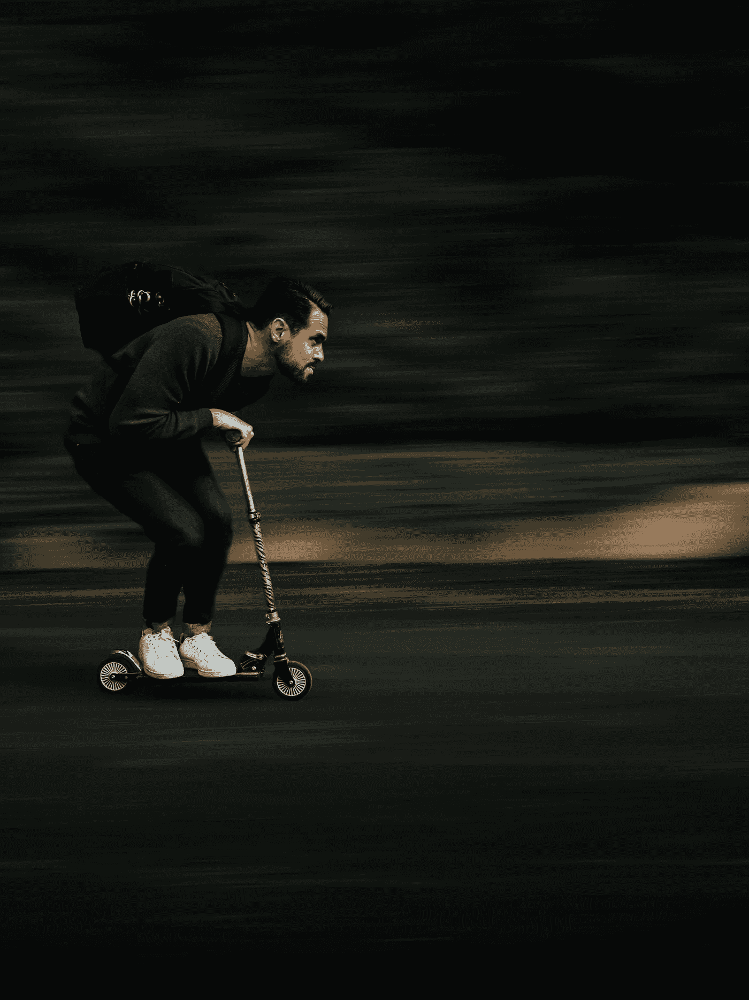

# 让我们来谈谈鸟

> 原文：<https://medium.com/swlh/lets-talk-about-birds-f9cd1d67d3bd>

不是天上的那些

我说的是我们在美国一些人口更稠密的城市的人行道上看到的电子、应用程序订购的踏板车。更有趣的是，让我们利用它作为一个机会，用相当容易理解的术语来比较技术呈指数增长意味着什么，以及它如何影响我们。

Photo by [Nicolas I.](https://unsplash.com/photos/o8koK0E-oRg?utm_source=unsplash&utm_medium=referral&utm_content=creditCopyText) on [Unsplash](https://unsplash.com/search/photos/scooter?utm_source=unsplash&utm_medium=referral&utm_content=creditCopyText)