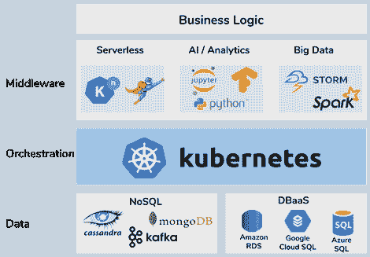

# 利用 Kubernetes 作为数字企业的中央 IT 基础设施主干

> 原文：<https://medium.com/swlh/leveraging-kubernetes-as-central-it-infrastructure-backbone-for-the-digital-enterprise-50367b2b9bc3>

Image by [Pexels](https://pixabay.com/users/Pexels-2286921/?utm_source=link-attribution&utm_medium=referral&utm_campaign=image&utm_content=1834397) from [Pixabay](https://pixabay.com/?utm_source=link-attribution&utm_medium=referral&utm_campaign=image&utm_content=1834397)

产品和服务的数字化是一个快速发展的大趋势，可以在全球范围内观察到，它破坏了各行业的现有价值链。

随着企业踏上数字化之旅，试图改变自己，它们正在采用容器技术。这种转变的发生主要是由于使用尖端技术的灵活性、易用性、安全性、成本节约、可移植性以及应用程序和基础架构之间的独立性。

> *Gartner 预测，到 2020 年，超过 50%的全球组织将在生产中运行容器化应用程序，而目前这一比例还不到 20%。*

近年来，Kubernetes 已经发展成为标准的容器编排平台。它提供了一个灵活的平台即服务(PaaS)来管理可以在容器中运行的各种工作负载，包括无状态、有状态和数据处理工作负载。Kubernetes 是一个以容器为中心的管理环境，可以被认为是可移植的云、容器和微服务平台。

# 实现数字化转型

Photo by [**Aleksandar Pasaric**](https://www.pexels.com/@apasaric?utm_content=attributionCopyText&utm_medium=referral&utm_source=pexels) from [**Pexels**](https://www.pexels.com/photo/architecture-buildings-business-city-325185/?utm_content=attributionCopyText&utm_medium=referral&utm_source=pexels)

数字化转型与采用数字化技术引起的组织内所有层面的变化有关，可分为三个层次。

*   *后端层*包括组织变革、数据和数字化流程
*   *分销和营销*层包括企业如何通过数字渠道与客户沟通
*   *产品层*是将产品的核心转化为数字产品

Kubernetes 可以作为一个中央 IT 基础设施平台来支持持续的适应，以满足业务环境中不断出现和变化的需求。它为企业范围的云战略提供了一个平台。随着企业将其 IT 基础设施迁移到云中，Kubernetes 可以在防止供应商锁定和实现混合云和多云战略方面发挥核心作用。

此外，许多老牌公司，尤其是保险和银行业，正在处理遗留的软件应用程序和基础设施。通过容器化迁移这些遗留应用程序后，Kubernetes 可以帮助在现代环境中运行这些有状态的、复杂的和非容错的业务服务。

企业正在围绕专用业务逻辑构建小型自治团队，这些团队拥有一个或多个微服务来实现该业务功能。Kubernetes 通过提供与服务网格和现有持续集成和交付工具的集成，从一开始就能够以云原生方式构建应用程序。

# Kubernetes 作为中央数字平台组件

数字化转型包括用数字化能力丰富现有的业务流程。为了提供更好的客户体验，公司需要在现有的产品和服务中加入智能。此外，部署大数据分析和人工智能解决方案对于驾驭数据爆炸变得至关重要。

adapted from [https://thenewstack.io/will-kubernetes-sink-the-hadoop-ship/](https://thenewstack.io/will-kubernetes-sink-the-hadoop-ship/)

今天，许多 IT 环境仍然以称为 Hadoop 的旧集群技术为特征，以处理大量数据。以前，大数据是作为一个技术筒仓来管理的，但现在，大数据、人工智能和业务服务必须集成和互连，才能作为一项业务成功提供智能数字服务。

最近，Kubernetes 的进步使得直接在 Kubernetes 内部运行有状态应用程序和高性能数据平台变得更加简单。Apache Kafka 和 Apache Spark 等底层数据系统可以以更简单的方式运行，Kubernetes 可以用来扩展这些不同类型的工作负载。

此外，人工智能框架和工具，如 Tensorflow 或 Jupyter 笔记本，可以在相同的 Kubernetes 环境中容器化和运行。最后，以运行在同一个 Kubernetes 集群中的微服务或无服务器功能的形式实现的业务功能可以以更加集成的方式进行访问。

# 结论

Kubernetes 提供了很大的灵活性，旨在成为一个构建其他平台的平台。围绕 Kubernetes 的生态系统正在快速增长，人工智能和大数据领域的许多领先项目正在为 Kubernetes 提供集成。所有主要的云提供商都提供 Kubernetes 即服务解决方案，减少企业自行管理 Kubernetes 集群的摩擦。

如今，至少有 54%的财富 500 强公司正在使用 Kubernetes，它有望成为数字企业应对商业环境不断变化的核心基础设施组件。

# 来源

*   [https://www . Gartner . com/smarterwithgartner/6-用于创建容器平台的最佳实践-策略/](https://www.gartner.com/smarterwithgartner/6-best-practices-for-creating-a-container-platform-strategy/)
*   [https://kubernetes . io/docs/concepts/overview/what-is-kubernetes/](https://kubernetes.io/docs/concepts/overview/what-is-kubernetes/)
*   [https://www . business insider . com/what-is-kubernetes-Google-cloud-2019-1？IR=T](https://www.businessinsider.com/what-is-kubernetes-google-cloud-2019-1?IR=T)
*   [https://www . oreilly . com/ideas/progress-for-big-data-in-kubernetes](https://www.oreilly.com/ideas/progress-for-big-data-in-kubernetes)
*   [https://jax enter . com/kubernetes-transforms-business-150723 . html](https://jaxenter.com/kubernetes-transforms-business-150723.html)
*   [https://www . Forbes . com/sites/cognitive world/2019/02/06/data-the-fuel-powering-ai-digital-transformation/# 3 BF 5 e 75 c 578 b](https://www.forbes.com/sites/cognitiveworld/2019/02/06/data-the-fuel-powering-ai-digital-transformation/#3bf5e75c578b)
*   [https://prosper global . com/stories/the-multi-layers-of-digital-transformation-and-ai-transformation/](https://thriveglobal.com/stories/the-multiple-layers-of-digital-transformation-and-ai-transformation/)

*原载于 2019 年 6 月 10 日*[*http://ebusiness2020.wordpress.com*](https://ebusiness2020.wordpress.com/2019/06/10/leveraging-kubernetes-as-central-it-infrastructure-backbone-for-the-digital-enterprise/)*。*