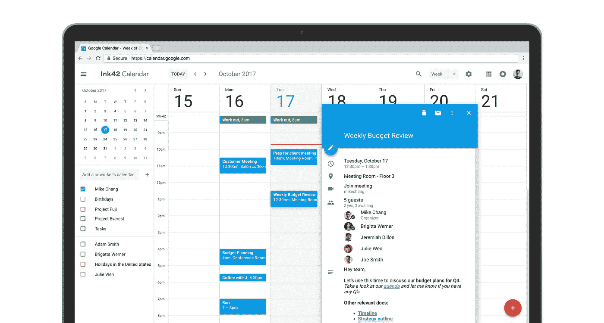
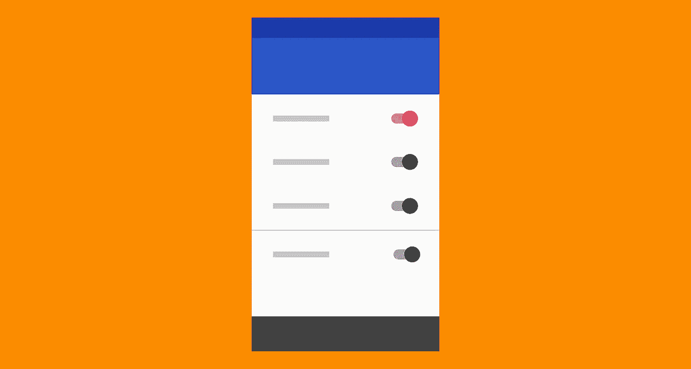

# 在产品设计中利用心智模型

> 原文：<https://medium.com/swlh/leveraging-mental-models-in-ux-design-21ba8fbce22d>

无论是创新新产品还是优化现有产品，产品设计师都应该利用产品用户对熟悉产品和界面的了解。回报是更流畅的交互、更快的采用率和更好的整体可用性。

甚至在你设计之前，人们就知道你的产品是如何工作的，如何使用它。至少，他们*应该*。设计师想要令人兴奋和有创意，但人们总是会根据他们以前用过的东西来接触新产品和新功能(在 UX，这被称为“心智模型”)。因此，设计师应该根据用户的期望来设计。

Through repeated use, users form mental models of how apps and devices should work.

# 什么是心智模型？

> *“心智模型是基于信念，而不是事实:也就是说，它是一个用户知道(或认为他们知道)像你的网站这样的系统的模型。”——*[*尼尔森诺曼集团*](https://www.nngroup.com/articles/mental-models/)

通过习惯性地使用当今存在的众多产品，一个人的大脑发展出产品如何运作的心智模型。这些心智模型是通过定期使用系统(如网站、应用程序，甚至是上面汽车座椅例子中更具触觉的用户界面)以及系统如何工作的知识形成的。

**人们会将围绕一个熟悉产品建立的期望转移到另一个看起来相似的产品上。**

这些天来，经常可以看到小孩子尝试刷平板电视(甚至是书)，当刷不起作用时，他们会感到惊讶，因为他们花在触摸屏设备上的时间可能比书本或普通电视更多。基于对触摸屏设备的接触，[触摸屏一代](https://www.theatlantic.com/magazine/archive/2013/04/the-touch-screen-generation/309250/)已经建立了一种预期(心理模型)，即滑动是每个盒状物体应该做出的反应。

即使他们被一本书弄糊涂了，这些孩子可能也能毫不费力地拿起一个不熟悉的触摸屏设备。这并不是因为他们花时间学习使用每一个设备，而是因为他们了解了一个特定的设备及其工作原理。他们的大脑存储了一个操作的心理模型，他们能够成功地将这个模型应用到其他使用相同或相似模式和序列的设备上。

> *“每个用户都有自己的心智模型，不同的用户可能会构建同一个用户界面的不同模型。此外，可用性的一大难题是设计者和用户的心理模型之间的普遍差距。——*[*Jakob Nielsen，尼尔森诺曼集团*](https://www.nngroup.com/articles/mental-models/) *。*

The car seat setting in a Mercedes is a great example of an interaction design that uses a mental model. A car seat shape for controls makes it intuitively easy to understand and operate.

设计师沉浸在设计项目中，定期形成自己的心智模型。他们也从其他设计师使用的通用交互设计模式中获得这些知识。在某种程度上，这可以创造一个“**设计师泡沫。我们很容易陷入这样一个陷阱:设计出一些对其他设计师来说有意义的东西，但却可能让普通用户感到困惑。**

**人们有独特的心智模式，通常由教育、经历、年龄和文化形成。**普通用户对生活在上述“设计师泡泡”中的设计师所熟悉的微妙的用户界面模式并不熟悉为了和用户产生共鸣，设计出最大的可用性，设计师需要缩小设计师和用户心理模型之间的差距。

为了与用户现有的心智模型保持一致，设计过程应该包含对用户对产品工作方式的期望的理解。作为 UX 研究方法的一部分，这对于发现用户需求和痛点尤为重要。

# 错位的用户心智模型

**当用户的心智模型与特定设计的实际工作方式之间存在差异时，心智模型就会出现错位。这种脱节产生了可用性问题，因为产品不符合用户的期望和现有的知识。捕捉用户注意力和信心的窗口很小，因此错位可能会带来灾难。**

例如，大多数人已经使用了足够多的电子商务系统，以至于他们对体验如何流动产生了期望。意想不到的流量给用户带来惊喜可能意味着转化率和销售额的下降。

今天，大多数购物者基于以前的经验对可选注册有所期待，他们不愿意把时间花在填写表格上，而是作为客人结账。根据 Econsultancy 的一项调查，25%的购物者在结账前被迫创建账户时会放弃购买。

在用户界面工程的[案例研究中，当结账流程中的“注册”按钮被“继续”按钮取代时，这一微小的调整创造了 3 亿美元的收入增长。根据以前的经验，购物者对点击“注册”按钮后的过程有一个心理模型，这通常是一个耗时的注册过程，在购买产品之前是必要的。这些负面预期导致购物者放弃购物车。](http://www.uie.com/articles/three_hund_million_button)

在另一个例子中， [Snapchat 最近在对其用户界面进行重大修改后遭到了重大的抵制](https://www.cnbc.com/2018/02/13/snapchats-new-interface-is-already-pushing-some-users-to-instagram.html)。用户希望 Snapchat 看起来和操作起来像他们已经习惯的上一个版本，现有的思维模式与新版本不一致。

结果呢？[用户感到困惑](https://uxdesign.cc/ux-critique-snapchat-2f7b14dc5a30)，感到无能，这一变化导致了大规模流失，公司可能无法恢复。

概括一下— **人们有基于以前使用特定产品的经历的期望和心理模型**。UX 或用户界面中意想不到的惊喜会导致混乱和沮丧，公司会为此付出代价。

Mental models mismatch in action: The recently redesigned Skype UI confuses people and slows them down due to its use of non-standard dialogs where options presented don’t look like standard buttons.

# 改善错位的心理模型

可用性测试和其他 UX 研究方法有助于揭示设计体验和用户心理模型之间的不一致。此外，心理模型之间的差距可以通过互动参观、仔细的入职培训、实时反馈和/或[符号](http://www.jnd.org/dn.mss/signifiers_not_affordances.html)来帮助学习新产品功能和新用户界面。

更新和设计变更不一定会给用户造成混乱。与其强迫改变，不如给用户机会[在他们准备好的时候更新软件](https://www.smashingmagazine.com/2016/06/rolling-features-without-hurting-loyal-users/)。当用户能够有意识地选择界面何时可能改变，并可能挑战他们熟悉产品的现有模型时，他们会更多地意识到新的设计，并为其所赋能。

Google made [sweeping changes to the UI and behavior](https://techcrunch.com/2017/10/17/google-calendar-on-the-web-gets-a-fresh-new-look/) of Google Calendar, a product that had not changed much in many years. By warning and allowing them to opt in over several months, Google empowered its users to decide when to change their mental models of how the product should work.

谷歌最近彻底修改了谷歌日历。此次重新设计为一款全球数百万人使用的产品带来了十年来最重大的设计变化。他们提醒用户即将发生的变化，而不是把它强加给用户，因为对他们来说，如此重要的东西的剧烈变化可能会增加摩擦和沮丧。谷歌允许用户在旧版本和更新版本之间切换几个月，然后最终完全替换旧版本。

使产品的旧版本兼容和可用，并允许用户在有限的时间内继续使用熟悉的版本，可以保持信任。**允许并授权用户*决定*何时学习新界面，这将有助于他们感觉自己仍然掌控着体验。**

Slack uses interactive tours to help new users learn the interface and efficiently improves any contradictory mental models users may have.

对用户已经熟悉的现有设计进行大范围、大规模的改变可能会违反用户现有的思维模式。为了将扰乱用户的风险降至最低，公司可能会考虑通过几次更新或用较小的团队测试更改来进行小的调整。

脸书在运用这一策略方面相当成功。例如，“反应”在全球发行之前，已经在特定的地区进行了广泛的实施和测试。虽然小的调整经常发生，但脸书小心翼翼地推出会扰乱用户思维模式的重大更新。通过多个发布来启动变更可以最小化需要改进的心智模型的数量。

# 基于心智模型的设计

Jakob 的互联网用户体验定律指出“用户大部分时间都花在你的网站之外的网站上。因此，很大一部分顾客对你网站的心理模型会受到从其他网站收集的信息的影响。"

简而言之，UX 设计者的目标是创建一个过程，让用户快速而轻松地完成他们的目标。人是习惯的动物，利用用户心智模型意味着用户在使用产品之前就知道如何使用它。

# 心理模型研究

UX 的设计师通常会创建旅程图和移情图，并在创建新产品(或改进产品)时使用数据来帮助识别用户的痛点。当谈到心智模型时，同样的 UX 研究方法和过程可以应用于对现有竞争对手或同行产品的研究。

当设计一个新产品时，研究一个现有的系统可以潜在地为设计者节省大量的时间和金钱，因为它可以消除从头创建新的原型来测试新概念的需要。观察用户如何与现有设计互动，找出他们对类似设计的期望。

设计师可以尝试改进现有的解决方案。此外，只要目标人群是相同的，镜像众所周知的系统意味着几乎不需要做测试来验证核心功能的可用性。

Users of competing and/or related systems can be studied to find out how they are working currently, their current mental models, and what their pain points are.

# 镜像现有的 UX

世界上最受欢迎的应用程序直接受到彼此的影响，它们经常基于现有的心理模型实现设计。例如，脸书引入了“喜欢”的互动模式，然后被 LinkedIn 和 Instagram 复制。

Twitter 引入了标签，然后被脸书和 Instagram 复制。标签由 Twitter 引入，随后被脸书、LinkedIn、Instagram 和其他网站效仿。Instagram 引入了故事，然后脸书实现了这些故事。Snapchat 引入了照片滤镜和操作，然后脸书复制了这些。

在几乎所有这些情况下，在采用这些特性时几乎没有什么变化。脸书和 Twitter 非常有竞争力，他们总是希望利用彼此的成功。脸书有条不紊地模仿竞争对手的产品体验，当一个新的、成功的应用出现时，如果他们无法获得它，这正是他们会做的。

Facebook Messenger’s UI mirrors Snapchat, capitalizing on existing mental models. Users of one popular app will have no trouble using and enjoying the other.

最近的统计数据显示，脸书每月活跃用户超过 22 亿。该应用程序如此受欢迎，以至于它影响了今天的许多设计，因为用户对像脸书这样熟悉的产品已经建立的范例有所期待。

例如，由于脸书今天的设计影响力，在许多不同的桌面应用程序中，在靠近登录区域的右上角发现通知图标是非常标准的。在其他应用程序中，状态更新、新闻订阅等也越来越常见。

LinkedIn 可以随心所欲地设计个人更新、新闻订阅或通知。然而，利用他们的成功、庞大的用户群和用户现有的心理模型，他们选择创造一种直接反映脸书的体验[。](/productivity-revolution/how-linkedin-copied-facebook-ui-and-disappointed-everyone-79a5f7285cac)

除非有特殊的原因来回避用户的期望，参考熟悉的模式可以让设计者将用户的注意力集中在产品更重要的、独特的特性上。即使有人从未使用过 LinkedIn，他们对脸书的了解也意味着一切都很熟悉。

# 心理模型和 Skeuomorphism

Skeuomorphism 是一个用来描述界面对象的术语，这些对象反映了现实世界中的对应物的外观和/或用户与它们的交互方式。这个设计概念利用了用户现有的知识和对实际对象的心理模型，因此他们不需要学习新的界面。

许多数字 UI 元素反映了现实世界中的对应元素。这并不是因为设计师缺乏想象力，而是他们意识到一个脱离了现实世界中任何类似物的 UI 元素意味着用户需要付出更多的努力来解释他们所看到的东西。将[一个开关整合到数字用户界面](https://blog.prototypr.io/design-obsv-01-toggle-switches-3a723f3b14f2)中，这个开关看起来和操作起来就像一个有人可能在家里找到的电灯开关，这极大地减轻了用户的认知负荷。视觉隐喻就在那里，他们马上就知道这是干什么用的。

Even completely abstracted, the average user will likely know that what they are looking at is a set of switches to turn on and off as desired. [Google’s Material Design system](https://material.io/design/components/selection-controls.html) uses very flat visual design and iconography but leverages common UI patterns based on physical metaphors to ensure optimal usability.

这个原则[应该适度使用](https://designrfix.com/web-design/skeuomorphism-web-design-main-pros-cons)，但是如果应用得当，对可用性非常有效。Skeuomorphism 意味着 UI 的外观和功能都与现实世界中的 UI 相似。然而，设计师需要小心这种心理模型理论，因为功能或外观上的差异实际上会降低设计的可用性。

外观设计在专业音频制作应用中很常见。数字插件通常模拟模拟设备，如压缩器、均衡器和混响单元。在下图中，底部的数字插件利用 skeuomorphic 设计来模拟顶部硬件单元的 UI。

轮廓设计元素的使用使用户能够应用通过操作真实世界的声音压缩器而存在的心理模型。右下角的图片使用了一种独特的设计，它不是基于任何现有的齿轮。正因为如此，即使用户使用了真实世界中的实体副本，他们也没有关于界面的基础知识，需要花费额外的时间和精力来学习。

Digital audio plugins often emulate analog gear, such as compressors, equalizers, and reverb units. Utilizing skeuomorphic design capitalizes on existing mental models.

# 基础创造力和创新

为了最大化可用性，在心智模型的基础上进行设计是很重要的。在现有的思维模式和标准内创造和创新可以带来新的和令人兴奋的产品，这些产品仍然符合用户的期望。违反这些心理模型应该有策略地进行，并且只在必要时进行。

例如，大多数人已经开发了音量滑块的心理模型。在下面的例子中，左边的滑块代表了大多数人对音量滑块的心理模型。中间的滑块[被设计成一个笑话](https://www.popularmechanics.com/technology/design/a26848/redditors-volume-slider/)，但它说明了重要的一点。

滑块完全违背了心理模型和用户的期望，因为它看起来像一个垂直的滑块，但实际上，它是水平操作的。右边的滑块取自苹果的 iOS。苹果利用创造力和创新来设计新的和原创的东西，但它仍然尊重心理模型的网格，这些模型形成了对音量滑块如何操作的共同预期。

A volume slider representing the common mental model, a volume slider **countering** the common mental model, and a volume slider from Apple’s iOS, utilizing the common mental model in a new touch design.

# 最后的想法

对现有设计进行 UX 研究将有助于澄清现有的心智模型，并使设计师能够利用他们的产品用户的心智模型。反过来，这些发现将帮助设计师优化任何数码产品的可用性。

忽视心智模型的设计师们是在自担风险。利用现有的心智模型作为创造力和创新的基础，可以使设计师改进现有的产品，并帮助他们设计出令人兴奋的新产品。

👋🏻**你好！感谢阅读并到达文章结尾。**🙂

我现在可以通过我的 UX 课程 让人们开始他们的 UX 设计师职业生涯[，或者继续在](http://uxwithmiklos.com/) [**导师课程**](https://mentorcruise.com/mentor/miklosphilips) 上进行指导。

跟我一起学习 UX，费用只有蹩脚训练营的一半。获得认证为高薪工作建立一个文件夹。7 天免费试用[http://uxwithmiklos.com](http://uxwithmiklos.com)

你也可以在推特上关注我。 ➣

## 这篇文章发表在 [The Startup](https://medium.com/swlh) 上，这是 Medium 最大的创业刊物，拥有+419，678 读者。

## 在这里订阅接收[我们的头条新闻](http://growthsupply.com/the-startup-newsletter/)。

