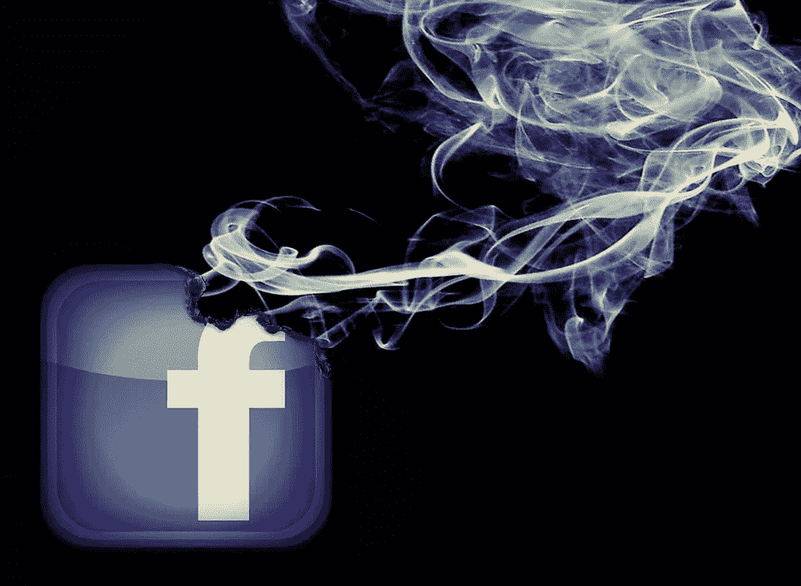

# 脸书之后的生活

> 原文：<https://medium.com/swlh/life-after-facebook-158f0c0ee842>

[https://www.flickr.com/photos/mkhmarketing/8546850049](https://www.flickr.com/photos/mkhmarketing/8546850049)

这些天我有点不喜欢无所事事。

以前从来不是这样。我清楚地记得(不太遥远的)过去的生活，在那段时间里，我可以无所事事地在厕所里呆上 5-10 分钟。见鬼，以前我就是这样背乘法表的。

一晃 15 年过去了，独自思考的想法变得陌生而令人不安。

越来越令人担忧的是，在超市排队等候时，我发现自己发痒的手指在摸索手机。一旦朋友借故去洗手间。我一坐下就去洗手间。

起初，每一个空闲的时间似乎都是喂养我的 FOMO 的宝贵机会。有太多的事情让 T2 忙得不可开交。朋友的约会和婚礼。假新闻丑闻。b 级名人做丰臀手术。

惰性似乎是对完美的技术检查时间的浪费。

但是每一次对 FOMO 的疯狂喂食只会增加上瘾程度。像其他瘾君子一样，我吸得越多，就越需要吸。

有些东西必须放弃。

所以三周前，我把脸书从手机里删掉了。不是我的帐户，只是应用程序。几乎同时，一些惊人的事情开始发生。

> ***1。对话质量***

沉闷的谈话突然开始重新焕发光彩。

不足为奇。以前，在关于阴谋论和人工智能背叛我们并接管世界的激烈辩论中，我的眼睛会反复瞟向我的手机。检查我都不知道是什么？

尽管我试图说服自己，我是一个“优秀的多任务者”，但事实不容否认。我的大脑根本无法在阅读或发帖的同时对对话做出有意义的贡献。

在后脸书时代的生活中，我对社交媒体的访问变得更有目的性了。

现在，我必须起身，走到房间的另一边，打开我的笔记本电脑并登录，在我可以检查我的提要之前，有许多障碍要克服。大多数时候，我只是懒得去迎接挑战。

因此，我不再不停地监视我的远方熟人在做什么，而是满足于与我真正关心的人进行有质量的交谈。

不错的替代品，真的。

> ***2。恢复我的注意力范围***

不可否认，随着时间的推移，社交媒体一直在缓慢但肯定地削弱我的专注能力。

滚动系统让我以远远超出我大脑实际处理能力的速度浏览信息。我的眼睛和大脑会浏览，但不会真正接受(主要是平庸和不相关的)内容。事后看来，这可能是合理的(考虑到它主要是平庸和不相关的)。

这不是一个问题，我没有完全处理我七年没有见过的人吃早午餐。但问题是，我的注意力缺陷正在影响我生活的其他方面。

专注于高雅的对话变得很难。阅读完整的新闻文章是一个挑战。读真正的书？你做梦去吧。

因此，我不会去阅读那些实际上会拓展我思维的材料，而是去查看我的新闻订阅源，那里那些小小的帖子对我分心的大脑来说简直太容易处理了**。**

自从把脸书从我的手机中删除后，我的注意力和集中力的反弹几乎是奇迹。

在我离开脸书的三周里，我已经读了差不多两整本书，还心不在焉地看了很多播客。有时，我甚至会积极倾听我的搭档关于神经细胞内钠和钾通道的长篇大论。

毫无疑问，脸书一直在控制着我的注意力。现在它已经被释放了，我们已经团聚了，我不会很快让它再次离开。

> ***3。创新***

不久前，我写了一篇关于不活动的重要性的博客。关于新的和创造性的想法是如何从完全的精神空白期产生的，这种空白期允许我们的思想漫游到以前未探索的思想领域。

(记住——正是在一次平静的沐浴中，阿基米德认识到了体积和浮力之间的关系。并不是艾萨克·牛顿的苹果设备让他发现了万有引力定律。)

但是无所事事是社交媒体努力消除的。

事实上，有了脸书在我的手机上，我很少发现自己在等待没有它在身边的任何事情。刺激似乎是必要的。懒惰的概念？几乎不可思议。

在过去的三周里，我已经学会了站在超市的队伍里，除了自己的陪伴之外，什么都不带。在等待朋友到来的时候，我静静地坐着，观察周围的世界。

当然，我还没有炮制出任何值得诺贝尔奖的理论。但我才怀孕三周。

谁知道会发生什么。